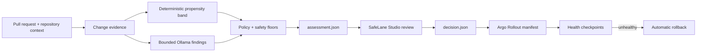

<p align="center">
  
</p>

# SafeLane

<p align="center">
  <strong>Every change gets the rollout it deserves.</strong>
</p>

<p align="center">
  SafeLane turns evidence about a software change into a versioned rollout policy for Argo Rollouts.
</p>

<p align="center">
  <a href="LICENSE"></a>
  
  
</p>

> [!IMPORTANT]
> SafeLane is a pre-alpha hackathon project. The pre-final decision spine—contracts, deterministic
> engine, bounded Ollama adapter, evaluation fixtures, and local Studio approval—is implemented. The
> repository-aware PR workflow, Argo Rollout compiler, GitHub Check adapter, and bound outcome
> receipts are implemented. Production cluster application and automatic Argo observation are not.
> Nothing in this repository is production-ready.

## Why SafeLane?

Progressive delivery tools execute careful rollouts, but their steps are usually fixed before anyone knows what changed. A documentation edit and a permission change can therefore receive the same exposure, checkpoints, and release speed.

SafeLane adds the missing decision layer. It examines the change, records the evidence it could verify, selects a `safe`, `guarded`, or `risky` tier, and resolves that tier into an Argo Rollouts profile. Argo still owns deployment and rollback; SafeLane decides how carefully this particular change should be released.

The design is deliberately conservative:

- local AI may identify code-backed dangers, but it cannot choose the rollout;
- fixed, versioned rules apply every safety floor;
- missing or invalid evidence prevents the Fast profile; and
- a missing, stale, or invalid rollout decision rejects release compilation.

## How it works



1. **Collect change evidence** — diff size, mapped services, downstream impact, shipping support, and bounded incident candidates.
2. **Find specific dangers** — local `qwen2.5-coder:7b` returns one bounded category and exact changed-line citations; base-owned backend policy maps that category to minimum rollout care and normal code renders the explanation.
3. **Apply deterministic policy** — coarse failure propensity and one-way safety floors produce the final risk tier.
4. **Review the assessment** — SafeLane Studio shows the Main risk, verified evidence, and minimum rollout profile. Guarded and Risky decisions require approval.
5. **Resolve the rollout** — the approved decision contains complete pod stages and health checkpoints for Argo Rollouts.
6. **Release and observe** — Argo advances exposure while Prometheus checks service health and rolls back unhealthy revisions.

## Rollout profiles

The Phase 1 demo uses five replicas and no traffic router. Pod exposure is therefore the honest primary unit; the corresponding Argo weights are recorded alongside it.

| Risk tier | Profile | Exposure | Health behavior |
|---|---|---|---|
| `safe` | Fast | all 5 pods immediately | Kubernetes readiness |
| `guarded` | Guarded | 2 pods → checkpoint → all | service health limit |
| `risky` | Strict | 1 pod → checkpoint → 2 → checkpoint → 3 → checkpoint → all | service health limit |

Risk changes exposure and observation time. It does **not** weaken the service's definition of healthy. The demo policy uses a configurable 5% maximum error rate for Guarded and Strict checkpoints.

## Two artifacts, one exact change

SafeLane separates review evidence from the deployment handoff:

- **`change-assessment-v1`** contains the full SHA-bound assessment, base-owned policy and trusted-probe provenance, verified AI safety case, backend rule IDs, rollout options, and review state. Studio and the CLI read the same bytes.
- **`rollout-decision-v1`** is emitted only after the assessment resolves automatically or receives approval. It contains the resolved profile and trusted analysis identity consumed by the compiler.

A new push invalidates the previous approval. The repository-aware lifecycle is specified in
[`docs/safelane-studio.md`](docs/safelane-studio.md) and
[`ADR 0005`](docs/adr/0005-base-owned-repository-safety-contract.md); its closed-world wire shapes
are [`change-assessment-v1`](schemas/change-assessment-v1.schema.json) and
[`rollout-decision-v1`](schemas/rollout-decision-v1.schema.json). `contract.md` remains the frozen
pre-final decision-spine contract.

## Safety model

SafeLane does not claim to calculate a precise probability of failure.

| Concept | Meaning |
|---|---|
| Failure propensity | A coarse `low`, `medium`, or `high` band derived from deterministic change facts |
| AI risk finding | A bounded warning tied to exact changed code; never rollout authority |
| Safety floor | A rule that can keep or raise rollout care, never reduce it |
| Evidence confidence | Whether every policy-required input was available and understood—not model certainty |
| Risk tier | The final `safe`, `guarded`, or `risky` result after every floor |

Fast-lane eligibility requires positive proof. The absence of an AI warning is not enough.

See [`docs/risk-signals.md`](docs/risk-signals.md) for the complete Phase 1 policy and [`CONTEXT.md`](CONTEXT.md) for the project vocabulary.

## SafeLane Studio

Studio connects to a local checkout or remote GitHub repository containing a base-owned
`.safelane/policy.yaml` and trusted-probe catalog, discovers its open pull requests,
and assesses each exact base/head diff. The Changes inbox shows the selected lane and review state;
the PR dossier explains the evidence and records approval for a repository-owned rollout profile. It never
shows uncommitted working-tree changes or deploys software. It can publish exact-head GitHub Check
Runs when the authenticated GitHub App has Checks write permission. The checked-in
`pull_request_target` workflow supplies that installation token while executing only the trusted
base-branch SafeLane implementation; local OAuth-user sessions surface Check delivery as unavailable.

Run it against the current checkout's GitHub origin:

```powershell
uv run safelane studio --repository .
```

Or connect a remote repository without cloning it:

```powershell
uv run safelane studio --repository owner/repository
```

Open <http://127.0.0.1:4173>. Studio uses the authenticated GitHub CLI, stores SHA-bound assessments
under `.safelane/studio`, and invalidates an earlier assessment when a PR receives a new push.
Approval records a SHA-bound decision. A reviewer can then bind an immutable image digest and compile
a validated Argo Rollout YAML. Compilation requires GitHub to verify a signed artifact attestation
for the image, repository, and assessed source revision before SafeLane records a signed local
catalog entry; a digest alone is rejected. Register that CI-produced identity before compilation:

```powershell
uv run safelane register-image `
  --repository . `
  --number <pull-request-number> `
  --service safelane `
  --image ghcr.io/owner/service@sha256:<64-hex-digest>
```

The checked-in `build-and-attest.yml` workflow builds the exact PR head, labels the OCI image with
that full revision, pushes its immutable digest to GHCR, and signs GitHub artifact provenance. The
base-owned policy pins that workflow as the only accepted signer.

SafeLane still does not merge the PR or apply the manifest to a cluster.
Use the repository chip in Studio's top bar to connect another local path, GitHub URL, or
`owner/repository` without restarting the server.
The interaction contract lives in [`docs/safelane-studio.md`](docs/safelane-studio.md).

## Evaluation boundary

Phase 1 has three explicit gates:

1. **Deterministic conformance** — every policy branch, boundary, invariant, and fail-safer fallback must pass.
2. **Locked Ollama challenge** — 12 authored cases run twice must produce the expected semantic findings, evidence decisions, and tiers without under- or over-triage.
3. **Real-history smoke test** — SafeLane must process a pinned, authentic permission-changing diff from [`roots/trellis`](https://github.com/roots/trellis) through the same assessment path.

These gates test conformance and demo readiness. They do not establish production accuracy, calibration, incident reduction, or causality. The exact scenarios and reporting rules are in [`docs/golden-scenarios.md`](docs/golden-scenarios.md).

## Project status

| Area | Status |
|---|---|
| Domain model and risk semantics | complete |
| Assessment and rollout contracts | complete |
| Rollout profiles and Studio interaction | complete |
| Golden evaluation specification | complete |
| Andrew-owned decision spine and Studio | complete |
| Argo Rollout compilation | complete |
| GitHub exact-head Check adapter | complete; requires GitHub App auth |
| Bound outcome receipts and calibration counts | complete |
| GitHub open-PR Studio flow | complete |
| Production cluster application and automatic observation | not started |

The project is being built for the **DevOpsDays Cairo 2026 DevOps Hackathon**, Track 1: Automate Deployment & Operations.

## Repository guide

| Path | Purpose |
|---|---|
| [`docs/safelane-studio.md`](docs/safelane-studio.md) | repository-aware lifecycle and interaction authority |
| [`docs/adr/0005-base-owned-repository-safety-contract.md`](docs/adr/0005-base-owned-repository-safety-contract.md) | repository-workflow architecture authority |
| [`schemas/`](schemas) | closed-world wire contracts for both delivered workflow generations |
| [`contract.md`](contract.md) | frozen pre-final decision-spine v2/v3 contract; not the repository workflow |
| [`CONTEXT.md`](CONTEXT.md) | canonical SafeLane vocabulary |
| [`docs/input-contracts.md`](docs/input-contracts.md) | exact request, policy, incident, profile-draft, and evaluation-fixture inputs |
| [`docs/risk-signals.md`](docs/risk-signals.md) | failure-propensity and safety-floor policy |
| [`docs/rollout-profiles.md`](docs/rollout-profiles.md) | built-in profiles and custom-profile validation |
| [`docs/golden-scenarios.md`](docs/golden-scenarios.md) | Gate 2 scenarios and acceptance thresholds |
| [`research/risk-engine-evaluation.md`](research/risk-engine-evaluation.md) | evidence behind the evaluation boundary |
| [`research/phase1-reuse-boundary.md`](research/phase1-reuse-boundary.md) | explicit build, adapt, and reject decisions |
| [`prototypes/safelane-studio`](prototypes/safelane-studio) | throwaway interactive Studio prototype |

Research files explain how decisions were reached. For the repository-aware workflow, ADR 0005,
`docs/safelane-studio.md`, and the corresponding JSON Schemas win. `contract.md` governs only the
frozen pre-final v2/v3 decision-spine artifacts it names.

## Scope

Phase 1 intentionally excludes production ML training, organization-wide incident ingestion, multi-cluster rollout management, accounts and RBAC, deployment controls in Studio, and a traffic router. SafeLane integrates with Argo Rollouts; it does not replace it.

## Attribution

SafeLane adapts and credits design lessons from [DeployWhisper](https://github.com/deploywhisper/deploywhisper): service-graph traversal, an explicit synthetic-incident format, and safer behavior when context is missing. Phase 1 copies no DeployWhisper source code or sample text.

See [`research/prior-art.md`](research/prior-art.md) for the broader landscape and the limits of SafeLane's novelty claims.

## License

SafeLane is available under the [MIT License](LICENSE).
