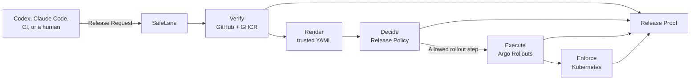

<p align="center">
  
</p>

# SafeLane

<p align="center">
  <strong>Ship on autopilot. Stay in control.</strong>
</p>

<p align="center">
  <a href="https://andrewmaged814.github.io/safelane/">Read the documentation</a> ·
  <a href="https://github.com/AndrewMaged814/safelane">View the source</a>
</p>

SafeLane is the missing safety layer for deployment agents. Agents can plan a release, watch a
canary, and repair a bad step. They should not set their own limits or hold the keys to production.

SafeLane gives Claude Code, Codex, CI, and humans one guarded path to production. You identify a
merged pull request. SafeLane collects GitHub and GHCR evidence, applies the operator-owned Release
Policy, renders trusted Kubernetes objects, and allows only the rollout step that policy permits.

The agent can drive the release. SafeLane remains the release authority.

## One request. One decision. One proof.



SafeLane verifies the artifact and decision before execution. Argo Rollouts runs the canary.
Kubernetes enforces the identity boundary. SafeLane records the artifact, decision, execution, and
enforced boundary in one Release Proof.

SafeLane now includes a Claude Code skill, /safelane, for agent-driven releases.

## Install

SafeLane requires Go 1.26.5 or later.

```bash
go install github.com/AndrewMaged814/safelane/cmd/safelane@main
```

Or build from source:

```bash
git clone https://github.com/AndrewMaged814/safelane.git
cd safelane
go build -o ./bin/safelane ./cmd/safelane
```

See the [documentation](https://andrewmaged814.github.io/safelane/) for the current command
reference, configuration schemas, and release workflow.

## License

SafeLane is available under the [MIT License](LICENSE).
