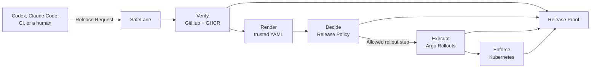

<p align="center">
  
</p>

# SafeLane

<p align="center">
  <strong>Ship on autopilot. Stay in control.</strong>
</p>

<p align="center">
  <a href="https://andrewmaged814.github.io/safelane/">Read the documentation</a> ·
  <a href="https://github.com/AndrewMaged814/safelane">View the source</a>
</p>

SafeLane is the missing safety layer for deployment agents. Agents can plan a release, watch a
canary, and repair a bad step. They should not set their own limits or hold the keys to production.

SafeLane gives Claude Code, Codex, CI, and humans one guarded path to production. You identify a
merged pull request. SafeLane collects GitHub and GHCR evidence, applies the operator-owned Release
Policy, renders trusted Kubernetes objects, and allows only the rollout step that policy permits.

The agent can drive the release. SafeLane remains the release authority.

## One request. One decision. One proof.



SafeLane verifies the artifact and decision before execution. Argo Rollouts runs the canary.
Kubernetes enforces the identity boundary. SafeLane records the artifact, decision, execution, and
enforced boundary in one Release Proof.

SafeLane now includes a Claude Code skill, /safelane, for agent-driven releases.

## Setup from inside a repository

From a fresh clone with a GitHub `origin`, run:

```bash
safelane setup
```

SafeLane discovers the repository, CI check names, default branch, and image repository locally.
It asks Claude for a project-shaped Release Policy and Release Template, shows the recommendation,
and writes operator-owned configuration only after one approval. Claude receives a bounded, read-only
snapshot and has no tools, so it cannot edit the application repository. If Claude is unavailable,
SafeLane offers a conservative repository-derived proposal instead. Use `safelane setup --no-agent`
to choose that fallback directly.

Setup writes under `~/.safelane/apps/<application>/`; it never creates `.safelane` files in the
application repository and never provisions credentials or a cluster. Existing `project.yml` files
are not overwritten. After approval, run:

```bash
safelane doctor
```

`doctor` remains a deterministic readiness check. It validates the approved policy, Release Template,
GitHub/GHCR access, and target identities; it is not another conversational setup step. See the
[setup guide](docs/setup.md) for the exact flow and fallback behavior.

## Install

macOS and Linux:

```bash
curl -fsSL https://raw.githubusercontent.com/AndrewMaged814/SafeLane/main/docs/install.sh | sh
```

Windows PowerShell:

```powershell
irm https://raw.githubusercontent.com/AndrewMaged814/SafeLane/main/docs/install.ps1 | iex
```

The installers download the latest checksummed GitHub Release. They always reuse one
canonical location: `~/.local/bin/safelane` on macOS and Linux, and
`%LOCALAPPDATA%\SafeLane\bin\safelane.exe` on Windows. Rerun the same command to upgrade.

To build from source, install Go 1.26.5 or later:

```bash
git clone https://github.com/AndrewMaged814/safelane.git
cd safelane
go build -o ./bin/safelane ./cmd/safelane
./bin/safelane version
```

See the [documentation](https://andrewmaged814.github.io/safelane/) for the current command
reference, configuration schemas, and release workflow.

## License

SafeLane is available under the [MIT License](LICENSE).
