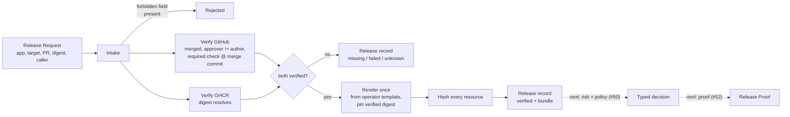

<p align="center">
  
</p>

# SafeLane

<p align="center">
  <strong>Ship on autopilot. Stay in control.</strong>
</p>

<p align="center">
  SafeLane ships reviewed changes on autopilot, while keeping every release inside your rules.
</p>

<p align="center">
  <a href="LICENSE"></a>
  
  
</p>

## Why SafeLane?

An autonomous deployer can ask for a production release. It needs one safe place to send that
request.

Direct cluster credentials are not safe — a deployer with real Kubernetes access can bypass any rule.
Trusting the deployer's own claims is not safe either — it can say a change was reviewed when it was
not. And if the deployer supplies the Kubernetes objects a risk scanner reads, it can shape its own
risk score: the bytes the scanner checked and the bytes the cluster runs are no longer provably the
same bytes.

SafeLane closes all three gaps. A deployer sends release identity and evidence only: which
application, which reviewed change, which built artifact. It sends no Kubernetes object, no patch, no
template choice, no policy choice — SafeLane rejects these fields, it does not ignore them. SafeLane
checks the evidence itself, against GitHub and the container registry. It renders the deployment
bundle itself, from a template the operator owns. SafeLane is the only path to a real production
release.

## How it works



Four stages. The third stage never runs on anything the second stage did not confirm.

1. **Intake.** SafeLane reads the Release Request. The request holds identity and evidence only.
   SafeLane rejects any Kubernetes object, patch, template choice, or policy choice by name — it does
   not stay silent and drop the field.
2. **Verify.** SafeLane checks the pull request against GitHub: the change merged to the correct
   branch, the approver is not the author, and the required check passed **on the merge commit**, not
   the pull request head. SafeLane checks the image digest against the registry through GHCR's public
   anonymous flow. Anything SafeLane cannot confirm is `unknown`. `Unknown` is never a pass.
3. **Render.** SafeLane renders the Rendered Manifest Bundle once, and only after both checks pass. It
   fills the operator's Release Template with the verified digest and hashes every object it renders.
   Nothing downstream renders a second bundle. The hashed bytes, the bytes a risk scanner would read,
   and the bytes the cluster would run are the same bytes.
4. **Record.** SafeLane writes one Release record with a stable ID before any risk check or policy
   decision exists — whether the evidence passed, failed, was missing, or could not be checked.

## Claimed evidence versus verified evidence

Every field in a Release Request is a claim. SafeLane does not trust a claim on its own.

The `ReleaseEvidence` type enforces this in code: only SafeLane's own verification step can build one.
Its fields are unexported, so no other code path can fake a "verified" result. A check that does not
pass returns one of three answers:

| Outcome | What it means | Example |
| --- | --- | --- |
| **Failed** | SafeLane checked, and the answer is no | The pull request is not merged; the approver is the author |
| **Missing** | The evidence does not exist | No approving review; no check run for the merge commit |
| **Unknown** | SafeLane could not check | GitHub did not respond; the registry timed out |

None of the three counts as a pass. See [`CONTEXT.md`](CONTEXT.md) for the full vocabulary.

## Try it

```powershell
go build ./...
go test ./...
go run ./cmd/safelane release --file testdata/release-evidence.json
```

This fixture's pull request and digest are placeholders — the demo Podinfo fork does not exist yet
(see [Project status](#project-status)). The command still makes a real call to GitHub and to GHCR,
and correctly returns `unknown`. `testdata/README.md` lists every value to replace once real evidence
exists.

## Project status

This table tracks the 12-step chain the team's progress demonstration needs. See
`docs/prototype/progress-meeting.md` for the full chain.

| Step | Status |
| --- | --- |
| A real Podinfo pull request is reviewed and merged | Not started — longest lead time, needs a second human reviewer |
| CI publishes a public, immutable GHCR digest | Not started |
| The release-facing CLI accepts identity and evidence only | **Done** |
| SafeLane verifies GitHub evidence (merge, reviewer, check on the merge commit) | **Done** — tested against real GitHub |
| SafeLane verifies the GHCR digest (public anonymous flow) | **Done** — tested against real GHCR |
| SafeLane renders the bundle once and hashes every object | **Done** |
| SafeLane persists the Release record with a stable ID | **Done** |
| DeployWhisper reports advisory risk on the exact rendered bytes | Not started |
| SafeLane maps risk through the versioned Release Policy to a typed decision | Not started |
| `safelane proof <release-id>` | Not started |
| Argo patches the pre-created Rollout to the verified digest | Not started — depends on the infrastructure workstream |
| A restricted deployer identity is denied a direct mutation attempt | Not started |

## Repository guide

| Path | Purpose |
| --- | --- |
| [`CONTEXT.md`](CONTEXT.md) | The project's vocabulary — Release Request, Release Evidence, Rendered Manifest Bundle, and the rest |
| [`AGENTS.md`](AGENTS.md) | Where an agent finds the issue tracker, the triage labels, and the domain docs |
| [`docs/prototype/`](docs/prototype) | The release interface spec and the progress-meeting chain |
| [`docs/policy/safelane-policy.yml`](docs/policy/safelane-policy.yml) | The sample Release Policy — risk tier mapped to rollout stage |
| [`docs/research/`](docs/research) | Prior-art and integration research, including the DeployWhisper spike |
| `internal/release` | The core types — Release Request, Release Evidence, Rendered Manifest Bundle, the persisted Release |
| `internal/render` | The render-and-hash step — renders once, from the operator's Release Template |
| `internal/intake` | Reads the request and screens out forbidden fields |
| `internal/verify/github`, `internal/verify/ghcr` | Verifies evidence against real GitHub and GHCR |
| `internal/orchestrate` | The one release-intake path every transport must call |
| `internal/store` | Saves and loads the Release record |
| `internal/cli`, `cmd/safelane` | The CLI itself |

## Scope

SafeLane does not yet do these things:

- score risk or apply a release policy (the DeployWhisper integration);
- render the Release Proof;
- create or change an Argo Rollout, or touch Kubernetes in any way;
- serve an HTTP API or an MCP adapter;
- verify build provenance or attestation;
- store private-registry credentials.

Each item above is roadmap work or a named upcoming ticket. See the Progress Vertical Slice and Final
Prototype entries in [`CONTEXT.md`](CONTEXT.md).

## Attribution

SafeLane treats [DeployWhisper](https://github.com/deploywhisper/deploywhisper) as one replaceable
evidence provider. SafeLane calls it through a pinned adapter and does not copy its code — see
[`docs/research/deploywhisper-spike.md`](docs/research/deploywhisper-spike.md) for the research behind
that decision.

## License

SafeLane is available under the [MIT License](LICENSE).
