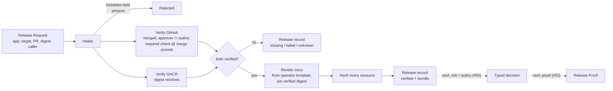

<p align="center">
  
</p>

# SafeLane

<p align="center">
  <strong>An autonomous caller asks for release authority. SafeLane decides what it actually gets.</strong>
</p>

<p align="center">
  SafeLane is the one neutral entry point an agent, CI system, or human uses to request a production
  release — and the release-facing decision layer that verifies evidence, renders the exact bundle it
  will assess and apply, and enforces the boundary a caller cannot talk its way past.
</p>

<p align="center">
  <a href="LICENSE"></a>
  
  
</p>

> [!IMPORTANT]
> SafeLane is a hackathon prototype, rebuilt from a fresh start (the previous PR-analyzer product is
> archived as [`v0-studio`](https://github.com/AndrewMaged814/safelane/tree/archive/v0-studio)).
> **Request intake, GitHub/GHCR evidence verification, deterministic bundle rendering, and Release
> record persistence are implemented and tested against real GitHub and GHCR endpoints.** Risk
> aggregation and policy decision, Release Proof, and the Argo execution handoff are not built yet —
> see [Project status](#project-status).

## Why SafeLane?

An autonomous agent that can request a production release needs somewhere to send that request that
isn't a raw `kubectl` credential. Handing it direct cluster access creates a bypass path; trusting its
own claims about what was reviewed, tested, and built creates a forgery path. And if the caller
supplies the Kubernetes objects a risk scanner analyzes, the bytes that were assessed are not
provably the bytes that reach the cluster — the caller can shape its own risk assessment.

SafeLane closes all three. A caller submits release identity and evidence **only** — no Kubernetes
objects, no patches, no template or policy selection, and such fields are rejected, not silently
ignored. SafeLane verifies the evidence itself against GitHub and the registry, renders the
deployment bundle itself from an operator-owned template, and is the only thing that ever touches the
production release path.

## How it works



Four stages, and the third never runs on anything the second didn't independently confirm:

1. **Intake** — decode the request into a closed set of fields (identity + evidence only), reject any
   caller-supplied Kubernetes object, patch, or template/policy selection by name, and validate shape.
2. **Verify** — check the pull request is merged to the expected branch, the approver isn't the
   author, the required check passed **on the merge commit** (not the PR head), and the image digest
   actually resolves in the registry via GHCR's public anonymous flow. Anything SafeLane can't confirm
   is `unknown`, never a pass.
3. **Render** — only once both checks verify: fill the operator-owned Kubernetes template with the
   verified digest, deterministically, and content-hash every rendered object. One render per release;
   nothing downstream re-renders. The hashes that get recorded, the bytes a risk scanner would see,
   and the bytes that would reach the cluster are the same bytes, by construction.
4. **Record** — persist a Release with a stable ID before any risk or policy step exists, whether
   evidence verified, failed, was missing, or couldn't be checked at all.

## What's claimed versus what's verified

Every field a caller submits is a claim. SafeLane's `ReleaseEvidence` type can only be constructed by
its own verification step — its fields are unexported, so nothing outside that path can fabricate a
"verified" result and hand it to a Release. A rejection is always one of three kinds:

| Outcome | Means | Example |
| --- | --- | --- |
| **Failed** | SafeLane checked, and it's actually wrong | PR isn't merged; approver is the author |
| **Missing** | The required evidence doesn't exist | No approving review; no check run found |
| **Unknown** | SafeLane couldn't determine the answer | GitHub unreachable; registry timed out |

None of the three can become a pass. See [`CONTEXT.md`](CONTEXT.md) for the full vocabulary.

## Try it

```powershell
go build ./...
go test ./...
go run ./cmd/safelane release --file testdata/release-evidence.json
```

The bundled fixture's PR and digest are placeholders (the demo Podinfo fork doesn't exist yet — see
[Project status](#project-status)), so this makes a real call to GitHub and GHCR and correctly reports
`unknown`. `testdata/README.md` lists exactly which fixture values need real evidence once available.

## Project status

Tracking the 12-step chain the team's progress demonstration needs (`docs/prototype/progress-meeting.md`):

| Step | Status |
| --- | --- |
| Real Podinfo PR reviewed and merged | not started — longest-lead item, needs a second human reviewer |
| CI publishes a public, immutable GHCR digest | not started |
| Neutral release-facing CLI accepts identity + evidence only | **done** |
| GitHub evidence verified (merge, reviewer, check @ merge commit) | **done**, tested against real GitHub |
| GHCR digest verified (public anonymous flow) | **done**, tested against real GHCR |
| Bundle rendered once from operator template, every resource hashed | **done** |
| Release record persisted with a stable ID before any decision | **done** |
| DeployWhisper advisory risk on the exact rendered bytes | not started |
| Risk mapped through versioned Release Policy to a typed decision | not started |
| `safelane proof <release-id>` | not started |
| Argo patches the pre-created Rollout to the verified digest | not started, depends on the infrastructure workstream |
| Restricted caller denied a direct mutation attempt | not started |

## Repository guide

| Path | Purpose |
| --- | --- |
| [`CONTEXT.md`](CONTEXT.md) | domain vocabulary — Release Request, Release Evidence, Rendered Manifest Bundle, and the rest |
| [`AGENTS.md`](AGENTS.md) | where agents find the issue tracker, triage labels, and domain docs |
| [`docs/prototype/`](docs/prototype) | the release interface spec and the progress-meeting target chain |
| [`docs/policy/safelane-policy.yml`](docs/policy/safelane-policy.yml) | the sample Release Policy risk-tier mapping |
| [`docs/research/`](docs/research) | prior-art and integration-boundary research, including the DeployWhisper spike |
| `internal/release` | core domain types: Release Request, Release Evidence, Rendered Bundle, the persisted Release |
| `internal/render` | the render-and-hash seam — deterministic rendering from the operator-owned template |
| `internal/intake` | request parsing and forbidden-field screening |
| `internal/verify/github`, `internal/verify/ghcr` | evidence verification against real GitHub and GHCR |
| `internal/orchestrate` | the one release-intake orchestration boundary every transport calls |
| `internal/store` | Release record persistence |
| `internal/cli`, `cmd/safelane` | the CLI itself |

## Scope

This prototype intentionally excludes, for now: risk aggregation and policy evaluation (DeployWhisper
integration), Release Proof rendering, any Argo Rollout or Kubernetes mutation, an HTTP API or MCP
adapter, build-provenance/attestation verification, and private-registry credentials. All are either
roadmap or a specific upcoming ticket — see [`CONTEXT.md`](CONTEXT.md)'s Progress Vertical Slice and
Final Prototype definitions.

## Attribution

SafeLane treats [DeployWhisper](https://github.com/deploywhisper/deploywhisper) as a replaceable
advisory evidence provider, integrated through a pinned adapter rather than reimplemented — see
[`docs/research/deploywhisper-spike.md`](docs/research/deploywhisper-spike.md).

## License

SafeLane is available under the [MIT License](LICENSE).
