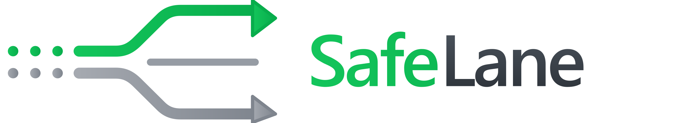
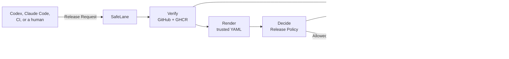

<p align="center">
  
</p>

# SafeLane

<p align="center">
  <strong>Ship on autopilot. Stay in control.</strong>
</p>

<p align="center">
  SafeLane ships reviewed changes on autopilot, while keeping every release inside your rules.
</p>

<p align="center">
  <a href="LICENSE"></a>
  
  
</p>

## The missing safety layer for deployment agents

Deployment agents can plan a release, watch it, and repair it. They should not set their own limits
or hold the keys to production.

SafeLane gives Codex, Claude Code, CI, and humans one guarded path to production. A caller asks to
release one reviewed change and one immutable image. SafeLane checks the evidence, applies the
Release Policy, and allows only the rollout step that the policy permits.

The caller does not send Kubernetes configuration. It does not choose the policy. It does not get
production credentials. If it tries to change the protected application directly, Kubernetes denies
the change.

**The agent can drive the release. SafeLane remains the release authority.**

## One request. One decision. One proof.



1. **Request.** You tell Claude Code, Codex, CI, or a human to release. That caller sends SafeLane
   the application, target, reviewed change, CI result, and immutable image digest. It does not
   send Kubernetes YAML.
2. **Verify.** SafeLane checks GitHub and GHCR. It then renders the Kubernetes objects from an
   operator-owned Release Template. The caller cannot supply or change these objects. SafeLane
   does not scan that YAML.
3. **Decide.** SafeLane records Release Eligibility from the verified GitHub and GHCR evidence. Eligible releases receive the operator's static rollout envelope. Evidence completeness is not risk and does not choose the stages.
4. **Execute and prove.** SafeLane gives the approved image and limits to Argo Rollouts. Argo runs
   the canary. Kubernetes enforces the boundary. SafeLane joins the evidence and outcome into one
   Release Proof.

SafeLane fails closed. Ineligible and indeterminate evidence never becomes permission to release.

## The part SafeLane owns

GitHub already stores reviews and CI results. GHCR already stores images. Argo Rollouts already
runs canaries. Kubernetes already enforces access.

SafeLane does not rebuild those tools. It makes them answer one release question:

> May this exact reviewed image take the next production step under this Release Policy?

SafeLane owns the small layer needed to answer that question:

- one caller-neutral Release Request for agents, CI, and humans;
- independent checks that bind the reviewed change to an immutable image;
- one trusted Rendered Manifest Bundle for hashing and execution;
- a typed eligibility record that, when eligible, attaches the operator's static rollout envelope;
- a constrained Release Controller that cannot act outside those limits; and
- one Release Proof that shows the artifact, decision, execution, and enforced boundary.

Eligibility gates entry. Argo executes. Kubernetes enforces. SafeLane binds the full release
together.

## Install

SafeLane is a Go CLI. With the repository public, install the binary from GitHub:

```bash
go install github.com/AndrewMaged814/safelane/cmd/safelane@main
```

That puts `safelane` in `$(go env GOPATH)/bin` (or `GOBIN`). Put that directory on your `PATH`.

Use `@main` until we publish a semantic version tag such as `v0.1.0`. Then `@latest` is the right query.

```bash
safelane init --adapter codex
```

`init` writes local discovery files. It does not start a background agent. Start a new Codex session after it runs.

A `curl | sh` installer needs GitHub Release binaries. We do not publish those yet.

## Try the working slice

SafeLane requires Go 1.26.5 or later.

```powershell
git clone https://github.com/AndrewMaged814/safelane.git
cd safelane
go test ./...
go run ./cmd/safelane release --file testdata/release-evidence.json
```

The command uses the real GitHub and GHCR verification paths. The checked-in request contains
placeholder demo evidence, so SafeLane records the attempt as ineligible or indeterminate. This is the
expected fail-closed result. [`testdata/README.md`](testdata/README.md) lists the values that the live
demo must provide.

## Prototype status

SafeLane is an active DevOpsDays Cairo 2026 hackathon prototype.

**Works now**

- `safelane release` accepts release identity and evidence only.
- SafeLane verifies the merged pull request, independent approval, required CI check, and GHCR
  digest against the real services.
- SafeLane renders the bundle once from the Release Template and hashes every object.
- Every attempt gets a stable Release ID and a stored Release record, including failed or unknown
  checks.
- SafeLane records Release Eligibility. Eligible releases receive the operator's static
  5 → 25 → 50 → 100 envelope; ineligible and indeterminate releases receive none.

**Next**

- add `safelane proof <release-id>` with Artifact and Decision proof.

**Final demonstration**

- patch a pre-created Argo Rollout through the constrained Release Controller;
- progress a healthy canary to 100% using trusted runtime results;
- deny a direct change from the Restricted Caller Identity; and
- finish the Execution and Boundary sections of Release Proof.

See the [progress demonstration](docs/prototype/progress-meeting.md) for the exact build order and the
[open issue map](https://github.com/AndrewMaged814/safelane/issues/31) for current work.

## What SafeLane is not

- **Not a deployment agent.** Any agent, CI job, or human can use the same release interface.
- **Not a YAML scanner.** SafeLane renders the trusted bundle and does not score it.
- **Not a rollout engine.** Argo Rollouts owns workload, traffic, and analysis execution.
- **Not a cluster administrator.** The Release Controller gets only the narrow access needed to
  update the protected Rollout.
- **Not a prompt-only guardrail.** Guidance helps agents find SafeLane. Kubernetes access rules still
  stop a caller that ignores the guidance.

## Repository guide

| Path | Start here for |
| --- | --- |
| [`CONTEXT.md`](CONTEXT.md) | The exact SafeLane vocabulary and product scope |
| [`docs/prototype/release-interface.md`](docs/prototype/release-interface.md) | The Release Request, result, and Release Proof contracts |
| [`docs/prototype/progress-meeting.md`](docs/prototype/progress-meeting.md) | The current demonstration and its finish line |
| [`docs/policy/safelane-policy.yml`](docs/policy/safelane-policy.yml) | Required evidence, optional approval, and the static rollout envelope |
| [`docs/research/`](docs/research) | Prior-art, evidence, and integration decisions |
| [`internal/release`](internal/release) | Release Request, Release Evidence, bundle, and Release types |
| [`internal/orchestrate`](internal/orchestrate) | The shared release path used by every caller |
| [`internal/verify`](internal/verify) | Live GitHub and GHCR evidence checks |
| [`internal/render`](internal/render) | Trusted bundle rendering and content hashes |
| [`cmd/safelane`](cmd/safelane) | The CLI entry point |

## License

SafeLane is available under the [MIT License](LICENSE).
