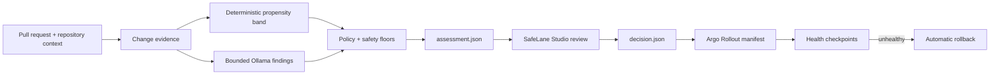

<p align="center">
  
</p>

# SafeLane

<p align="center">
  <strong>Every change gets the rollout it deserves.</strong>
</p>

<p align="center">
  SafeLane turns evidence about a software change into a versioned rollout policy for Argo Rollouts.
</p>

<p align="center">
  <a href="LICENSE"></a>
  
  
</p>

> [!IMPORTANT]
> SafeLane is a pre-alpha hackathon project. The risk policy, contracts, evaluation, and Studio interaction are specified; the runtime scorer and end-to-end rollout integration are not implemented yet. Nothing in this repository is production-ready.

## Why SafeLane?

Progressive delivery tools execute careful rollouts, but their steps are usually fixed before anyone knows what changed. A documentation edit and a permission change can therefore receive the same exposure, checkpoints, and release speed.

SafeLane adds the missing decision layer. It examines the change, records the evidence it could verify, selects a `safe`, `guarded`, or `risky` tier, and resolves that tier into an Argo Rollouts profile. Argo still owns deployment and rollback; SafeLane decides how carefully this particular change should be released.

The design is deliberately conservative:

- local AI may identify code-backed dangers, but it cannot choose the rollout;
- fixed, versioned rules apply every safety floor;
- missing or invalid evidence prevents the Fast profile; and
- a missing, stale, or invalid rollout decision fails closed to Strict.

## How it works



1. **Collect change evidence** — diff size, mapped services, downstream impact, shipping support, and bounded incident candidates.
2. **Find specific dangers** — local `qwen2.5-coder:7b` returns only structured findings with exact code and incident evidence.
3. **Apply deterministic policy** — coarse failure propensity and one-way safety floors produce the final risk tier.
4. **Review the assessment** — SafeLane Studio shows the Main risk, verified evidence, and minimum rollout profile. Guarded and Risky decisions require approval.
5. **Resolve the rollout** — the approved decision contains complete pod stages and health checkpoints for Argo Rollouts.
6. **Release and observe** — Argo advances exposure while Prometheus checks service health and rolls back unhealthy revisions.

## Rollout profiles

The Phase 1 demo uses five replicas and no traffic router. Pod exposure is therefore the honest primary unit; the corresponding Argo weights are recorded alongside it.

| Risk tier | Profile | Exposure | Health behavior |
|---|---|---|---|
| `safe` | Fast | all 5 pods immediately | Kubernetes readiness |
| `guarded` | Guarded | 2 pods → checkpoint → all | service health limit |
| `risky` | Strict | 1 pod → checkpoint → 2 → checkpoint → 3 → checkpoint → all | service health limit |

Risk changes exposure and observation time. It does **not** weaken the service's definition of healthy. The demo policy uses a configurable 5% maximum error rate for Guarded and Strict checkpoints.

## Two artifacts, one exact change

SafeLane separates review evidence from the deployment handoff:

- **`assessment.json` v1** contains the full SHA-bound assessment: evidence status, AI risk findings, incident connections, failure propensity, safety floors, explanations, and review state. Studio reads it.
- **`decision.json` v2** is emitted only after the assessment resolves automatically or receives approval. It contains the final risk result and fully resolved rollout profile. The release workstream reads it.

A new push invalidates the previous approval. The canonical field and lifecycle specification lives in [`contract.md`](contract.md).

## Safety model

SafeLane does not claim to calculate a precise probability of failure.

| Concept | Meaning |
|---|---|
| Failure propensity | A coarse `low`, `medium`, or `high` band derived from deterministic change facts |
| AI risk finding | A bounded warning tied to exact changed code; never rollout authority |
| Safety floor | A rule that can keep or raise rollout care, never reduce it |
| Confidence | Whether every policy-required input was available and understood—not model certainty |
| Risk tier | The final `safe`, `guarded`, or `risky` result after every floor |

Fast-lane eligibility requires positive proof. The absence of an AI warning is not enough.

See [`docs/risk-signals.md`](docs/risk-signals.md) for the complete Phase 1 policy and [`CONTEXT.md`](CONTEXT.md) for the project vocabulary.

## SafeLane Studio

Studio is a small local review and policy tool, not a deployment dashboard. It explains the latest assessment for each pull request and lets a user approve the suggested rollout or choose a more careful valid profile. Argo's own dashboard remains responsible for live rollout controls.

The current Studio is an interaction prototype with in-memory state:

```powershell
python -m http.server 4173 --directory prototypes/safelane-studio
```

Open <http://localhost:4173/?page=changes>.

The prototype never writes policy files and never deploys anything. Its behavior is specified in [`docs/safelane-studio.md`](docs/safelane-studio.md).

## Evaluation boundary

Phase 1 has three explicit gates:

1. **Deterministic conformance** — every policy branch, boundary, invariant, and fail-safer fallback must pass.
2. **Locked Ollama challenge** — 12 authored cases run twice must produce the expected semantic findings, evidence decisions, and tiers without under- or over-triage.
3. **Real-history smoke test** — SafeLane must process a pinned, authentic permission-changing diff from [`roots/trellis`](https://github.com/roots/trellis) through the same assessment path.

These gates test conformance and demo readiness. They do not establish production accuracy, calibration, incident reduction, or causality. The exact scenarios and reporting rules are in [`docs/golden-scenarios.md`](docs/golden-scenarios.md).

## Project status

| Area | Status |
|---|---|
| Domain model and risk semantics | complete |
| Assessment and rollout contracts | complete |
| Rollout profiles and Studio interaction | complete |
| Golden evaluation specification | complete |
| Runtime scorer and policy engine | not started |
| Argo Rollouts integration | not integrated |
| End-to-end demo | not started |

The project is being built for the **DevOpsDays Cairo 2026 DevOps Hackathon**, Track 1: Automate Deployment & Operations.

## Repository guide

| Path | Purpose |
|---|---|
| [`contract.md`](contract.md) | canonical assessment, decision, validation, and handoff contract |
| [`CONTEXT.md`](CONTEXT.md) | canonical SafeLane vocabulary |
| [`docs/input-contracts.md`](docs/input-contracts.md) | exact request, policy, incident, profile-draft, and evaluation-fixture inputs |
| [`docs/risk-signals.md`](docs/risk-signals.md) | failure-propensity and safety-floor policy |
| [`docs/rollout-profiles.md`](docs/rollout-profiles.md) | built-in profiles and custom-profile validation |
| [`docs/safelane-studio.md`](docs/safelane-studio.md) | Studio lifecycle and interaction specification |
| [`docs/golden-scenarios.md`](docs/golden-scenarios.md) | Gate 2 scenarios and acceptance thresholds |
| [`research/risk-engine-evaluation.md`](research/risk-engine-evaluation.md) | evidence behind the evaluation boundary |
| [`research/phase1-reuse-boundary.md`](research/phase1-reuse-boundary.md) | explicit build, adapt, and reject decisions |
| [`prototypes/safelane-studio`](prototypes/safelane-studio) | throwaway interactive Studio prototype |

Research files explain how decisions were reached. When wording differs, the canonical contract and `docs/` specifications win.

## Scope

Phase 1 intentionally excludes production ML training, organization-wide incident ingestion, multi-cluster rollout management, accounts and RBAC, deployment controls in Studio, and a traffic router. SafeLane integrates with Argo Rollouts; it does not replace it.

## Attribution

SafeLane adapts and credits design lessons from [DeployWhisper](https://github.com/deploywhisper/deploywhisper): service-graph traversal, an explicit synthetic-incident format, and safer behavior when context is missing. Phase 1 copies no DeployWhisper source code or sample text.

See [`research/prior-art.md`](research/prior-art.md) for the broader landscape and the limits of SafeLane's novelty claims.

## License

SafeLane is available under the [MIT License](LICENSE).
