# SafeLane — Detailed pre-final implementation plan

**Version 3.2 · revised 2026-08-09**

Target: demo-ready for the earliest possible assessment slot on **2026-08-23**.

This document replaces the 2026-07-31 build plan. Research and accepted decisions remain in Git and
in the canonical domain documents, but the old additive scorer, copied-code plan, dashboard,
backtest, nginx attempt, and day-by-day sequence are not implementation instructions.

## 1. Rebaseline

### 1.1 What changed

The original plan was written before the August 8 assessment lifecycle, strict schemas, human
approval, Studio behavior, and evaluation decisions. It scheduled work that was later rejected while
omitting work that later became mandatory. On August 9 the repository still has no runtime package,
schemas, fixtures, Kubernetes manifests, or integration path.

Version 3.2 keeps that finishing constraint while restoring one product-worthy AI loop. The model
does semantic work ordinary counters cannot: it identifies an endangered code contract, cites the
change, and proposes a bounded verification intent. Normal code validates and renders the proposal,
fixed policy retains authority, and trusted infrastructure executes the safeguard.

The project-level proof is:

```text
bounded change evidence
    -> AI safety case with exact source references
    -> deterministic validation and rollout decision
    -> explicit authorization where required
    -> trusted change-specific verification
    -> real automatic abort
```

The pre-final is not an accuracy benchmark, a production safety claim, or a miniature deployment
platform.

### 1.2 Language used in the build and pitch

- Say **change-scope band** or **policy baseline** when discussing the low/medium/high result.
  Contract v5 removes `failure_propensity` and `risk.score`; there is no implemented consumer that
  justifies carrying the `20`/`50`/`80` projection into a new wire version.
- Say **Fast-eligible under the bounded policy**, not “proved safe.” A false negative can produce a
  faster rollout, so the limitations slide must say the detector is closed-world.
- Say **source reference verified**, not “the AI reasoning was verified.” Normal code can prove that
  a cited diff span exists; it cannot prove the model's interpretation is semantically correct.
- Say **AI supplies meaning; policy supplies authority; Argo supplies enforcement**. The model never
  supplies executable deployment content.
- Say **one canary pod at the first stage** and **potential exposure**. With no traffic router,
  Kubernetes Service routing does not guarantee an exact request or user percentage.
- Say **SafeLane automatically assesses and recommends**. Only Fast resolves automatically;
  Guarded and Risky require explicit approval.
- Novelty wording: **“As of 9 August 2026, our documented review found adjacent products—including
  per-change AI monitoring—but did not find a documented workflow that binds an exact-source AI
  hypothesis through an allowlisted probe contract and SHA-bound decision to Argo enforcement.”**
  This is a dated inference from reviewed public material, not a universal-first claim. Because the
  event also excludes commercial solutions already available in the market, ask the organizer for
  written confirmation that the submitted combination is eligible before freezing the recording.

### 1.3 One-sentence definition of done

> On one nominated laptop, two checked-in, SHA-backed changes to one five-replica service traverse
> the complete SafeLane workflow: the Fast fixture resolves automatically; for a consumer-facing
> `/v1/quote` → `/v2/quote` rename, one bounded Ollama call returns a source-backed safety case,
> normal code binds its verification intent to a trusted compatibility probe, and Studio shows the
> evidence → impact → safeguard → Strict-preview chain. After explicit approval, Argo automatically
> aborts at the first one-pod exposure stage when that canary-only probe observes the predicted
> contract failure. The Rollout reports `Degraded`, the failed ReplicaSet scales down, and the stable
> ReplicaSet serves again. A normal-code receipt binds the prediction, decision, probe, observed
> statuses, and owned Argo resources. The flow succeeds twice from a defined namespace reset and is
> recorded.

## 2. Frozen contract v5

The planning pass reconciled `CONTEXT.md`, contract v5, the ADRs, `docs/input-contracts.md`,
`docs/risk-signals.md`, `docs/rollout-profiles.md`, `docs/golden-scenarios.md`, and
`docs/safelane-studio.md`. Gate 0 signs off those decisions and turns their wire shapes into executable
schemas; it does not reopen product scope.

The incompatible shapes deliberately use new versions: assessment request v2, policy v2, AI response
v2, assessment v2, and decision v3. Release request v1, trusted image/probe catalog v1, and
verification receipt v1 are new. No migration or dual-read path is required because no runtime
implementation exists.

### 2.1 Release authorization fails closed

Assessment uncertainty and release authorization are different concerns.

- Missing or incomplete evidence may raise the minimum rollout care.
- Missing, malformed, stale, identity-mismatched, or unapproved `decision.json` **rejects release**.
- The compiler may return a diagnostic Strict fallback preview, but no normal command renders or
  applies it as though approval existed.
- Only a schema-valid decision for the expected repository, service, full SHA, and policy version may
  cross into the release path.
- All assessment, approval, and release commands share an exclusive local-workspace lock. After new
  request/Git/policy validation succeeds, `assess` removes the prior decision before publishing the
  replacement assessment and writes any new automatic Fast decision last. A crash fails closed.

This replaces the v4 behavior that could synthesize Strict and continue through an undefined
authorization boundary.

### 2.2 One release target

The pre-final supports exactly one directly changed deployable service.

- The policy contains one `release_service`, exactly five replicas, `critical: false`, and no
  downstream dependents.
- Policy v2 rejects any other service topology; criticality and downstream-risk branches are not
  implemented behind unreachable configuration.
- Every demo changed path maps to that service exactly once.
- A request that changes zero or more than one deployable service is outside the pre-final contract
  and produces no decision.
- `decision.json.service` must equal `release_service.name`.
- Multi-service propensity and release behavior remain future design work, not dormant code branches.

Use one repository layout everywhere:

```text
demo/repository/
└── src/demo_api/
    ├── app.py
    └── messages.py
```

The old `src/payouts/**`, `src/workers/payouts.py`, and `config/retries.yaml` examples must not coexist
in build fixtures.

### 2.3 Three SHA-backed revisions

The demo repository contains:

1. **Warm-up** — healthy initial revision. Argo skips canary steps on the first deployment.
2. **Fast fixture** — a direct child of Warm-up that changes bounded response copy inside
   `src/demo_api/messages.py`; every configured check completes and no safety floor fires.
3. **Strict fixture** — a direct child of Fast that renames the consumer-facing
   `@app.get("/v1/quote")` endpoint to `@app.get("/v2/quote")` while leaving Kubernetes readiness on
   a separate `/ready` endpoint. The `breaking_api` finding requires exactly those removed and added
   route spans. The trusted canary analysis still calls `GET /v1/quote`, observes a non-success
   response, and aborts the update.

For each revision, `prepare-demo.ps1` creates a new detached temporary Git worktree at the exact SHA,
asserts both `git status --porcelain --untracked-files=all` and `git clean -ndx` are empty, and uses
that directory as the sole application build context. It builds `safelane-demo:<full-sha>`, sets and
inspects the OCI `org.opencontainers.image.revision` label and Docker image ID, writes a trusted
catalog entry, preloads that exact tag into the single-node kind cluster, and records its normalized
containerd runtime image ID. Every pod template has
the `safelane.dev/source-revision: <full-sha>` label and uses `imagePullPolicy: Never`. This is an
honest local-demo identity mechanism, not a claim that a mutable tag is production-grade provenance.
There is no free-form `--fail-rate` switch in the release path.

### 2.4 Assessment identity and trace

Add these implementation requirements to `assessment.json`:

- `assessment_input_sha256`, the SHA-256 of the exact field-ordered envelope in `contract.md`: request
  v2, canonical policy hash, raw Git-diff hash and byte length, the fixed
  `incident_history:disabled_by_policy` sentinel, trusted-probe catalog hash, and pinned AI
  configuration. It never embeds diff bytes, so invalid UTF-8 remains reproducible;
- `assessment_result_sha256`, the SHA-256 of the immutable canonical assessment result excluding the
  hash field itself and all review/resolution state;
- complete directly changed service facts needed by the policy;
- a deterministic `policy_trace` with the baseline rule and every applied safety floor;
- stable rule IDs and reason templates;
- an always-present `primary_reason`;
- one optional validated `selected_safeguard` linked to an accepted finding. It carries rendered
  impact, review question, remediation, and the resolved trusted probe ID; raw model prose never
  enters the assessment; and
- `rollout_options`, the full normal-code built-in previews allowed for the final tier, ordered from
  minimum to most careful. Studio remains assessment-only and decision v3 copies the selected option.

The policy fixes `incident_history.enabled: false`; assessment evidence status is
`disabled_by_policy`. That deliberate state neither lowers confidence nor blocks Fast eligibility.
There is no incident store, candidate selector, or incident model prompt in the pre-final. Shipping
time is also removed from the retained policy rather than creating a decision-reuse clock.

Minimum trace shape:

```json
{
  "baseline": {
    "rule_id": "scope.low",
    "tier": "safe",
    "reason": "The change affects at most 2 recognized files and 50 changed lines."
  },
  "safety_floors": [
    {
      "rule_id": "finding.breaking_api",
      "minimum_tier": "risky",
      "reason": "An existing HTTP contract was removed or renamed."
    }
  ]
}
```

The canonical rule IDs, exact reason strings, floor ordering, final-tier maximum, and primary-reason
tie-break are frozen in `docs/risk-signals.md`. The primary reason and safety-case display read this
trace and the validated safeguard projection. Studio does not independently recompute either.

### 2.5 Retained policy surface

Contract v5 implements and tests only this table:

| Fact | Deterministic effect |
|---|---|
| Zero or more than one directly changed deployable service | Unsupported assessment; no decision |
| At most 2 files and 50 changed lines | `scope.low` / Safe baseline |
| At least 10 files or 500 changed lines | `scope.high` / Risky baseline |
| Any other supported one-service size | `scope.medium` / Guarded baseline |
| Unknown or incompletely decoded changed path, while one service is still identified | Guarded floor and low confidence |
| Canonical diff exceeds 16,384 UTF-8 bytes | Skip Ollama; Guarded floor and low confidence |
| Ollama timeout, invalid response, unsupported kind, or unverifiable span | Guarded floor and low confidence |
| Verified `breaking_api` finding | Risky floor |

Fast additionally requires exactly the validated demo service, every changed path recognized, a
complete decodable diff within 16,384 UTF-8 bytes, and one valid Ollama response with zero accepted
findings and no safeguard proposal. Incident history is deliberately disabled and shipping time is
not consulted. There are no
multi-service, criticality, downstream, incident, or shipping-window branches; stored-data,
access-control, and retry findings; custom profiles; multi-chunk inference; or numeric risk scores
hidden behind unused configuration.

Every non-Fast assessment with `selected_safeguard: null` receives the policy-owned fallback analysis
after human resolution. This includes high-confidence medium/high scope baselines with a valid empty
AI result as well as low-confidence uncertainty; fallback is not evidence that AI made a prediction.

### 2.6 Evidence-bound AI safety case

Use one bounded diff-span shape in the model response and assessment:

```json
{
  "file": "src/demo_api/app.py",
  "side": "added",
  "line": 18,
  "text": "@app.get(\"/v2/quote\")"
}
```

- `side` is `added` or `removed`.
- A finding has one or two spans so old/new changes and pure deletions are representable. The frozen
  quote-contract fixture requires both its removed and added route spans.
- Normal code verifies the exact `(file, side, line, text)` tuple against the canonical Git diff.
- Duplicate text is disambiguated by side and line number.
- Rename handling inspects both source and destination paths.
- The UI field is named `source_reference_verified`; it does not claim semantic verification.

AI response v2 replaces the earlier finding-only response. It contains `findings` plus one optional
`safeguard_proposal`; the proposal is separate so an invalid proposal cannot erase a separately
verified danger. For the pre-final, `breaking_api` is the only accepted finding kind and the Strict
fixture is the only executable safety case. Its illustrative model output is:

```json
{
  "findings": [
    {
      "kind": "breaking_api",
      "spans": [
        {
          "file": "src/demo_api/app.py",
          "side": "removed",
          "line": 17,
          "text": "@app.get(\"/v1/quote\")"
        },
        {
          "file": "src/demo_api/app.py",
          "side": "added",
          "line": 18,
          "text": "@app.get(\"/v2/quote\")"
        }
      ]
    }
  ],
  "safeguard_proposal": {
    "finding_index": 0,
    "hypothesis_kind": "removed_http_route_unavailable",
    "verification_intent_kind": "preserve_removed_http_route",
    "approval_question_kind": "confirm_callers_migrated",
    "remediation_kind": "retain_removed_route_as_alias"
  }
}
```

The engine uses the contract's two-phase decoder: reject duplicate JSON keys, validate the shallow
two-key envelope, validate its raw finding and proposal independently against the schema `$defs`, then
validate their relationships. A bad proposal cannot invalidate a structurally valid finding. Every
component object rejects unknown fields. The model may select only frozen enums and the one proposal
finding index; it may
not return prose, a route parameter, host, URL, status code, probe ID, image, command, credential,
tier, rollout stage, or approval. After verifying the finding spans, normal code must:

1. prove the proposal refers to that accepted finding and that the finding's two spans have the
   required removed/added roles;
2. parse `GET /v1/quote` and `GET /v2/quote` from the verified decorators;
3. resolve `(service, finding kind, intent kind, removed method, removed path)` against the
   versioned trusted-probe catalog;
4. project a stable finding reference, resolved probe ID, and non-executable catalog/policy preview
   into `selected_safeguard`; and
5. render, from templates and verified values only:
   - impact: “Existing callers of `GET /v1/quote` may receive a non-success response.”
   - question: “Have all callers migrated away from `GET /v1/quote`?”
   - remediation: “Retain `GET /v1/quote` as an alias while introducing `GET /v2/quote`, then
     reassess.”

An unsupported finding still applies the existing uncertainty floor. A valid `breaking_api` finding
survives an invalid or absent safeguard proposal and retains its Risky floor; the proposal is omitted,
confidence is low, and no model-selected probe is recorded. The built-in Guarded/Strict profile may
still use its policy-owned fallback probe. No model output crosses directly into the compiler.

This is one model call, not a planner agent or a second reasoning pass. The AI supplies the semantic
candidate; normal code verifies references and relationships, while policy remains the only rollout
authority.

### 2.7 Evaluation crosses the approval seam correctly

- Policy and AI evaluations assert unresolved or automatically resolved `assessment.json`.
- Guarded/Risky cases do not silently manufacture decisions.
- Decision goldens supply an explicit resolution event and fixed timestamp.
- The real rollout test uses the same explicit approval path as Studio.
- The Trellis case and 24-run challenge are not pre-final gates.

### 2.8 Canonical artifact bytes

One writer owns both JSON artifacts and every golden file:

- UTF-8 without BOM;
- LF line endings;
- declared model field order;
- two-space indentation;
- JSON separators `,` and `: `;
- RFC 3339 UTC timestamps ending in `Z`;
- no NaN or Infinity;
- one final newline.

Tests compare parsed semantics where prose may vary and exact bytes where all inputs, including the
resolution event and fake AI response, are fixed.

### 2.9 Policy and Studio are read-only except approval

Production Studio does not edit `policy.yaml` in the pre-final.

- Built-in Fast, Guarded, and Strict profiles are displayed from the validated policy.
- The only state-changing UI action resolves a current Guarded/Risky assessment with a built-in
  profile at least as careful as its minimum.
- Custom profiles, overrides, policy-version invalidation, and Generate with AI remain in the
  throwaway prototype, not the runtime.
- The real UI drops branch display unless `head_ref` is deliberately added later. SHA is the release
  identity.

### 2.10 Independent release identity

Release request v1 is deliberately small and is created by Ahmed's release command independently of
`decision.json`:

```json
{
  "schema_version": "1",
  "repository": "AndrewMaged814/safelane-demo",
  "service": "demo-api",
  "base_sha": "0123456789abcdef0123456789abcdef01234567",
  "head_sha": "a1b2c3d4e5f6789012345678901234567890abcd",
  "policy_version": "2026.08.3",
  "image_catalog_version": "2026.08.1",
  "image_catalog_sha256": "sha256:...",
  "image_ref": "safelane-demo:a1b2c3d4e5f6789012345678901234567890abcd",
  "image_id": "sha256:...",
  "runtime_image_id": "sha256:..."
}
```

Decision v3 also carries both `base_sha` and `head_sha`. The release command derives repository,
service, both SHAs, and policy version from explicit frozen demo arguments, then looks up the head
image fields in the trusted catalog produced by `prepare-demo.ps1`; it does not copy those values out
of the decision. `RolloutCompiler` is configured with that catalog and rejects any
request/catalog/decision mismatch. It renders the catalogued full-SHA tag and
`imagePullPolicy: Never`.

Image catalog v1 has the exact closed shape in `contract.md`: three application entries bind
repository/service/full source SHA to full-SHA tag, inspected image ID, and equal OCI revision; one
probe entry binds the trusted probe image key/ID/ref. Both entry kinds also record kind's normalized
containerd runtime image ID for receipt comparison. The release request carries the canonical whole
catalog hash. `trusted-probes.yaml` references only the probe image key, so image ownership is not
duplicated across catalogs.

Before compilation, the release adapter reads Argo's current stable ReplicaSet and verifies its
`safelane.dev/source-revision` label equals `base_sha`. A missing label, no stable ReplicaSet, or a
different base rejects the release. This read-only cluster preflight binds the assessed diff to the
revision actually serving; the pure compiler does not pretend cluster state was one of its inputs.

Both `assessment_input_sha256` and `assessment_result_sha256` are copied into decision v3 so the
engine can prove which inputs and exact reviewed result were approved. Every automatic or human
resolution event carries both hashes. `SafeLaneEngine` validates them during resolution. They are not
release-request fields and the compiler does not pretend to have independent copies to compare.

### 2.11 Trusted-probe and Job-analysis contract

Fast has `analysis: null`. Guarded and Strict contain only the resolved trusted Job profile:

```json
{
  "kind": "job_http_contract_probe",
  "probe_id": "demo-api-public-quote-v1",
  "catalog_entry_sha256": "sha256:...",
  "selection_source": "ai_safeguard",
  "attempts": 3,
  "interval_seconds": 10,
  "failure_allowance": 1,
  "request_timeout_seconds": 2,
  "active_deadline_seconds": 45
}
```

The versioned trusted-probe catalog is a shared, read-only integration contract. Its only pre-final
entry binds:

```text
breaking_api + removed_http_route_unavailable + preserve_removed_http_route
    + demo-api + GET /v1/quote + expected 200
    -> demo-api-public-quote-v1
```

`SafeLaneEngine` may resolve that entry only after deriving the hypothesis, method, and path from the
verified safety case and removed span. Policy v2 also names the same entry as the conservative
fallback for every resolved non-Fast assessment with `selected_safeguard: null`, including
baseline-only scope cases. The compiler independently verifies the probe ID and canonical
catalog-entry hash, then reads only compiler-owned execution fields: canary-Service DNS name,
expected status, and probe image key. It resolves that key and inspected image identity through image
catalog v1; retry and deadline settings arrive already resolved in the decision. A wrong service,
method, path, image key, hash, or unknown probe rejects before manifest output.

`selection_source` is assigned by normal code as `ai_safeguard` or `policy_fallback`; it is never
model output. The receipt may say the AI prediction was observed only for `ai_safeguard`.

Neither a decision nor Ollama can supply a host, URL, image, shell command, credentials, or arbitrary
probe parameters. The pre-final compiler accepts only `null` or this one
`job_http_contract_probe` kind and inserts the analysis after every non-final Guarded/Strict pod
stage.

The rendered Job sets `restartPolicy: Never`, `backoffLimit: 0`, and the decision's frozen
`activeDeadlineSeconds: 45`. Its container—not the Argo provider—always performs all
three requests, ten seconds apart, with a two-second timeout, then exits nonzero when more than one
request failed. `attempts` is therefore an exact count. A nonzero container exit makes the Job and
AnalysisRun fail; Job startup failures such as `ErrImagePull` are inconclusive and must never be
presented as an automatic abort.

### 2.12 Verification receipt

The release adapter writes one small `verification-receipt.json` after an analysis-bearing rollout
reaches a terminal state. Fast has no prediction/Job and writes no receipt. This is evidence output,
not a deployment input, a new handoff, or a Studio data source. It binds:

- assessment-result, decision, release-request, and image-catalog hashes;
- base and head SHAs;
- probe ID and catalog-entry hash;
- normal-code selection source;
- the deterministic hypothesis kind;
- schema-valid probe-result-v1 observations and probe-container exit code;
- the decision/release-request annotations on the exact Rollout;
- equal Rollout metadata/observed generations, Rollout UID, and every ordered
  AnalysisRun → Job → probe-Pod UID/owner UID;
- each AnalysisRun completion timestamp and its ordering before any analysis-triggered abort;
- a probe-time canary Service/EndpointSlice → head ReplicaSet/pod snapshot plus actual application and
  probe runtime image IDs matched to image catalog v1;
- Job, AnalysisRun, and Rollout terminal fields, including `abort`, `abortedAt`, and the exact
  Progressing condition;
- stable and current ReplicaSet source-revision labels; and
- a deterministic verdict: `prediction_observed_and_update_aborted`, `prediction_not_observed`, or
  `inconclusive`.

The verdict-discriminated schema and exhaustive truth table live in `contract.md`. The positive
verdict additionally requires enough actual non-200 HTTP responses to exceed the failure allowance,
Argo v1.9.1's `Progressing=False` / `RolloutAborted` condition message containing `Step-based analysis
phase error/failed`, non-null `abortedAt`, a preceding linked failed AnalysisRun, and
`abort_origin: analysis_failure`. Timeouts/connection errors do not prove the HTTP hypothesis; “not
observed” requires all HTTP 200. Policy fallback, mixed evidence, an external/unknown abort, startup
failure, or any missing/mismatched field is `inconclusive` with the contract's closed reason.
`run-demo.ps1` renders the receipt as a short terminal chain and stores its canonical JSON beside the
end-to-end log; there is no second model call and no Studio rollout polling.

## 3. Architecture

The design has two deep modules and one runtime SafeLane-to-release artifact seam. Schemas, fixture
identities, and deployment catalogs are shared build-time contracts. Helper functions remain private
implementation details.

```mermaid
flowchart LR
    A["Git worktree + request + frozen policy"] --> B["SafeLaneEngine.assess"]
    R["Ollama: finding + safeguard proposal"] --> B
    B --> C["assessment.json: validated safety case"]
    B -->|"Fast: engine resolves automatically"| H["decision.json"]
    C -->|"Guarded or Risky"| F["Studio approval"]
    F --> G["SafeLaneEngine.approve"]
    G --> H
    H --> I["RolloutCompiler.compile"]
    I --> J["complete manifest bundle"]
    J --> K["lint + server dry-run + one apply"]
    K --> L["Argo + trusted compatibility Job"]
    L -->|"Job failed"| M["Update auto-aborted; Rollout Degraded"]
    M --> N["deterministic verification receipt"]
```



### 3.1 `SafeLaneEngine`

Interface:

```python
engine.assess(worktree, request_path, assessed_at) -> AssessmentArtifacts
engine.approve(current_assessment, human_event) -> ResolvedArtifacts
```

`AssessmentArtifacts` always contains the assessment and contains an automatic decision only when
the engine itself establishes Fast eligibility. `assessed_at` comes from the CLI boundary; its same
value becomes the automatic event's `resolved_at`, which makes fixed-clock tests deterministic.
Adapters never decide whether automatic resolution is allowed.

The module hides request/policy validation, Git normalization, path mapping, the single-diff byte
limit, model calls, span and proposal-relation verification, trusted-probe resolution, deterministic
safety-case rendering, change-scope baseline, safety floors, profile resolution, and artifact
serialization.

Interface invariants:

- Git, not caller metadata, owns counts, paths, line numbers, and patch text.
- AI candidates may keep or raise rollout care; they never lower it.
- AI supplies semantic enums, exact source-span candidates, and one bounded finding index. Normal
  code verifies those candidates and supplies prose, probe identity, and every executable value.
- A bad safeguard proposal cannot erase a separately verified `breaking_api` finding.
- Adding uncertainty or a verified danger never lowers the tier.
- Fast requires every bounded precondition, not merely an empty finding list.
- A Guarded/Risky assessment emits no decision without an explicit resolution event.
- A successful replacement assessment invalidates any prior decision before it becomes current.
- A decision matches the assessment repository, PR, base/head SHAs, input hash, result hash, and
  policy version.
- Safe/Fast/automatic/null-analysis, Guarded/(Guarded or Strict)/human/policy-fallback analysis, and
  Risky/Strict/human/(AI-selected or fallback) analysis are the only authorization combinations.
- Only built-in profiles exist in the pre-final runtime.

Error modes:

- invalid request, policy, repository identity, Git range, or artifact schema: typed command error,
  no artifact;
- over-budget diff, Ollama timeout, invalid response, or unsupported span: valid low-confidence
  assessment with the documented Guarded floor;
- stale assessment, wrong policy/input hash, or faster selection: resolution error, no decision.

### 3.2 `RiskFinder` port

Interface:

```python
risk_finder.find(canonical_diff) -> AiAttempt
```

Adapters:

- pinned Ollama adapter for the demo;
- deterministic fake adapter for engine tests.

This is a real seam because Ollama is external and tests need a second adapter. Prompt assembly,
transport status, and model metadata stay behind it. Duplicate-key rejection plus two-phase
AI-response-v2 envelope/component decoding stay inside the engine so real and fake adapters have the
same semantics. The engine
calls it once only when the canonical diff is at most 16,384 UTF-8 bytes; there is no truncation,
chunking, retry, best-of selection, or follow-up call. Span, relation, template, and trusted-probe
verification remain inside `SafeLaneEngine`.

Git and the local filesystem do not get ports. Tests use real temporary Git repositories and
directories.

### 3.3 `RolloutCompiler`

Interface:

```python
compiler.compile(decision_bytes, release_request_bytes) -> ReleasePlan | Reject
```

The compiler is configured with the trusted image and probe catalogs plus a fixed deployment catalog. It owns
decision/release-request validation, authorization and independent identity comparisons, catalog
lookup, the one-service/five-replica constraint, pod-to-weight validation, Job-profile validation,
and translation of the already resolved profile into a complete bundle. It performs no Docker,
network, or kubectl calls.

Invalid, absent, stale, unapproved, dishonest-weight, or wrong-image input returns `Reject`. It never
maps tier to profile; `decision.json` already contains the complete resolved lane.

A thin PowerShell adapter then runs exactly:

1. read the current stable ReplicaSet label and compare it with release-request `base_sha`;
2. compile and write the Rollout resource and complete bundle to a temporary directory;
3. `kubectl argo rollouts lint -f <rollout.yaml>` for the Rollout resource;
4. `kubectl apply --dry-run=server -f <complete-manifest.yaml>` for the whole bundle;
5. one state-changing `kubectl apply -f <complete-manifest.yaml>`.

No patching and no `kubectl argo rollouts set image` exist in the workflow.

### 3.4 Studio and CLI

They are adapters over `SafeLaneEngine`, not policy owners.

Studio implements only:

- one current assessment view;
- tier, primary reason, exact removed/added spans, and policy trace;
- one linear safety-case card: AI-proposed impact → source-reference ledger → SafeLane-selected trusted
  probe → resolved built-in rollout stages;
- the deterministic approval question and bounded remediation suggestion;
- **Approve selected rollout** (rendered as **Approve Strict rollout** for the risky fixture);
- resolved state and the resulting artifact path.

The labels must distinguish **AI proposed**, **2/2 source references verified**, and **trusted probe
selected by SafeLane**. The Fast view invents no failure hypothesis or safeguard. Guarded and
Risky-with-rejected-proposal states show the trace, available verified evidence, low confidence, and
policy fallback notice without rendering rejected proposal values. Studio reads the assessment's
normal-code probe preview rather than loading catalogs. Studio does not
collect an answer to the question, generate a patch, poll Argo, or display the post-run receipt.

The JavaScript never reimplements safety comparisons. The existing prototype supplies visual style,
not runtime logic. An approval request carries the expected assessment ID, head SHA, input hash, and
result hash. The server loads the current assessment itself, compare-and-swaps all four values, and
only then calls `approve`; it never resolves a client-supplied assessment. It atomically replaces the
resolved assessment first and atomically creates or replaces `decision.json` last, so the decision is
the authorization commit point.

The CLI surface is deliberately small:

```text
safelane assess  --worktree ... --request ... --assessed-at ... --output ...
safelane studio  --workspace ...
safelane verify  --assessment ... | --decision ...
```

For Fast, `assess` uses the same two-file commit protocol as human approval: atomically replace the
resolved assessment first, then atomically create or replace the engine-created decision last. No
filesystem operation is assumed atomic across both files. Human approval exists only through the
current-workspace Studio endpoint in the pre-final, so a standalone command cannot bypass its
compare-and-swap.

## 4. Demo compatibility adapter

### 4.1 Locked adapter: inline Job analysis

Argo Rollouts supports Job-backed analysis. The AnalysisTemplate launches one Kubernetes Job against
the canary ReplicaSet for the current update through `canaryService`. Its pinned, preloaded container
implements the three-request loop defined in section 2.11. The Job sets `restartPolicy: Never`,
`backoffLimit: 0`, and the frozen `activeDeadlineSeconds: 45`; Gate 1 must prove that budget works on
the nominated laptop. These controls prevent Kubernetes' default retry behavior from extending
the demo by minutes.

For the Strict fixture, `GET /v1/quote` returns 404 because the canary revision renamed it while the
stable revision continues serving it. Kubernetes readiness remains green on the separate `/ready`
endpoint, proving that change-specific rollout analysis caught a client-contract regression rather
than a pod-startup failure.

This removes Prometheus installation, discovery, relabeling, empty-vector behavior, load generation,
and scrape warm-up from the critical path while preserving a real automatic Argo abort. Prometheus
is post-pre-final work, not an alternative implementation branch.

### 4.2 Exact outcome language

The integration test must observe a real nonzero probe-container exit, Job `Failed`, AnalysisRun
`Failed`, Argo automatically aborting the update, and the Rollout reporting `Degraded`. Argo scales
the failed ReplicaSet down and the stable ReplicaSet up, so the stable revision serves again; it does
not rewrite the desired Rollout spec to the prior image. Do not call that a completed rollback or a
Healthy Rollout. A Job that never starts is inconclusive and fails the gate.

Official references:

- [Argo Rollouts Job analysis](https://argo-rollouts.readthedocs.io/en/stable/analysis/job/)
- [Argo Rollouts canary Services](https://argo-rollouts.readthedocs.io/en/stable/features/canary/)
- [Argo Rollouts analysis behavior](https://argo-rollouts.readthedocs.io/en/stable/features/analysis/)
- [Kubernetes Job retry controls](https://kubernetes.io/docs/concepts/workloads/controllers/job/)
- [Argo abort behavior](https://argo-rollouts.readthedocs.io/en/stable/getting-started/#4-aborting-a-rollout)

## 5. Vertical implementation slices

Every slice ends in a demonstrable path through a public interface. Do not build all parsers, then
all rules, then all UI.

### Slice 0 — decision lock and machine

**Owners:** both · **target:** 10 Aug

The planning pass has already reconciled the normative documents. Keep this gate small enough to
finish in one day:

- sign off `CONTEXT.md`, contract v5, ADRs, `docs/input-contracts.md`, `docs/risk-signals.md`,
  `docs/rollout-profiles.md`, `docs/golden-scenarios.md`, and `docs/safelane-studio.md` without
  rediscovering product scope;
- freeze all wire-version names, retained rules, AI safety-case enums, trusted-probe binding, Job
  profile, receipt shape, release-request shape, and local image identity mechanism;
- create only decision-v3 and release-request-v1 schemas plus one hand-written schema-example
  Fast/Strict pair using syntactically valid placeholder identities; these are not frozen demo artifacts;
- create `docs/env-check.md` naming one demo laptop and its exact tool/model versions;
- start Docker, install kind and the pinned Argo plugin, and verify every version; and
- send the organizer written questions about the commercial-solution restriction and presentation
  duration.

Pass: both owners validate the same schema-example artifacts; Strict includes a human event bound to
both assessment hashes; wrong base/head SHA, service, policy, image, invalid schema, absent decision,
and unresolved decision are all written as rejection cases; the nominated machine passes the
environment check.

### Slice 1 — infrastructure kill shot

**Owners:** Ahmed infrastructure; Andrew fixture source · **target:** 11 Aug

Before polishing the compiler, prove the most failure-prone dependency with a hand-written Strict
manifest. Create the complete linear Warm-up → Fast → Strict Git history—where Strict renames
`/v1/quote` to `/v2/quote`—before freezing any SHA, build and catalog all three inspected images, pin and preload the
compatibility-probe image, install Argo v1.9.1, and add the stable/canary Services, AnalysisTemplate,
and five-replica Rollout. In parallel, Andrew creates the assessment-request, policy, AI-response,
assessment, and receipt schemas plus fake Fast/Strict inputs and goldens. Andrew also checks in the
evaluation-only additive-route canonical diff, hash, manifest, and expected empty normalized result;
it gets no Git demo revision or image. Ahmed freezes the image catalog, trusted-probe, and
probe-result schemas/models alongside the cluster work.
After all SHAs and catalog identities are frozen, both owners regenerate and validate the exact
hand-written Fast/Strict decision and release-request pair. The Strict bundle carries hashes from that
Slice-1 pair so the later receipt observer validates the same causal binding as the compiler will emit.

`reset-demo.ps1` refuses to run unless the current context is exactly `kind-safelane`; it deletes and
recreates only the literal `safelane-demo` namespace, reapplies prerequisites and the warm-up
revision, then waits for five Ready stable pods. Every counted run starts there.

Pass twice from reset:

- the hand-written Fast manifest promotes first and its full SHA becomes the observed stable base;
- the first Strict stage contains one canary pod and `canaryService` selects only that ReplicaSet;
- the stable and canary pod templates expose their exact source-revision labels;
- readiness remains green on `/ready`, while the preloaded Job calls `GET /v1/quote`, records 404,
  and terminates nonzero with `backoffLimit: 0`;
- the Job and AnalysisRun are `Failed`, Argo automatically aborts the update, the Rollout reports
  `Degraded`, the failed ReplicaSet scales down, and the stable ReplicaSet serves again; and
- the measured reset-to-outcome duration fits the provisional live-demo budget.

Parallel exit condition: assessment-request v2, policy v2, AI-response v2, assessment v2,
image-catalog v1, trusted-probes v1, probe-result v1, and receipt v1 schemas/models validate the frozen
Fast/Strict fake artifacts before Slice 2 begins.

### Slice 2 — walking skeleton and full handshake

**Owners:** Andrew engine; Ahmed compiler · **target:** 12 Aug

Use the already frozen revisions, schemas, canonical policy, trusted catalogs, and goldens. Add fixed
resolution events and expected decisions/release requests. Use a fake `RiskFinder` that returns no
finding/proposal for Fast and the complete typed safety case for Strict, then cross the real public
interfaces. This slice wires public interfaces; it does not discover wire shapes.

Pass:

- `assess` returns an assessment plus automatic Fast decision for the Fast fixture;
- Strict produces a separately verified `breaking_api` finding, a validated safeguard proposal, and
  the expected trusted probe binding; `approve` alone creates its Strict decision;
- both decisions compile from independently created release requests into complete bundles;
- automatic and human events carry the exact input and result hashes they resolve;
- invalid or unapproved input rejects before manifest output or kubectl;
- exact fixed inputs produce canonical bytes agreed by both owners; and
- no helper interface is exposed merely for tests.

### Slice 3 — real Git evidence and policy

**Owner:** Andrew · **target:** 13 Aug

Replace walking-skeleton internals with real temporary-repository Git ingestion, exact span and
safeguard-relation verification, route extraction, trusted-probe resolution, deterministic safety-case
rendering, the policy trace, monotonic floors, and canonical serialization.

Pass at the `SafeLaneEngine` interface:

- the Fast fixture and two-span quote-contract fixture;
- every row and numeric boundary in the retained policy table;
- 16,384-byte input calls the fake adapter, while 16,385 bytes skips it and applies the Guarded floor;
- a span with wrong file, side, line, or text rejected;
- unknown proposal fields/enums, bad indexes, reversed span roles, an unparsable route, or a route
  that does not match the trusted catalog never produces a selected safeguard or executable model
  value;
- an invalid proposal cannot erase a valid `breaking_api` finding or its Risky floor;
- adding uncertainty or danger never lowers tier;
- `disabled_by_policy` incident evidence does not lower confidence or block Fast; and
- a second model result for the same input produces a distinct result hash when reviewed content
  differs, while fixed inputs and fake AI output produce byte-identical artifacts.

### Slice 4 — live Ollama

**Owner:** Andrew · **target:** 14 Aug

Implement the one external adapter for a single canonical diff of at most 16,384 UTF-8 bytes. Never
truncate or chunk it. Record the full model manifest digest, prompt hash, response-schema hash,
settings, latency, and raw response.

Pass with one-shot inference and no retry or best-of selection:

- the warmed 7B model returns no accepted finding or proposal for the Fast fixture twice;
- it returns the complete `breaking_api` finding and expected safeguard enums for the quote-contract
  fixture twice;
- an evaluation-only change that adds `/v2/quote` while retaining `/v1/quote` returns no breaking
  case twice;
- every accepted span validates and both breaking runs resolve to `demo-api-public-quote-v1`; and
- timeout, schema failure, unknown kind, bad spans, and fabricated references all yield
  low-confidence Guarded-or-higher assessments without losing normal-code floors.

Record all six raw observations, model/prompt/schema hashes, settings, latency, and normalized result.
This is a tiny semantic-discrimination and repeatability gate, not an accuracy percentage or the old
24-run benchmark.

### Parallel slice R — receipt observer

**Owner:** Ahmed · **target:** 13–14 Aug

Build receipt evidence collection before final integration:

- on 13 Aug, implement serialization against Andrew's frozen verdict-discriminated receipt v1
  schema, all three truth tables, fake-observer negatives, probe-result-v1 parsing, identity/catalog
  comparisons, generation/timestamp checks, runtime-image comparison, probe-time canary-target
  snapshots, and ownership-reference traversal;
- on 14 Aug, run the observer against the Gate-1 cluster proof and show it selects the exact
  annotated Rollout and its full Rollout → AnalysisRun → Job UID/owner-UID chain, controller abort
  condition, and statuses, then produces the expected receipt; and
- keep this work parallel to Andrew's engine/Ollama slices; it does not change the compiler API.

If this slice is not green by the end of 14 Aug, it triggers the synchronized rebaseline described in
the cut order below; until that rebaseline is committed, the receipt gate is failed rather than
silently demoted.

### Slice 5 — minimal Studio

**Owner:** Andrew · **target:** 15 Aug

Serve the approved visual shell from one local Python process. The server loads a fixed workspace and
exposes narrow endpoints for the current assessment and approval. File writes are atomic.

Pass:

- Fast shows resolved automatically;
- Risky shows the causal chain, both source spans, **2/2 source references verified**, deterministic
  impact, SafeLane-selected trusted probe, approval question, bounded remediation, Strict stages, and
  unresolved state;
- approval compare-and-swaps assessment ID, SHA, input hash, and result hash, calls
  `SafeLaneEngine.approve`, writes resolved assessment then the exact decision, and changes the page
  to Resolved;
- a stale-page approval is rejected; and
- there is no policy/profile mutation in production UI.

### Slice 6 — compiled end-to-end proof

**Owners:** both · **target:** 16–17 Aug

Connect real decisions to the proven deployment path. The adapter lints the Rollout file, server
dry-runs the complete bundle, then applies it once.

Pass twice from the defined namespace reset:

- warm-up establishes stable state;
- Fast promotes without an analysis step and becomes the stable revision;
- before each release, the adapter proves the stable ReplicaSet source label equals decision/request
  `base_sha`;
- the subsequently approved Strict decision creates one canary pod and the canary-only Job;
- the trusted Job records the predicted 404 responses; a real nonzero probe exit yields
  `AnalysisRun Failed`; Argo automatically aborts the update and the Rollout reports `Degraded`;
- the stable ReplicaSet serves again while the desired spec remains visibly failed; and
- a canonical verification receipt binds the prediction, decision, probe, observed statuses, Argo
  outcome, and revision identities; and
- all commands and failures are captured in `docs/e2e-log.md`.

### Slice 7 — presentation and freeze

**Owners:** both · **target:** 18–22 Aug

| Date | Deliverable |
|---|---|
| **18 Aug** | Freeze commands, fixture SHAs, catalog, manifests, one-page runbook, and dated prior-art/eligibility due diligence. Record any organizer answer. If duration is unanswered, prepare both 10- and 20-minute run sheets; if eligibility is unanswered, Andrew records an explicit submit/no-submit decision against the public rule before recording. |
| **19 Aug** | Record the eight-minute backup demo; produce the first English deck. Feature freeze. |
| **20 Aug** | Rehearsal 1 on the actual call software; repair only correctness or timing failures. |
| **21 Aug** | Buffer and non-substantive narrative cleanup: README, abstract, Q&A, and attribution. |
| **22 Aug** | Rehearsal 2, verify backup playback, freeze laptop state and printed run sheet. |

## 6. Test strategy

The interface is the test surface.

### 6.1 `SafeLaneEngine`

Use real temporary Git repositories and fake `RiskFinder` adapters. Test:

- the two demo revisions;
- every retained policy boundary;
- monotonicity and Fast preconditions;
- wrong, missing, or incomplete two-span evidence;
- missing/extra proposal fields, unsupported enums, bad proposal finding index, invalid span tuples, reversed route sides,
  dynamic routes, and trusted-catalog mismatches;
- deterministic hypothesis, approval-question, and remediation rendering from verified spans;
- preservation of a valid Risky finding when its safeguard proposal is rejected;
- engine-owned automatic resolution versus explicit human approval;
- stale base/head SHA, input hash, result hash, or policy resolution rejection;
- approved A → unresolved replacement B removes A's decision and rejects a later A release;
- high-confidence medium/high baseline assessments with policy-fallback resolution;
- canonical output bytes.

Do not preserve separate unit suites for private Git reader, mapper, verifier, or rule helpers once the
engine tests cover their observable behavior.

### 6.2 Ollama adapter

Contract-test the Fast, breaking rename, and additive-route fixtures twice each plus deterministic
invalid-response paths. Keep raw responses and exact pins. Six observations are reported as raw
fixture evidence, never an accuracy rate. The 12-case challenge remains final-round work.

### 6.3 `RolloutCompiler`

Golden-test Fast, Guarded, and Strict manifests. Reject:

- absent or invalid decision;
- unresolved or unapproved decision;
- wrong repository, service, base/head SHA, or policy across independently produced inputs;
- release image reference, build image ID, or runtime image ID absent from or mismatched with the trusted catalog;
- every invalid tier/profile/resolution/analysis authorization combination;
- dishonest replica/weight pairs;
- unknown Job kind, probe ID, catalog-entry hash, or non-frozen Job settings;
- a known probe whose service, method, path, or expected status does not match the trusted catalog;
- any decision-supplied URL, image, or command;
- any profile other than the three built-ins;
- any router other than `none`.

### 6.4 Real integration

Two runs, each beginning with the defined namespace reset, prove:

```text
reset -> warm-up -> Fast decision -> compile/lint/server-dry-run/one apply
-> promotion without analysis -> verify Fast is stable base -> approved Strict decision
-> compile/lint/server-dry-run/one apply
-> one canary pod -> trusted GET /v1/quote probe observes 404 -> probe exits nonzero
-> Job/AnalysisRun Failed -> update auto-aborted -> Rollout Degraded
-> failed ReplicaSet down -> stable ReplicaSet serving -> bound verification receipt
```

This is the only test that supports the stage claim that the rollout really aborted.

## 7. Demo flow

Provisional 20-minute budget pending organizer confirmation: **5 minutes pitch · 8 minutes demo · 7
minutes Q&A**. If no duration answer arrives, also freeze a 10-minute version with a two-minute
problem/safety opening and the same eight-minute demo; Q&A then follows the organizer. The
[published event criteria](https://www.devopsdays.org.eg/hackathon) are innovation, practical impact,
implementation, usability, and presentation; DORA evidence is optional.

1. **Problem and idea — 60 s.** Static rollout policy treats unlike changes alike. SafeLane turns
   bounded change evidence into how carefully Argo exposes one specific revision.
2. **Safety design — 60 s.** “AI supplies meaning; policy supplies authority; Argo supplies
   enforcement.” AI returns only a typed finding, exact source-span candidates, one bounded finding
   index, and semantic enums. Normal code verifies the references, renders the safety case, and
   resolves the trusted probe; missing evidence cannot create Fast.
3. **Nearest prior art — 30 s.** [Firetiger's per-change monitoring](https://www.firetiger.com/solutions/verify-ai-generated-code),
   Akuity Promotion Advisor, Meta risk gating, and DeployWhisper cover adjacent pieces. State the
   dated market-review result and the recorded eligibility disposition; SafeLane's prototype binds
   source evidence to a constrained probe and SHA-bound Argo enforcement.
4. **Honest limitations — 60 s.** Closed-world detector, no calibrated probability, no exact traffic
   percentage, synthetic fixtures, single local service.
5. **Fast change — 60 s.** Assess the copy change; show complete checks, the Fast decision, and
   promotion without an analysis step.
6. **Risky change — 90 s.** Assess `/v1/quote` → `/v2/quote`; show `breaking_api`, both exact diff
   spans, predicted client impact, **2/2 source references verified**, the trusted compatibility
   probe, bounded remediation, and the Strict preview.
7. **Approval — 45 s.** Ask “Have all callers migrated away from `GET /v1/quote`?” In Studio,
   approve Strict. State clearly that this records the rollout plan and does not deploy it.
8. **Artifact contrast — 45 s.** Diff Fast versus Strict decisions/manifests: same service health
   definition, different exposure stages and number of checks.
9. **Real abort — up to 3 min.** Apply once; watch the first canary pod remain Ready while the trusted
   `/v1/quote` probe records 404, then show Job and AnalysisRun failure, automatic abort, Rollout
   `Degraded`, failed ReplicaSet scale-down, and the stable ReplicaSet serving the old contract.
10. **Receipt and close — 30 s.** Print the bound prediction-versus-outcome receipt. “The AI
    understood the endangered contract; policy constrained the safeguard; Argo enforced it.”

The prior-art survey belongs in appendix slides. Do not spend ninety seconds defending five products
before judges have seen SafeLane.

## 8. Risks and pre-decided responses

| Risk | Early test | Response |
|---|---|---|
| Demo machine cannot run kind + Argo | Gate 0 environment check | Stop feature work. Fix the nominated laptop or move the whole demo to one verified laptop; never split live state across two. |
| Ollama misses or over-triages a demo fixture | Slice 4, two runs each | Simplify the fixture/prompt before freeze. If still unstable, Gate 3 fails: do not add a replay adapter. Use only a backup video from an actual successful live run; if none exists, stop claiming live inference. |
| Ollama returns a valid finding but a bad safeguard proposal | Engine negative matrix | Preserve the verified finding and Risky floor, omit the AI-selected safeguard, lower confidence, and use only the policy-owned trusted fallback. Never execute or display rejected model content. |
| Contract drift between owners | Exchange exact fixtures in Slice 2 | Schemas and golden bytes decide. No owner “interprets” a field independently. |
| Job cannot reach only the canary | Test `canaryService` before fault behavior | Fix Service selection first. Do not fall back to probabilistic routing through the normal Service. |
| Probe Job never starts | Slice 1 preloaded-image check | Treat the run as inconclusive, not an abort. Fix image/startup behavior; never raise Job retry limits during the demo. |
| Receipt cannot prove the same decision/probe/revisions caused the outcome | Slice 6 receipt test | Mark the result `inconclusive`; never print “prediction observed.” Keep the raw Argo evidence. |
| Risky source change and runtime fault diverge | Build images from exact SHAs | Reject release-request/catalog tag, label, or image-ID mismatch; no arbitrary fault flag in the release command. |
| Initial revision skips steps | Warm-up revision in every rehearsal | Pre-warm off-camera and assert stable revision before the live sequence. |
| Live cluster fails before call | Full dry run 45 minutes before | Play the Aug 19 recording and say so immediately. |
| Organizer rejects eligibility or uses a shorter slot | Written question at Gate 0 | By 18 Aug, record the answer or the explicit no-response fallback: Andrew makes the eligibility go/no-go call, and both 10- and 20-minute run sheets are ready. |
| Scope begins expanding again | Review the explicit out-of-scope list | New ideas enter a post-pre-final list, never the active sprint. |

### Cut order inside the retained scope

If the team slips after Gate 2:

No cut below is implicit. Before invoking one, both owners must update and version the summary plan,
contract/source documents, definition of done, and golden gates in the same commit. Without that
synchronized rebaseline, taking the cut forfeits pre-final `PASS`.

1. Drop the Guarded manifest golden; keep its policy semantics and rejection behavior.
2. If parallel slice R missed its 14 Aug gate, remove the canonical receipt artifact and retain only
   the deterministic terminal/e2e-log summary.
3. Drop the additive-route model observations, reducing the live gate from six to four; keep the Fast
   and breaking cases twice each.
4. Drop remediation display, then approval-question display; keep the source-bound hypothesis and
   trusted safeguard.
5. Drop non-demo CLI polish.
6. Present a previously recorded successful live run rather than debugging the cluster or model live.

Never cut exact source verification, trusted-probe binding, the SHA-bound decision seam, explicit
approval, real automatic Argo abort, or limitations slide. Those are the product's integrity.

## 9. Expected repository shape

The exact internal file split may change as modules deepen; these are ownership boundaries, not a
mandate for one shallow file per helper.

```text
SafeLane/
├── pyproject.toml
├── policy.yaml
├── schemas/
│   ├── assessment-request-v2.schema.json
│   ├── policy-v2.schema.json
│   ├── ai-response-v2.schema.json
│   ├── assessment-v2.schema.json
│   ├── decision-v3.schema.json
│   ├── release-request-v1.schema.json
│   ├── image-catalog-v1.schema.json
│   ├── trusted-probes-v1.schema.json
│   ├── probe-result-v1.schema.json
│   └── verification-receipt-v1.schema.json
├── src/safelane/
│   ├── engine.py              # SafeLaneEngine and private implementation
│   ├── risk_finder.py         # port, Ollama adapter, deterministic fake
│   ├── artifacts.py           # canonical models and writer
│   ├── cli.py                 # thin adapter
│   └── studio.py              # thin local HTTP adapter
├── studio/
│   ├── index.html
│   ├── app.js
│   └── styles.css
├── demo/
│   ├── repository/            # three frozen commits
│   ├── requests/
│   ├── expected/
│   ├── image-catalog.json      # SHA/tag/image ID/label + pinned probe image
│   └── trusted-probes.yaml     # one source-to-probe binding + execution contract
├── rollout/
│   ├── compiler.py
│   ├── templates/
│   └── k8s/                   # kind, Argo, Services, Job analysis
├── scripts/
│   ├── env-check.ps1
│   ├── prepare-demo.ps1
│   ├── reset-demo.ps1
│   └── run-demo.ps1
└── tests/
    ├── engine/
    ├── ollama/
    ├── compiler/
    └── integration/
```

Use Python 3.12 and `uv`, both already installed. Use PowerShell as the single Windows entrypoint;
`make` is absent and is not part of the plan. The UI uses plain browser assets served by the Python
process—no Node build, React, database, or second application stack.

## 10. Source hierarchy during the build

After Gate 0 lands:

1. `CONTEXT.md` owns vocabulary.
2. Accepted ADRs own hard architectural decisions.
3. Contract v5 and executable schemas own artifacts, authorization, and handoff behavior.
4. Input and risk documents own caller inputs and retained policy rules.
5. `docs/rollout-profiles.md` owns built-in stages and the trusted Job profile.
6. `docs/safelane-studio.md` owns the runtime UI and approval interaction.
7. `docs/golden-scenarios.md` owns retained acceptance fixtures and reporting.
8. This document owns implementation order, scope, gates, and cuts.
9. The prototype owns visual direction only.
10. Research, the abstract, Q&A, brief, and pre-August-9 Git history are explanatory or publishing
   material and never override build behavior.

Before the deck is frozen, rewrite the abstract and Q&A to match the running product. Remove claims
about no LLM, exact traffic percentages, risk-dependent health thresholds, self-learning, DORA
improvement, continuous scores, or being definitively first.
