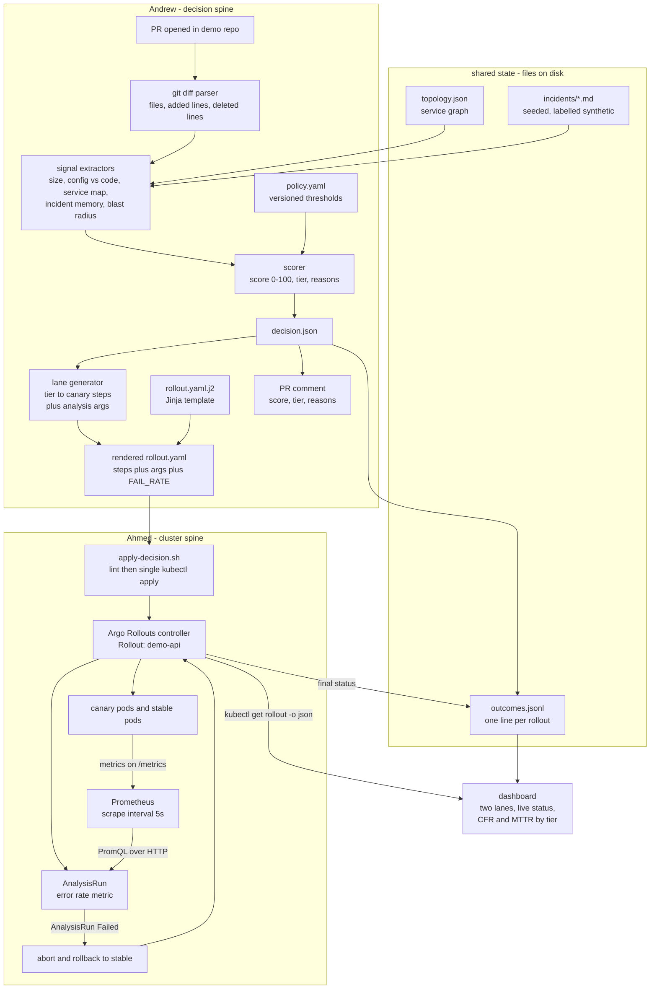
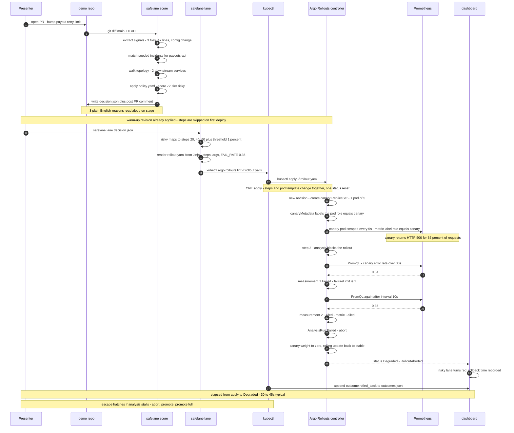
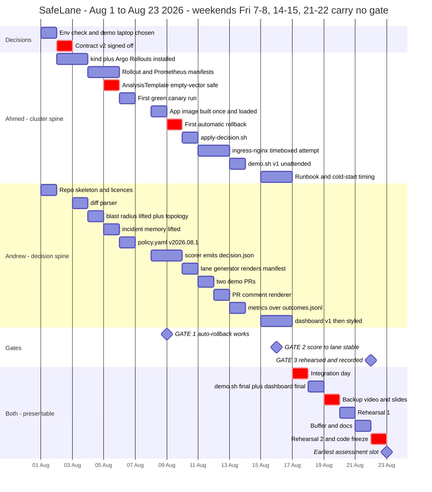

# SafeLane — Detailed Implementation Plan (verified)

**Written 2026-07-31 (Friday).** Target: demo-ready **Sunday 2026-08-23**.
Team: **Ahmed Anany** (DevOps — cluster spine) · **Andrew** (dev — decision spine).

This document supersedes the schedule in `plan.md`. It keeps `contract.md`'s `decision.json`
as the interface, but **two fields in that contract are not achievable as written** — see §1.3.

Every technical claim below is either sourced to an official doc / upstream source file
(URL given) or explicitly marked **unverified**.

> ### Four decisions due Sunday 2 August. Nothing else matters until these are made.
> 1. **Delete "1%" everywhere.** It is not achievable on kind without a traffic router (§1.1
>    FINDING 1). Adopt pod-count framing and the revised tier→lane table (§1.3).
> 2. **`kubectl argo rollouts version` must print on Ahmed's laptop.** This is the go/no-go for the
>    whole build and it is still an open item in `plan.md`.
> 3. **Nominate the demo laptop**, and make its shell the entrypoint. `make` is not installed
>    anywhere on Andrew's machine (§1.1 FINDING 5).
> 4. **Change "patch the Rollout" to "render and apply the Rollout"** in `contract.md`. Patching
>    `steps` while a rollout is aborted **clears the abort** (§1.1 FINDING 3).

---

## 1. Reality check

### 1.1 The bad news first

**Five findings, in descending order of damage.**

---

**FINDING 1 — "rolled out at 1%" is false on the planned setup. This is a stage-killer.**

`plan.md`'s definition of done says the risky PR is *"rolled out at 1%"*. `contract.md` encodes
`{ "set_weight": 1, ... }`. With a kind cluster and **no traffic router**, Argo Rollouts does not
split traffic. It approximates the weight with **replica counts**, and the real split is whatever
kube-proxy's round-robin gives across pods.

Verbatim, from the Argo Rollouts canary docs
(<https://argo-rollouts.readthedocs.io/en/stable/features/canary/>):

> "If the canary Rollout does not use traffic management, the Rollout makes a best effort attempt
> to achieve the percentage listed in the last `setWeight` step between the new and old version."

> "If a user wants to have more fine-grained control of the percentages without a large number of
> Replicas, that user should use the traffic management functionality."

The approximation is `approximateWeightedCanaryStableReplicaCounts()` in
[`utils/replicaset/canary.go`](https://github.com/argoproj/argo-rollouts/blob/master/utils/replicaset/canary.go).
It picks the candidate `(canary, total)` pair minimising `|canary*100/total − desiredWeight|`, with
candidate totals of only `specReplicas` or `specReplicas + 1`. Critically, the floor candidate is
discarded when floor is 0, so **`ceil()` wins and the canary count is never 0 for any non-zero
weight**.

Traced by hand at `replicas: 5`, `maxSurge: 25%`:

| `setWeight` | canary pods | stable pods | real traffic share |
|---|---|---|---|
| 1 | 1 | 5 | ~16.7% |
| 5 | 1 | 5 | ~16.7% |
| 10 | 1 | 5 | ~16.7% |
| 20 | 1 | 4 | 20% |
| 25 | 1 | 3 | 25% |
| 50 | 2 | 2 | 50% |

So the contract's `risky` ladder `1 → 5 → 25 → 50` executes as **1 → 1 → 1 → 2 canary pods**. The
first three steps are visually and behaviourally identical. On a shared screen, three quarters of
the "SafeLane is being careful" narrative shows *nothing happening*, and any judge who knows Argo
Rollouts can say "that's not 1%, that's one pod out of five" — the worst possible moment to be
corrected.

**Granularity is exactly `1/N`.** For `1%` to mean 1% you need **100 replicas**. Not happening on
a laptop.

Two honest exits, both viable:
- **(A) Reframe to pod counts (zero extra infra).** Never say "1% of traffic". Say *"one canary pod
  out of five — about 20% of requests"*, and change the contract's units from percent to an
  explicit exposure step. Costs 0 days.
- **(B) Install ingress-nginx and get real weights.** Argo Rollouts has a **first-class built-in**
  nginx provider — not a plugin
  (<https://argo-rollouts.readthedocs.io/en/stable/features/traffic-management/nginx/>). You author
  only the stable Ingress; the controller creates the canary Ingress and sets
  `nginx.ingress.kubernetes.io/canary-weight` itself. Real proxy-level splitting, independent of
  replica count. Costs ~1.5–2 days including debugging.

**Recommendation: build (A), attempt (B) once, on a fixed timebox, in the Aug 10–13 window.**
Details and the cut-line in §7 Risk 1.

---

**FINDING 2 — the empty-Prometheus-vector path aborts the rollout for the *wrong reason*, and the
error message points at Prometheus, not at your app.**

This is the highest-probability *live* failure, and it looks like a broken product on stage.

If the PromQL query returns an empty vector, `result[0] >= x` raises index-out-of-range inside
`EvalCondition`, and
[`utils/evaluate/evaluate.go`](https://github.com/argoproj/argo-rollouts/blob/master/utils/evaluate/evaluate.go)
returns **`AnalysisPhaseError`**, not `Failed`:

> `could not evaluate successCondition "result[0] >= 0.95": metric result is nil or empty: no data returned from the metric provider`

Errors count against **`consecutiveErrorLimit` (default 4)**, not `failureLimit`. So four empty
scrapes abort the rollout with a message about the metric provider. The rollback *happens* — for
entirely the wrong reason — and the CLI output on screen says "no data returned".

Three things make an empty vector likely on a fresh kind cluster:
1. Prometheus' default `scrape_interval` is **1 minute**
   (<https://prometheus.io/docs/prometheus/latest/configuration/configuration/>). `rate(...[1m])`
   with 1m scrapes has ~1 sample in the window → no result for 2+ minutes.
2. `rate()` needs **≥2 samples in the range window**. Window must be ≥ 2 × scrape_interval.
3. The query has to be **scoped to the canary pods only**, and canary and stable pods are otherwise
   label-identical. Whichever label you scope on — `role` from `canaryMetadata` (recommended, §3.6)
   or `rollouts_pod_template_hash` — it must be **relabelled into a real metric label** by the
   Prometheus scrape config. A missing relabel silently yields an empty vector *every time*, and
   there is nothing on screen to tell you that is what happened.

Mandatory mitigations, all three: `scrape_interval: 5s`; `or vector(0)` in every PromQL branch plus
a `len(result) > 0 &&` guard in the condition; and the relabel rule. See §6.

---

**FINDING 3 — `contract.md`'s handoff mechanism ("patch the Rollout manifest") is the one that can
silently un-abort the rollout on stage. Use full-manifest render + a single `apply` instead.**

`contract.md` says: *"Ahmed's script reads it and emits/patches the Argo `Rollout` manifest, then
applies it."* Patching `spec.strategy.canary.steps` is exactly the sharp edge.

`checkStepHashChange()` in
[`utils/replicaset/replicaset.go`](https://github.com/argoproj/argo-rollouts/blob/master/utils/replicaset/replicaset.go)
compares a hash of the canary steps; any change makes `PodTemplateOrStepsChanged()` return true,
which calls `resetRolloutStatus()` in
[`rollout/sync.go`](https://github.com/argoproj/argo-rollouts/blob/master/rollout/sync.go):

```go
func (c *rolloutContext) resetRolloutStatus(newStatus *v1alpha1.RolloutStatus) {
	c.pauseContext.ClearPauseConditions()
	c.pauseContext.RemoveAbort()              // <-- clears an abort
	...
	newStatus.Canary.CurrentStepAnalysisRunStatus = nil
	newStatus.CurrentStepIndex = replicasetutil.ResetCurrentStepIndex(c.rollout)   // <-- back to 0
}
```

| When you patch `steps` | What happens |
|---|---|
| Rollout **idle / fully promoted** | Status resets, then `currentStepIndex` is set straight to `stepCount` — behaviourally a **no-op**. **This is the only safe window.** |
| Rollout **mid-canary or paused** | `currentStepIndex` → **0**, pause conditions cleared, analysis-run statuses nil'd. Pods are *not* recreated, so on screen the progress bar jumps backwards for no visible reason. |
| Rollout **aborted** | **`RemoveAbort()` fires — the abort is cleared and the rollout resumes toward the bad version.** In a demo whose entire point is "it rolled back", this un-does the proof. |

There is a second trap that compounds it: **mixing `kubectl apply` with `kubectl argo rollouts set
image` silently reverts the image.** Client-side apply keeps
`kubectl.kubernetes.io/last-applied-configuration`; a subsequent `apply` from a manifest holding the
old image makes the three-way merge drop the imperative change. Half an hour of "why did my image go
back", live.

And one more, from the spec reference
(<https://argo-rollouts.readthedocs.io/en/stable/features/specification/>): steps are
*"**Skipped upon initial deploy of a rollout**"* — the very first `apply` goes straight to 100% with
no canary at all. **Every demo run needs a throwaway warm-up revision before the interesting one.**
Discovering that at 20:55 before a 21:00 call would be fatal.

**Fix, adopted throughout this plan:** render the **whole** `Rollout` manifest from a Jinja template
(steps + analysis args + the per-commit fault env var together), `kubectl argo rollouts lint` it,
then **one** `kubectl apply -f rollout.yaml`. One API call ⇒ one reconcile ⇒ one status reset ⇒ no
intermediate state exists for the audience to see. Never `patch` and never `set image` in the same
workflow as `apply`.

---

**FINDING 4 — the calendar is 15 working days, not 22.**

`plan.md` says "22 days from today". The Egyptian weekend is Friday–Saturday. Aug 1–22 2026
contains **7 weekend days**: Sat 1, Fri 7, Sat 8, Fri 14, Sat 15, Fri 21, **Sat 22**.

Two of those are structurally awful:
- **Aug 1 is a Saturday.** Gate 1 does not actually start until **Sunday Aug 2**.
- **Aug 22 — the day the plan reserves for final rehearsal — is a Saturday.** Aug 23, the target,
  is a Sunday: the first working day of that week.

Both people hold full-time jobs. A defensible budget at ~2.5 h per weekday evening and ~5 h per
usable weekend day is **≈70 h per person, ≈140 person-hours total** for everything: cluster, Argo,
Prometheus, scorer, policy, lane generator, dashboard, PR comment, slides, backup video, two
rehearsals. That is the single most important number in this document, and the current plan is not
written against it.

The schedule in §4 treats weekend days as *usable but half-strength* and puts nothing load-bearing
on Fri/Sat.

---

**FINDING 5 — `make` does not exist on the dev machine, so `make cluster` / `make demo` is not a
command anyone can run yet.**

Verified on Andrew's box, 2026-07-31 (Windows 11 Pro 10.0.26200):

| tool | state |
|---|---|
| docker | 29.6.1 installed, **Docker Desktop daemon stopped** |
| kubectl | v1.36.1 client (kustomize v5.8.1 bundled) |
| kind | **not installed** |
| helm | **not installed** |
| make | **not installed** |
| go | **not installed** |
| python | 3.12.10 |
| node | v24.15.0 |
| WSL | `docker-desktop` distro only, **Stopped** |

Ahmed's machine is **unverified** — nobody has confirmed kind runs there, and `plan.md` lists that
as an open item due "this week". It is the go/no-go for the entire build and it is still open.

Consequence: either the entrypoint becomes `./safelane.sh` (Git Bash is present) or everything runs
inside WSL2/Linux. Keep a thin `Makefile` for the demo optics if you like, but the **shell script is
the real artifact** and the demo runs on **one nominated laptop** (recommend Ahmed's), decided
Aug 2, not Aug 20.

### 1.2 What survives from `plan.md`

| Item | Verdict |
|---|---|
| Three-gate structure, riskiest work first | **Survives.** Correct instinct, correctly ordered. |
| `decision.json` as the only interface between two people | **Survives, and is the plan's best decision.** Both tracks are genuinely unblocked. |
| Gate 1 = auto-rollback on a real kind cluster | **Survives, and is achievable.** Verified floor latency for a visible abort is ~18 s, typical 30–45 s, worst ~55 s (§6.4). 90 s is not the constraint. |
| Prometheus AnalysisTemplate | **Survives, and is cheaper than assumed.** kube-prometheus-stack is **not** needed — a bare Prometheus Deployment + ConfigMap + RBAC is enough. Argo talks plain HTTP to `provider.prometheus.address`, no ServiceMonitor, no Operator, no Grafana. |
| Deterministic, versioned policy in one YAML, no LLM | **Survives.** Also the correct answer to "you're just wrapping Argo with an LLM". |
| `confidence: low` always routes guarded | **Survives.** DeployWhisper ships the same posture in `apply_context_uncertainty()` — see §3. |
| Recording a backup video, non-negotiable | **Survives and should move earlier** — to Aug 19, not Aug 22 (a weekend day). |
| Lane generator emits per-change analysis thresholds | **Survives, and is cheaper than assumed.** `{{args.x}}` substitution is applied to the *whole* `Metric` object, not just the query — `ResolveMetricArgs()` in [`analysis/analysis.go`](https://github.com/argoproj/argo-rollouts/blob/master/analysis/analysis.go) marshals `Metric` to JSON, substitutes textually, and unmarshals. So `successCondition: "len(result) == 0 \|\| result[0] <= {{args.error-threshold}}"` works and the per-tier threshold needs no template duplication. **Caveat: keep args in string fields only** — templating an int field like `count` risks an unmarshal error. |
| Custom dashboard for the rollout view | **Partly redundant — cut it.** `kubectl argo rollouts dashboard` exists (`localhost:3100`, `--port`, `--root-path`), shows a list view plus a per-rollout detail view with steps, revisions and AnalysisRuns, and is **interactive**: `ui/src/app/components/rollout-actions/rollout-actions.tsx` ships `RESTART`, `RETRY`, `ABORT`, `PROMOTE`, `PROMOTE-FULL`. It cannot show the risk score, the diff, or why those steps were chosen. **Build only the SafeLane-specific panel** (§7 Risk 5) — roughly a day of UI instead of three. |
| Back-test loop as stretch only | **Survives.** Hold the line. It is 1,400+ lines of work in the one repo that has it. |
| Out-of-scope list | **Survives.** Add three items — see §1.4. |

### 1.3 What contradicts the frozen contract

`contract.md` is frozen but **two things in it are not physically achievable** on the agreed setup.
Both need a joint decision on **Sunday Aug 2**, before either person writes code against them.

| `contract.md` says | Reality | Fix |
|---|---|---|
| `lane.steps[].set_weight: 1` | With basic canary, 1% is unreachable below 100 replicas. At 5 replicas, weights 1/5/10/20 all yield **1 canary pod**. | Rename the field to `exposure_pods` **or** keep `set_weight` but constrain the vocabulary to `{20, 40, 60, 100}` at `replicas: 5` — the only values that are *honest* at that replica count. Add a sibling field `traffic_router: none \| nginx` so the number's meaning is self-documenting. |
| tier→lane table: `risky` = `1 → 5 → 25 → 50` | Executes as 1 → 1 → 1 → 2 pods. Three of four steps are indistinguishable. | `risky` = `20 → 40 → 60` at 5 replicas (1 → 2 → 3 pods): every step visibly moves. `guarded` = `40 → 100` (2 pods → all). `safe` = `100` immediately, unchanged and correct. |
| `analysis.error_rate_threshold: 0.01` vs `0.03` per tier | Achievable, but **not demonstrable**. If the injected fault makes the canary fail ~100% of requests, a 1% and a 3% threshold both trip identically. The demo shows two numbers in a JSON file that produce the same observable outcome. | Either accept it and don't claim the threshold difference is *shown* (recommended), or inject a **~2% error rate** so the risky lane's 1% trips and the guarded lane's 3% does not. That is a great beat and it is **stretch**, not baseline — see §9 cut list. |
| `analysis.interval_seconds: 20`, `failure_limit: 1` | Achievable. Contributes ~40 s to abort latency. | Tighten to `interval: 10s`, `failureLimit: 1` for the demo. `failureLimit: 0` shaves a further ~10 s but removes all debounce — keep 1. |
| `lane.name` ∈ `fast \| guarded` | Fine. Keep. | — |
| `tier` ∈ `safe \| guarded \| risky`; `score` advisory only; `reasons` 1–4 strings; missing decision ⇒ risky/low | All fine and all good design. Keep verbatim. | — |

| Handoff: *"Ahmed's script … emits/patches the Argo `Rollout` manifest"* | **`patch` is unsafe** (FINDING 3): patching `steps` mid-flight resets `currentStepIndex` to 0 and patching while aborted **clears the abort**. | Change one word: **emit, don't patch.** Render the full manifest from a Jinja template, `kubectl argo rollouts lint` it, then a single `kubectl apply -f`. Never mix `apply` with `set image`. |

Everything else in `contract.md` stands. The rest of the handoff mechanics (write to repo root, print
to stdout, schema-fail ⇒ risky) need no change.

### 1.4 Add to the out-of-scope list

- **Service mesh of any kind.** Istio, Linkerd, ambient mode. If real weights are needed it is
  ingress-nginx or nothing (§7 Risk 1).
- **More than one Rollout object.** ingress-nginx allows *"a maximum of one canary ingress per
  Ingress rule"*
  (<https://kubernetes.github.io/ingress-nginx/user-guide/nginx-configuration/annotations/>), so two
  Rollouts sharing a host is a dead end.
- **Argo CD.** Argo *Rollouts* only. They are different products and only one is needed.

### 1.5 Honest probability of a working live demo on 23 Aug

Scored against `plan.md`'s own definition of done — two PRs, trivial ships green, risky rolls back
automatically, dashboard shows both lanes plus CFR by tier.

| Outcome | P |
|---|---|
| **Core demo works live** — real kind cluster, real Argo Rollouts, real Prometheus-driven auto-rollback, scorer→lane→patch wired end to end, *pod-count* framing | **0.72** |
| The above **plus** a dashboard showing two lanes and CFR/MTTR by tier | **0.55** |
| The above **plus** genuine `1%`-class weighted traffic via ingress-nginx | **0.25** |
| **Everything in the current `plan.md` as literally written** (incl. "1%") | **0.10** |
| At least a **recorded backup video** of the full flow to play if live fails | **0.90** — conditional on treating Aug 19 as a hard deadline |

The gap between 0.72 and 0.10 is almost entirely one sentence: *"rolled out at 1%"*. Delete that
sentence and the plan's probability roughly triples. That is the cheapest scope cut available and it
should be made on **Sunday Aug 2**.

Largest single downward driver: **nobody has yet run kind + Argo Rollouts on Ahmed's machine.**
Until that happens (target: Sun Aug 2) every number above is soft.

---

## 2. Architecture

### 2.1 Component and data flow



**The two tracks touch at exactly two files:** `decision.json` (Andrew writes, Ahmed reads) and
`outcomes.jsonl` (Ahmed appends, dashboard reads). Nothing else crosses.

### 2.2 The risky-change demo path, PR open to auto-rollback



---

## 3. Reuse map — DeployWhisper and friends

**Source of truth read for this section:** local clone at
`C:\Andrew\personal\dev\hackathon\devops\deploywhisper`, remote
`https://github.com/deploywhisper/deploywhisper.git`, branch `develop`,
HEAD `5d8b0b17c4dd96b9fd6f67de29ba3299e28e96e2`, released version **v1.3.0** (2026-06-26),
**MIT**, `Copyright (c) 2026 deploywhisper`.

### 3.1 The input-shape mismatch, priced honestly

DeployWhisper's entire analysis core consumes `parsers.base.UnifiedChange`:

```python
class UnifiedChange(BaseModel):
    change_id: str
    source_file: str
    tool: str          # terraform | kubernetes | ansible | jenkins | cloudformation
    resource_id: str   # e.g. "aws_db_instance.checkout", "Deployment/payments-worker"
    action: str        # create | modify | replace | destroy | apply | read | no-op
    summary: str
    metadata: dict
```

That is **one record per infrastructure resource**, produced by parsing an IaC artifact. SafeLane's
input is **one record per changed file in a git diff**. What that costs, module by module:

- **`risk_scorer.py` (869 LOC) — the mismatch is total.** Its two severity matrices are
  `ACTION_BASE_SEVERITY` (`create/modify/replace/destroy/apply/read/no-op`) and
  `CATEGORY_BASE_SEVERITY` (`networking/ingress`, `namespace`, `iam/rbac`, `storage`,
  `addon/config`, `labels/annotations`, `compute/workload`, `data/service`,
  `pipeline/automation`). **Not one of those nine categories is computable from an app-code diff.**
  `_resource_category()` is 100 lines of Terraform/K8s resource-name string matching.
  `_security_flags()` greps for `AmazonS3FullAccess` and `0.0.0.0/0`. There is nothing to salvage
  except the *shape* of the aggregation.
- **`blast_radius.py` (477 LOC) — the mismatch is cheap to bridge.** It only reads
  `change.resource_id` and looks it up in `topology["services"][*]["resource_keys"]`. Swap
  `resource_keys` for path globs and it works unchanged on a diff. **This is the single best reuse
  win in the repo** (§3.3).
- **`incident_matcher.py` (586 LOC) — bridgeable, same trick.** It tokenises
  `source_file + tool + resource_id + summary` into a bag of words and does Jaccard overlap against
  incident markdown. A git path tokenises just as well as a resource id.
- **`interaction_risk.py` (210 LOC) — dead.** It exists solely to detect *cross-IaC-tool* pairs
  (`{"terraform","kubernetes"}`, `{"ansible","jenkins"}`). SafeLane has one tool: git.
- **`env_classifier.py` — it is an empty file.** One line: `"""Environment classifier placeholder."""`
  Do not plan around it.

**Net:** the mismatch costs you the 869-line scorer (which you were always going to write yourself
— it is the project's actual idea) and buys you a working blast-radius walker, an incident matcher,
and a proven incident-file format. That is a good trade.

### 3.2 Reuse map table

Rough LOC are measured (`wc -l`) for source files, estimated for SafeLane's own output.

| SafeLane component | Verdict | DeployWhisper reference | What to do | SafeLane LOC |
|---|---|---|---|---|
| **Risk scorer — feature extraction from diff** | **SKIP** | `analysis/risk_scorer.py` `_resource_category`, `_security_flags`, `_environment` (869 LOC total) | Nothing to take. Its features are Terraform/K8s resource semantics. Use **PyDriller** instead (§3.5) or hand-roll `git diff --numstat`. | ~90 |
| **Risk scorer — score aggregation formula** | **LEARN** | `risk_scorer._overall_score()` (L754-784) + `SEVERITY_SCORE` (L38-43) | Mimic the shape, write fresh (~25 lines). Their formula: `min(100, top_contributor + Σ(secondary × decay) + cascade_bonus + interaction_bonus)`, decay 0.20 crit / 0.12 high / 0.03 else, `+12` if ≥2 high-or-critical. Anchors: `low 18, medium 42, high 72, critical 92`. Worth mimicking because it avoids the naive-sum failure where ten trivial files outscore one dangerous one — SafeLane will hit that bug on day one otherwise. | ~25 |
| **Tier / confidence default-safe posture** | **LEARN** | `risk_scorer.apply_context_uncertainty()` (L173-210) | This is `contract.md`'s `confidence: low ⇒ guarded` rule already implemented by someone else: if `context_score < 0.7` set `insufficient_context`, downgrade `go → caution`, raise `low → medium`, prefix the headline with `INSUFFICIENT CONTEXT:`. Copy the *control flow*, not the code (it depends on `evidence.models.ContextCompleteness`, a 40-field pydantic model — a trap). | ~20 |
| **Blast radius** | **LIFT** | `analysis/blast_radius.py` `compute_blast_radius()`, real logic **L400-452** (~55 of 477 LOC) | Take the BFS: build `resource_to_service_ids` + `upstream_by_service_id`, seed a `deque` with directly-matched services at `depth 0`, walk `downstream`, emit `ImpactNode(service_id, label, depth, dependencies, owners)`, then `direct_count = depth==0`, `transitive_count = depth>0`. Drop the other ~420 lines: they are pydantic `model_validator`s and topology-freshness/`context_limitations` bookkeeping SafeLane does not need. **Adapter:** rename `resource_keys` → `path_globs` and match with `fnmatch` on the diff's file paths. | ~70 |
| **Topology file format** | **LIFT** | `data/topology/service_topology.json`, `samples/ui-demo-infra/topology/service-topology.json` | Copy the schema verbatim: `{updated_at, services:[{id, label, resource_keys[], downstream[], owner\|owners[]}]}`. Already exercised by `tests/test_analysis/test_blast_radius.py`. Also copy their 5-service demo graph shape (`edge-gateway → customer-web → checkout-api → payments-worker → data-store`) — a chain with a fan-out is exactly what makes a blast-radius number look non-trivial on stage. | ~40 (data) |
| **Incident memory — matcher** | **LEARN** | `analysis/incident_matcher.py` `find_incident_matches()` (L484-586) | Mimic, don't copy: Jaccard `|A∩B| / |A∪B|` over tokens, plus `_severity_bonus` (crit .08 / high .05 / med .02), `_recency_bonus` (≤30 d .06, ≤180 d .03, ≤365 d .015), `_affected_service_bonus` (.18 each, cap .35), confidence label at ≥0.5 high / ≥0.35 medium. Write fresh because their version calls `services.incident_service.get_incident_records()` → SQLAlchemy → `models.database.SessionLocal`. SafeLane reads a directory of markdown. **Simplify further:** for a 3-incident seeded corpus, path-prefix matching beats Jaccard and is 10 lines. Take the bonus *curves*, skip the similarity maths. | ~45 |
| **Incident memory — markdown extractors** | **LIFT** | `incident_matcher._extract_markdown_list_section` + `_normalize_section_title` + `_section_title_aliases` (L193-228, ~36 LOC) and `incident_service._extract_title` / `_extract_severity` / `_extract_incident_date` (L84-116, ~33 LOC) | Copy near-verbatim, ~70 lines total. All six are **pure functions with no DB import** — the only DB-free code in `incident_service.py`. `_extract_severity` even maps `P0/P1 → critical`, `P2 → high`. This is free, tested, boring code you would otherwise write badly at 1 a.m. | ~70 (copied) |
| **Incident memory — file format + honesty header** | **LIFT** | `samples/incidents/safe-pack-v1/*.md` and `manifest.json` | Copy the format: `# title`, then `Sample data: yes / Provenance: … / Permission: … / Contains real customer data: no / Contains real organization names: no / Limitations: - …`, then `Date:`, `Severity:`, `## Summary`, `## Root cause`, `## Trigger change`, `## Affected services`, `## Rollback path`, `## Prevention notes`. **The honesty header is worth more than the parser.** `safelane-qa.md` flags "is this a dashboard over made-up data?" as a soft spot; a seeded incident file whose second line literally reads `Sample data: yes / Provenance: synthetic` converts that from a gotcha into a point in your favour. Put it on a slide. | ~120 (data) |
| **Policy / threshold config** | **SKIP** | `services/settings_service.py`, `config.py` (113 LOC) | Theirs is env-var + DB-backed settings with LLM provider resolution. SafeLane wants one flat `policy.yaml` read by `yaml.safe_load`. Do take the discipline: DeployWhisper versions every persisted report with `report_schema_version` (`docs/schemas/report-v2.md`) — `contract.md`'s `policy_version` is the same idea, keep it. | ~60 (YAML) |
| **Lane generator (tier → Rollout steps)** | **no prior art anywhere** | — | Nothing to reuse. DeployWhisper has zero Argo/canary/rollout code, and a targeted search found **no OSS project that generates Argo Rollouts specs from a risk score**. Argo Rollouts itself has no mechanism for dynamic step generation — the Canary **Step Plugin** system is *"Alpha Feature (Since 1.8.0) … experimental, alpha-quality"*, must be written in Go over `net/rpc`, needs a binary mounted into the controller pod, and *executes* a step rather than generating the list (<https://argo-rollouts.readthedocs.io/en/stable/features/canary/plugins/>). So this **must** live outside the cluster, which is exactly what SafeLane is. This is the project's actual novelty and its actual work. Keep it small: a dict lookup from tier to a step list, plus a Jinja render. | ~110 |
| **Rollback guidance** | **SKIP** | `analysis/rollback_planner.py` (199 LOC) | It emits *human* rollback instructions with per-tool minute estimates (`terraform: 10, kubernetes: 8, …`) and a 1–5 complexity score. SafeLane's rollback is Argo aborting automatically — there is no human plan to print. **But steal one idea for the policy, not the code:** `research/prior-art.md` §5.4 already flags reversibility as a missing signal, and DeployWhisper scores it explicitly. A hard-to-revert change deserving a slower lane *regardless of size* is a genuinely good policy rule and costs ~5 lines. |  ~5 |
| **Back-test loop** | **SKIP the code, LIFT the two metric definitions** | `services/backtesting_service.py` (1,423 LOC) | The whole file is welded to SQLAlchemy: `models.tables.{AnalysisReport, DeploymentOutcome, FeedbackEvent, IncidentRecord}`, `models.repositories.*`, project/workspace scoping, a settings-table snapshot cache, and artifact-replay re-analysis. Porting it is a multi-week job. **Take only `_build_summary()`'s two lines** (~L980): `precision = true_positive / warned_total`, `recall = true_positive / failed_deploy_count`, where a row is `warned` if the tier was risky and `failed` if the outcome ∈ `{failure, rolled_back}`. Over `outcomes.jsonl` that is ~15 lines. Note `research/prior-art.md` §5.1 recommends framing it Meta-style — *"we catch Y% of incidents by gating X% of changes"* — which is exactly this precision/recall pair. | ~15 |
| **Deployment outcome recording** | **LEARN** | `services/deployment_outcome_service.py` (346 LOC) + `api/routes/deployments.py` | Take the **vocabulary only**: `outcome ∈ {success, failure, rolled_back}` (`DEPLOYMENT_OUTCOME_ALIASES`, L22-27). Their version is a token-authenticated `POST /api/v1/deployments` writing to SQLite. SafeLane appends one JSON line to `outcomes.jsonl` from the demo script. ~20 lines vs 346 + an API + a shared-secret header. | ~20 |
| **DORA metrics (CFR / MTTR)** | **SKIP — it does not exist** | `services/stats_service.py` (204 LOC) | **DeployWhisper has no DORA code at all.** `fetch_stats_summary()` returns `total_analyses`, `clean_verdict_rate`, `open_high_critical_count`, `avg_time_to_verdict_seconds` — product-usage metrics, not delivery metrics — and it is fully DB-coupled. Write CFR and MTTR yourself over `outcomes.jsonl`: CFR = `rolled_back / total` per tier; MTTR = mean `rollback_completed_at − bad_version_first_served_at`. Do lift the 7-day bucketing shape from `_bucket_dates()` / `_bucket_payload()` (L49-80, ~30 LOC) — it is the tidy way to get a sparkline series. | ~55 |
| **Dashboard — charts** | **LIFT the SVG maths only** | `frontend/src/components/ui/ScoreRing.tsx` (65 LOC), `Sparkline.tsx` (41 LOC) | Both are self-contained and genuinely good: ScoreRing's `circumference = 2πr; dashOffset = circumference × (1 − score/100)` with `transform: rotate(-90deg)`; Sparkline's min/max normalise + `M/L` path build + a gradient fill polygon. Port ~40 lines of maths into inline SVG in a single HTML file. | ~60 |
| **Dashboard — component library** | **SKIP — this is the biggest trap in the repo** | `frontend/` (React 18 + TS + Tailwind v4 + Vite + lucide-react), `Dashboard.tsx` 890 LOC, `primitives.css` 603, `dashboard.css` 963, `tokens.css` 154 | Adopting these components drags in **1,720 lines of CSS**, a Tailwind v4 + Vite + TypeScript build, `lucide-react`, locally-packaged variable fonts, and a FastAPI static-mount convention (their `AGENTS.md` mandates a `docker compose up --build` + Playwright loop before any UI change). For a 20-minute demo, build **one static `dashboard.html`** with vanilla JS polling two JSON files — and scope it to the SafeLane-specific panel only, because `kubectl argo rollouts dashboard` already renders the rollout half (§1.2). |  ~250 |
| **Dashboard — design tokens** | **LIFT** | `frontend/src/theme/tokens.ts` (91 LOC) | Copy the palette wholesale — it is a complete, coherent risk-dashboard token set: `severity.{CRITICAL,HIGH,MEDIUM,LOW}` each with `{fg,bg,dot,label}`, `verdict.{NO-GO,CAUTION,PROCEED}`, plus radii/shadows/motion. It even declares `type Confidence = "HIGH" \| "LOW"`, identical to `contract.md`. Two hours of colour-picking, free, and it makes a hand-rolled HTML page look deliberate. Convert to CSS custom properties. | ~40 (CSS) |
| **PR comment** | **LEARN** | `services/analysis_service.py` `build_share_summary()` (L2254-2440) | Mimic the *layout*: a verdict banner line, one `**Summary:**` line, bullet findings, a blast-radius line, a rollback line, then — the actual lesson — **a 1,500-character cap with a compact rebuild** when the full body is too long (L2360-2380). GitHub PR comments look terrible when they sprawl; they hit that wall and solved it. The code itself is coupled to their report dict, "Evidence Law" status, and scanner-conflict payloads. | ~40 |
| **GitHub Action** | **SKIP** | `docs/github-action.md`; runtime at `deploywhisper/analyze-action` | Not reusable and not present. The action's code lives in a **separate repo** (not in this MIT clone), it requires a **running DeployWhisper API server** plus project/workspace scope, and `docs/github-action.md` explicitly forbids this repo from hosting `action.yml`. For SafeLane, `actions/github-script` calling `gh pr comment` is ~25 lines of YAML. `plan.md` already correctly marks the Action as not required for the demo — keep it that way. | ~25 (YAML) |
| **CLI shape** | **LEARN** | `cli/analyze.py` (1,579 LOC) | Take one idea: `_emit_json(payload, stream=...)` + `pyproject.toml`'s `[project.scripts] deploywhisper = "cli.analyze:main"`. Their `build_parser()` alone is 400 lines across `analyze/project/workspace/outcome/topology/github/benchmark/skill` subcommands. SafeLane needs `argparse` with exactly three: `score`, `lane`, `serve`. | ~50 |
| **Test structure** | **LEARN** | `tests/test_analysis/` (6 files, 2,215 LOC; 89 test files repo-wide) | Copy the shape of `test_blast_radius.py` — build a literal topology dict inline, assert `direct_count` / `transitive_count`. SafeLane needs **~8 tests total**, golden-file style: two fixture diffs in, two `decision.json` in, assert exact equality. That is what makes Gate 2's "stable output" claim checkable. Do not build a 70%-coverage CI gate. | ~120 |

**Totals.** Roughly **420 lines copied or closely derived** from DeployWhisper (blast-radius BFS,
markdown extractors, topology + incident formats, design tokens, SVG maths) against a SafeLane
target of **~1,600 LOC**. Call it **20–25% reuse** — real, but the load-bearing parts (scorer,
lane generator, patcher, dashboard) are all new code. Anyone claiming "we reused DeployWhisper" as
a headline is overselling; **"we lifted its blast-radius walk, its incident file format, and its
design tokens"** is precise and true.

### 3.3 The single biggest win

**`compute_blast_radius()`'s BFS plus the topology JSON format plus the incident-file honesty
header.** Together ~200 lines and about **a day and a half saved**, and they land on the two
questions `safelane-qa.md` already marks as soft spots:

- *"Isn't scoring from a diff just noisy heuristics?"* → a real dependency walk producing
  *"2 downstream services depend on payouts-api"* is the least hand-wavy reason on the list, and it
  is a graph traversal, not a heuristic.
- *"Is this a dashboard over made-up data?"* → the seeded incidents carry
  `Sample data: yes / Provenance: synthetic` **in the file**, and you show the file.

### 3.4 MIT attribution obligations

MIT is permissive but **not attribution-free**. The operative sentence is:

> "The above copyright notice and this permission notice shall be included in all copies or
> substantial portions of the Software."

That obligation attaches to *modified and derivative* copies too. Porting `ScoreRing.tsx`'s maths
into vanilla JS, or `_extract_markdown_list_section` into a SafeLane module, still creates a
derivative work. The hackathon rule *"Proper attributions must be given"* raises the stakes from
licence hygiene to a **judging criterion**, and the same rules list plagiarism under
disqualification. Do all four of these:

**1. Ship `THIRD_PARTY_NOTICES.md` at the repo root** containing DeployWhisper's MIT text verbatim,
with provenance:

```
## DeployWhisper
Source:  https://github.com/deploywhisper/deploywhisper
Version: v1.3.0 (branch develop, commit 5d8b0b17c4dd96b9fd6f67de29ba3299e28e96e2)
License: MIT

Portions of SafeLane are derived from DeployWhisper. See file headers for the
specific files and functions. Derived material:
  - analysis/blast_radius.py  -> safelane/blast_radius.py   (BFS impact walk)
  - analysis/incident_matcher.py -> safelane/incidents.py   (markdown section extraction)
  - services/incident_service.py -> safelane/incidents.py   (title/severity/date extraction)
  - data/topology/service_topology.json -> demo/topology.json  (schema)
  - samples/incidents/safe-pack-v1/*.md -> demo/incidents/*.md (document format)
  - frontend/src/theme/tokens.ts -> web/tokens.css           (colour tokens)
  - frontend/src/components/ui/{ScoreRing,Sparkline}.tsx -> web/charts.js (SVG geometry)

MIT License

Copyright (c) 2026 deploywhisper

Permission is hereby granted, free of charge, to any person obtaining a copy
[... full MIT text, unaltered ...]
```

**2. Put a header comment on every file containing derived code:**

```python
# Portions of this file are derived from DeployWhisper (MIT License),
# https://github.com/deploywhisper/deploywhisper @ v1.3.0.
# Copyright (c) 2026 deploywhisper. Full licence text: THIRD_PARTY_NOTICES.md
# Derived from: analysis/blast_radius.py :: compute_blast_radius()
# Changes: topology `resource_keys` replaced with `path_globs` matched by fnmatch
#          against git diff paths; freshness/context-limitation tracking removed.
```

Naming the function and the change is what separates attribution from a fig leaf. It also lets you
answer *"what exactly did you write?"* by opening a file.

**3. Add SafeLane's own `LICENSE`** (MIT is the frictionless choice — it makes SafeLane
redistributable alongside derived MIT code with no compatibility question).

**4. Name DeployWhisper on a slide, and in `README.md`.** `plan.md` already plans to raise it as
prior art; make that same slide carry the attribution. "We used the OSS scorer's blast-radius walk
and its incident format; here's the notice file" is a *strength* under criterion 1 (creative use)
and criterion 5 (clarity), and it pre-empts any plagiarism reading.

**One more licence trap, flagged now:** `mozilla/bugbug` is **MPL-2.0**, not MIT/Apache. It is
file-level weak copyleft. Read it for which commit features carry signal; **do not vendor any of
it.** And `code-maat` is **GPL-3.0** — do not touch it at all.

### 3.5 Other OSS worth referencing (max 3, plus one that changes the demo)

| Repo | Licence | Take exactly this |
|---|---|---|
| **[PyDriller](https://github.com/ishepard/pydriller)** (~970★) | **Apache-2.0** | `pydriller/metrics/process/` already implements, per file path over a commit range: `code_churn.py`, `lines_count.py`, `hunks_count.py`, `commits_count.py`, `contributors_count.py` (incl. minor-contributor %), `contributors_experience.py`. That is most of SafeLane's deterministic feature vector, tested. Also `Repository(...).traverse_commits()` → `ModifiedFile.added_lines / deleted_lines / change_type` for the diff parse itself. **Trap:** it walks real git history and is slow — precompute per-path metrics into a JSON cache at seed time, never inside the scoring path. **Cheaper alternative for a 22-day build: `git diff --numstat` in 20 lines.** Adopt PyDriller only if `numstat` proves insufficient. |
| **[stefanprodan/podinfo](https://github.com/stefanprodan/podinfo)** (~6.0k★) | **Apache-2.0** | The canonical Flagger demo service, and it has a **built-in fault toggle**: `POST /fault_injection/enable` makes every endpoint return HTTP 500 (`/disable`, `/status`), plus `GET /status/{code}`, `GET /delay/{seconds}`, `GET /panic`. `GET /metrics` exposes Prometheus `http_request_duration_seconds` with a status label — directly usable in the AnalysisTemplate. Image `ghcr.io/stefanprodan/podinfo:6.x`. **Use this for the metrics plumbing.** Caveat: the toggle is per-pod runtime state, so making *only the canary* fail means hitting only canary pods — fiddly. Prefer a distinct image tag (§6). |
| **[argoproj/rollouts-demo](https://github.com/argoproj/rollouts-demo)** (~245★) | **Apache-2.0** | A web UI that continuously calls itself and paints one coloured square per response, so the canary shift is **visible live** — worth a great deal on a video call where nobody can read your terminal. Tags `argoproj/rollouts-demo:{blue,green,…}`, and **`:bad-<color>` has a baked-in high error rate**, `:slow-<color>` high latency. The `:blue → :bad-blue` swap *is* the risky-deploy beat, no code written. Also ships example Rollout + AnalysisTemplate YAML. **Use this for the judge-facing visual.** |

**Deliberately rejected:** `dora-team/fourkeys` (Apache-2.0 but welded to GCP/BigQuery/Cloud Run —
you would port infrastructure, not charts) and **Apache DevLake** (Grafana + MySQL + plugin ETL;
far too heavy). Hand-roll three charts.

### 3.6 Fault injection — the mechanism, decided

`plan.md` says *"a deliberate failure mode in the service (env var flips it to return 500s)"*. That
instinct is right, and it beats the obvious alternative. Four options, priced:

| Option | Verdict |
|---|---|
| **(b) env var in `spec.template`** | **Winner.** Because every commit already changes the pod template, put `FAIL_RATE` **in the pod template** — changing it *is* the new revision, and the old ReplicaSet keeps the old value. Canary and stable then differ by revision, which is the mechanism Argo already uses. **The image is built exactly once for the whole hackathon**: no `docker build`, no `kind load`, no `ErrImagePull` on stage, and ~30–60 s saved on every dev iteration. |
| (a) separate `:bad` image tag | Works, and is the canonical answer, but forces `docker build` + `kind load docker-image --name safelane` on every iteration, and every tag typo is an `ErrImagePull` in front of judges. **Keep two prebuilt tags as a fallback only.** Note also: re-loading the *same* tag does **not** restart pods — the pod template didn't change, so nothing reconciles. That alone burns an hour the first time. |
| (c) ConfigMap | Bad. A ConfigMap is shared by canary *and* stable, so changing it changes both. Making it per-revision means naming it per-revision and referencing it from the pod template — at which point you have reinvented (b) with more objects. |
| (d) runtime toggle endpoint | Bad as *the* mechanism. You would have to hit only canary pods (`port-forward` per pod, and pods appear as the canary scales), it is out-of-band state invisible to the audience, and it breaks the narrative that *the change's risk* determined the outcome. Fine as a manual panic button. |

**There is no per-canary pod-template override in Argo Rollouts.** `canaryMetadata` / `stableMetadata`
carry **labels and annotations only** — *"label or annotate the desired/stable pods … for only the
duration which they are the desired or stable set"*
(<https://argo-rollouts.readthedocs.io/en/stable/features/ephemeral-metadata/>). So there is no
`canary.template` to reach for.

A tempting-but-wrong variant, ruled out explicitly: Kubernetes' downward API *can* surface a single
label as an env var (`fieldRef.fieldPath: metadata.labels['role']`,
<https://kubernetes.io/docs/concepts/workloads/pods/downward-api/>), so `canaryMetadata.labels.role=canary`
could make the canary fail from one image. Don't. Two reasons: env vars resolve at container start
and never refresh, while ephemeral metadata flips the label **in place** on promotion — so a promoted
ex-canary keeps `ROLE=canary` and keeps failing forever. And more fundamentally, it encodes *"the
canary is bad"* rather than *"this commit is bad"*, which means a good change can never pass analysis.

**Do use `canaryMetadata` / `stableMetadata` for one thing: Prometheus separation.**

```yaml
strategy:
  canary:
    canaryMetadata: {labels: {role: canary}}
    stableMetadata: {labels: {role: stable}}
```

Then a `labelmap` relabel of `__meta_kubernetes_pod_label_(.+)` turns that into the metric label
`role="canary"`, and the PromQL is stable across revisions. **This is strictly better than scoping the
query by `rollouts_pod_template_hash`** — the hash is unpredictable per revision, which is precisely
why ephemeral metadata exists. `podTemplateHashValue: Latest` remains the documented fallback if the
relabel misbehaves; keep both in `docs/runbook.md`.

**The app:** ~40–60 lines. If the pair writes Python faster, FastAPI + `prometheus-client`
(`Counter` + `make_asgi_app()` mounted at `/metrics`) is ~25 lines. Go +
`prometheus/client_golang` + distroless is smaller and starts faster — but since the image is built
**once**, image size is nearly irrelevant here. Pick the faster language for this pair. One handler
that rolls `random() < FAIL_RATE` → 500, one `CounterVec{code, version}`, `/metrics`, `/healthz`.

**A load generator is mandatory, not optional.** Without constant traffic the `rate()` numerator and
denominator are both empty and the analysis goes to Error, not Failure (§1.1 FINDING 2). Run
`hey`/`vegeta` or a `while true; do curl -s ... ; done` Deployment **inside** the cluster.

**Prior-art note for the pitch, verified:** no OSS project generates Argo Rollouts specs from a risk
score. Argo Rollouts and Flagger both take a *human-authored* strategy and only evaluate metrics
post-deploy. The nearest thing is **Kargo's "Promotion Advisor"** (Akuity) — it analyses a release's
diffs and infers a risk score before promotion, but it is **LLM-based, commercial, and only informs
a human or a gate**. This matches `research/prior-art.md`, which already says the defensible claim
is *"first open-source risk-to-rollout-parameter compiler for Argo Rollouts"*, not "nobody connects
them". Use the narrow claim.

---

## 4. Day-by-day, Sat 1 Aug → Sat 22 Aug

Rules this schedule obeys:

- **Egyptian weekend is Fri–Sat.** Weekend days (**Aug 1, 7, 8, 14, 15, 21, 22**) are half-strength
  and carry **nothing load-bearing**. No gate falls on one.
- Every entry names an **artifact** — a file, a manifest, a recording — not an activity.
- The two tracks never block each other. Ahmed uses hand-written `decision.json` until Aug 17;
  Andrew validates against the schema and eyeballs the patch.
- Budget assumption: ~2.5 h per weekday, ~5 h per weekend day. **≈70 h each.**

### Week 0 — Sat 1 → Sun 2: unblock, then decide

| Date | Day | Ahmed — artifact | Andrew — artifact |
|---|---|---|---|
| Aug 1 | **Sat** *(weekend)* | `docs/env-check.md`: output of `kind version`, `docker info`, `kubectl version`. **Which laptop demos — decided and written down.** | `repo skeleton`: `safelane/` package, `pyproject.toml`, `LICENSE` (MIT), `THIRD_PARTY_NOTICES.md` stub. |
| Aug 2 | **Sun** | `cluster/kind-config.yaml` + `scripts/cluster-up.sh` that creates the cluster and installs Argo Rollouts v1.9.1 CRDs + controller + `kubectl argo rollouts` plugin. **`kubectl argo rollouts version` prints on Ahmed's box, or Gate 1 is already in trouble.** | `contract-v2.md`: the §1.3 amendments agreed **in writing** with Ahmed — `set_weight` semantics, the new tier→lane table, `traffic_router: none`. |

> **Decision point, Sun Aug 2 — do not skip.** Both people sign off `contract-v2.md`. If the "1%"
> claim is not deleted today, it will be deleted on stage by a judge.

### Gate 1 — Ahmed: the rollout actually rolls back · Sun 2 → Sun 9

| Date | Day | Ahmed — artifact | Andrew — artifact |
|---|---|---|---|
| Aug 3 | Mon | `k8s/demo-api/rollout.yaml` — basic canary, `replicas: 5`, `maxSurge: 1`, `maxUnavailable: 0`, hard-coded steps. `kubectl argo rollouts get rollout demo-api --watch` shows a canary progressing. | `safelane/diff.py` — `git diff --numstat` → `[{path, added, deleted, is_config}]`. Golden test on a fixture diff. |
| Aug 4 | Tue | `k8s/prometheus/{deployment,configmap,rbac}.yaml` — bare Prometheus, **`scrape_interval: 5s`**, `kubernetes_sd` pod discovery, **`labelmap` on `__meta_kubernetes_pod_label_(.+)`** so `canaryMetadata`'s `role` becomes a metric label. Proof artifact: a Prometheus query returning series with both `role="canary"` and `role="stable"`. | `demo/topology.json` + `safelane/blast_radius.py` — the lifted BFS with `path_globs`, plus the attribution header. Unit test asserts direct/transitive counts. |
| Aug 5 | Wed | `k8s/demo-api/analysistemplate.yaml` — error-rate metric, `interval: 10s`, `count: 6`, `failureLimit: 1`, `consecutiveErrorLimit: 2`, **`or vector(0)` in every PromQL branch and a `len(result) > 0 &&` guard**, `podTemplateHashValue: Latest`. Proof: the query pasted into the Prometheus UI returning a number, not "no data". | `demo/incidents/*.md` (3 files, DeployWhisper format incl. the `Sample data: yes` header) + `safelane/incidents.py` (lifted extractors + path-prefix match). |
| Aug 6 | Thu | **First green run:** `docs/gate1-log.md` with `kubectl argo rollouts get rollout` output showing a canary that **passes** analysis and promotes to 100%. | `safelane/policy.yaml` v`2026.08.1` — weights, thresholds, tier cut-offs, the reversibility rule. |
| Aug 7 | **Fri** *(weekend)* | — | — |
| Aug 8 | **Sat** *(weekend)* | `demo/app` built **once** as `demo-api:v1` and `kind load docker-image`'d, with `FAIL_RATE` as a pod-template env var (§3.6) + `scripts/loadgen.sh`. Artifact: `FAIL_RATE=0.35` visibly producing 500s. | `safelane/score.py` — aggregation per §3.2, emits `decision.json`. Validates against a JSON Schema. |
| Aug 9 | **Sun** | **First red run:** `docs/gate1-log.md` appended with a run where `FAIL_RATE=0.35` is applied and Argo **aborts on its own** — `status: Degraded`, `RolloutAborted`. Plus `docs/timing.md`: measured seconds from `apply` to `Degraded`. **Includes a warm-up revision first** — steps are skipped on initial deploy. | `safelane score` CLI produces correct `decision.json` for both demo PRs. Printed and read aloud once. |

> ### GATE 1 — PASS/FAIL · **Sunday 9 August**
> **Pass:** `scripts/cluster-up.sh` from nothing, a warm-up revision, then apply a revision with
> `FAIL_RATE=0.35`, and Argo aborts and restores stable **without human intervention**, in
> **under 60 s**, twice in a row.
> **Fail → act the same evening:** drop Prometheus analysis and abort on **pod readiness / Argo
> health** instead (removes the entire Prometheus surface — the biggest single risk reduction
> available). If *that* fails by Aug 11, switch to a simulated rollout engine and say so on stage.
> Decide on the 9th. Not the 20th.

### Gate 2 — Andrew: score → lane · Aug 10 → Sun 16 · Ahmed: harden + real weights attempt

| Date | Day | Ahmed — artifact | Andrew — artifact |
|---|---|---|---|
| Aug 10 | Mon | `scripts/apply-decision.sh` — reads a rendered `rollout.yaml`, runs `kubectl argo rollouts lint`, then **one** `kubectl apply -f`. No `patch`, no `set image` (FINDING 3). Works against a **hand-written** `decision.json`. | `safelane/lane.py` + `templates/rollout.yaml.j2` — tier → steps + analysis args, renders the full manifest. Golden tests for all three tiers. |
| Aug 11 | Tue | **Timeboxed ingress-nginx attempt, day 1 of 2.** Apply `deploy/static/provider/kind/deploy.yaml` pinned to `controller-v1.15.1`; add `canaryService`/`stableService`/`stableIngress`. Artifact: `docs/nginx-attempt.md` — works or does not. | `demo-repo/` with two branches: `trivial/copy-tweak` and `risky/payout-retry`. `docs/decisions/` holding both committed `decision.json` outputs. |
| Aug 12 | Wed | **ingress-nginx day 2 of 2 — hard stop at end of day** (see §7 Risk 1). Either `docs/nginx-attempt.md` says PASS and `rollout.yaml` gains `trafficRouting.nginx`, or the file says FAIL and the branch is deleted. | `safelane/comment.py` — PR-comment markdown, 1,500-char cap with compact fallback. Rendered output committed as `docs/sample-comment.md`. |
| Aug 13 | Thu | `scripts/demo.sh` v1 — full sequence unattended: cluster → trivial → risky → rollback. Artifact: a terminal recording. | `outcomes.jsonl` seeded with ~40 rows across tiers + `safelane/metrics.py` (CFR, MTTR, precision, recall). Numbers printed. |
| Aug 14 | **Fri** *(weekend)* | — | — |
| Aug 15 | **Sat** *(weekend)* | `docs/runbook.md` — every failure mode seen so far and its 30-second fix, for use *during* the call. | `web/dashboard.html` v1 — two lane panels, polling `decision.json` + `outcomes.jsonl`. Ugly but live. |
| Aug 16 | **Sun** | `scripts/cluster-up.sh` run on a **freshly deleted** cluster, timed. Artifact: `docs/timing.md` updated with cold-start seconds. | `web/tokens.css` (lifted tokens) + `web/charts.js` (lifted SVG maths) applied to the dashboard. |

> ### GATE 2 — PASS/FAIL · **Sunday 16 August**
> **Pass:** both demo PRs produce byte-stable `decision.json`; `safelane lane` emits a patch Ahmed's
> script applies without editing; the reasons are three sentences a judge can read aloud with no
> explanation.
> **Fail → cut in this order:** (1) drop the PR comment, run the CLI in a terminal instead;
> (2) drop the incident-memory signal, score on size + services + config-vs-code only;
> (3) hard-code the two `decision.json` files and demo the *lane generator* from them. #3 still
> satisfies the definition of done, honestly stated.

### Gate 3 — both: make it presentable · Mon 17 → Sat 22

| Date | Day | Ahmed — artifact | Andrew — artifact |
|---|---|---|---|
| Aug 17 | Mon | **Integration day.** Andrew's real `safelane` on the real cluster, end to end, no hand-written files. Artifact: `docs/e2e-log.md`. | Same — pair on it. This is the first day the two halves have ever met. |
| Aug 18 | Tue | `scripts/demo.sh` final — `--prewarm` and `--live` phases split (§6). Artifact: two clean consecutive runs. | `web/dashboard.html` final — CFR + MTTR by tier, precision/recall line, `Sample data: yes` banner visible. |
| Aug 19 | Wed | **`demo-backup.mp4` recorded** — full flow, 8 minutes, English narration. **Non-negotiable, and it is today, not Aug 22.** | `slides.pdf` v1 in English — 8 slides (§8), incl. the prior-art slide naming DeployWhisper, Kargo, ServiceNow, and the Meta DRS paper. |
| Aug 20 | Thu | **Rehearsal 1**, stopwatch, full 20 min, on the actual call software. Artifact: `docs/rehearsal-1.md` with per-beat timings and every stumble. | Same. Reread `safelane-qa.md` first. Fix the three worst timing overruns only. |
| Aug 21 | **Fri** *(weekend)* | Buffer. Absorb slippage. Nothing new. | Buffer. `README.md` + `THIRD_PARTY_NOTICES.md` finalised (§3.4). |
| Aug 22 | **Sat** *(weekend)* | **Rehearsal 2** + the frozen artifact list: laptop, cluster snapshot, `demo-backup.mp4`, `slides.pdf`, `docs/runbook.md`. **Code freeze.** | Same. `docs/run-sheet.md` printed on paper. |

> ### GATE 3 — PASS/FAIL · **Saturday 22 August**
> **Pass:** two rehearsals inside 20 minutes; `demo-backup.mp4` exists and plays; `scripts/demo.sh`
> ran clean twice on the demo laptop today.
> **Fail:** present from `demo-backup.mp4` and say so in the first thirty seconds — *"the live
> cluster is running here, and I'll play a recording so we don't burn your time on a laptop"*. A
> confident recording beats a failing live demo on criterion 5, every time.

### Gantt



---

## 5. Repo as it should look on 22 August

Target **≈1,600 LOC of hand-written code**. If the tree grows past this, something in §9 should have
been cut already.

```
safelane/
├── LICENSE                              MIT for SafeLane itself.                            21
├── THIRD_PARTY_NOTICES.md               DeployWhisper MIT text + per-file provenance (§3.4). 70
├── README.md                            What it is, how to run it, prior art, attribution.  120
├── Makefile                             Thin wrapper: cluster / demo / clean -> scripts/.     25
├── pyproject.toml                        Package + [project.scripts] safelane = cli:main.     30
├── policy.yaml                          THE policy. Versioned 2026.08.1. Tiers, weights,
│                                        thresholds, reversibility rule. Human-editable.       60
├── decision.schema.json                 JSON Schema for decision.json. Fail = tier risky.     70
│
├── safelane/
│   ├── __init__.py                                                                             2
│   ├── cli.py                           argparse: score | lane | serve. Nothing else.          50
│   ├── diff.py                          git diff --numstat -> per-file records.                60
│   ├── signals.py                       size, config-vs-code, files/services touched.          90
│   ├── blast_radius.py                  LIFTED BFS from DeployWhisper. Attribution header.     70
│   ├── incidents.py                     LIFTED markdown extractors + path-prefix match.       115
│   ├── score.py                         Aggregation -> score, tier, confidence, reasons.       95
│   ├── lane.py                          tier -> canary steps + analysis args.                  70
│   ├── render.py                        Renders the FULL Rollout manifest from Jinja.
│   │                                    One apply, never patch (FINDING 3).                    45
│   ├── comment.py                       PR-comment markdown, 1500-char cap.                    40
│   ├── metrics.py                       CFR, MTTR, precision, recall over outcomes.jsonl.      70
│   └── serve.py                         stdlib http.server for the dashboard + JSON.           50
│
├── web/
│   ├── dashboard.html                   ONE file. Two lanes, live status, DORA tiles.         250
│   ├── charts.js                        LIFTED ScoreRing + Sparkline SVG geometry.             60
│   └── tokens.css                       LIFTED DeployWhisper design tokens as CSS vars.        40
│
├── k8s/
│   ├── argo-rollouts/install.yaml        Pinned Argo Rollouts v1.9.1 manifest (vendored).   vendored
│   ├── prometheus/deployment.yaml        Bare Prometheus. No Operator, no Grafana.            45
│   ├── prometheus/configmap.yaml         scrape_interval 5s + labelmap relabel so pod label
│   │                                     role becomes role="canary". Most fragile file here.   55
│   ├── prometheus/rbac.yaml              SA + ClusterRole get/list/watch pods,svc,endpoints.   35
│   ├── demo-api/rollout.yaml.j2          Jinja source of truth. steps + analysis args +
│   │                                     FAIL_RATE env var. Rendered by safelane/render.py.   80
│   ├── demo-api/services.yaml            stable + canary Services (canary unused unless nginx).30
│   ├── demo-api/loadgen.yaml             In-cluster traffic Deployment. Mandatory for rate().  25
│   └── demo-api/analysistemplate.yaml    Error-rate metric, role="canary" label.
│                                         or vector(0) + len() guard + {{args.threshold}}.      55
│
├── demo/
│   ├── topology.json                    5-service graph, DeployWhisper schema shape.          45
│   ├── incidents/payouts-timeout.md     Seeded incident. Sample data: yes header.             40
│   ├── incidents/retry-storm.md          Seeded incident.                                     40
│   ├── incidents/readme-typo.md          Deliberate non-match, proves no false positive.      30
│   ├── outcomes.jsonl                   ~40 seeded rows + live rows appended by demo.sh.  data
│   └── app/                             The demo service. main.py + Dockerfile + metrics.     90
│
├── scripts/
│   ├── cluster-up.sh                    Nothing -> ready cluster. Idempotent. THE entrypoint. 90
│   ├── apply-decision.sh                decision.json -> patch -> set image.                  55
│   ├── demo.sh                          --prewarm and --live phases (§6).                     95
│   └── cluster-down.sh                  kind delete cluster.                                   8
│
├── tests/
│   ├── fixtures/diff-trivial.patch       Golden input.                                      data
│   ├── fixtures/diff-risky.patch         Golden input.                                      data
│   ├── golden/decision-trivial.json      Golden output. Byte-compared.                      data
│   ├── golden/decision-risky.json        Golden output.                                     data
│   ├── test_score.py                    Both goldens + tier boundaries + low-confidence.      70
│   ├── test_lane.py                     All three tiers -> expected step lists.               40
│   └── test_blast_radius.py             Direct/transitive counts, missing-service path.       40
│
└── docs/
    ├── run-sheet.md                     The 20 minutes, minute by minute (§8). Printed.       60
    ├── runbook.md                       Failure modes and their 30-second fixes.              70
    ├── env-check.md                     Which laptop, which versions, verified when.          25
    ├── timing.md                        Measured cold-start and rollback seconds.             20
    └── cut-list.md                      §9, pre-decided and dated.                            40
```

**Deliberately absent:** no `argocd/`, no `helm/`, no `istio/`, no database, no migrations, no
FastAPI, no React, no `node_modules`, no second Rollout, no auth. Each of those is a day nobody has.

---

## 6. The exact demo commands

Two phases. **Everything expensive happens before the call.** The live portion touches nothing that
can pull an image or install a CRD.

### 6.1 Pre-warmed — run 45 minutes before the call, once

```bash
# 0. Fail fast if the demo laptop is not the demo laptop.
./scripts/env-check.sh          # asserts docker running, kind, kubectl,
                                # and `kubectl argo rollouts version` (pinned v1.9.1)

# 1. Cluster from nothing. ~4-7 min cold, mostly image pulls.
make cluster                    # -> scripts/cluster-up.sh
#   kind create cluster --name safelane --config cluster/kind-config.yaml
#   kubectl create namespace argo-rollouts
#   kubectl apply -n argo-rollouts -f k8s/argo-rollouts/install.yaml   # PINNED v1.9.1, vendored.
#                                                                     # install.yaml INCLUDES CRDs;
#                                                                     # namespace-install.yaml does NOT.
#   kubectl rollout status -n argo-rollouts deploy/argo-rollouts --timeout=180s
#   kubectl apply -f k8s/prometheus/                                   # rbac, configmap, deployment
#   kubectl rollout status -n monitoring deploy/prometheus --timeout=120s

# 2. Build the app image ONCE and pre-load it. The fault is an env var in the pod
#    template (§3.6), so there is no `:bad` image and no rebuild between beats.
#    Pre-loading removes 10-60s of registry pull from the live critical path.
docker build -t demo-api:v1 demo/app
kind load docker-image demo-api:v1 --name safelane      # --name is mandatory; omitting it
                                                        # targets the wrong cluster and you get
                                                        # ErrImagePull on an image that "is there"

# 3. WARM-UP REVISION. Canary steps are SKIPPED on initial deploy, so the first apply
#    always goes straight to 100%. Burn that revision now, off-camera.
safelane render --tier safe --fail-rate 0 > /tmp/warmup.yaml
kubectl apply -f /tmp/warmup.yaml
kubectl argo rollouts status demo-api --timeout=120s    # expect: Healthy, 5/5 stable

# 4. Constant load, so rate() has a numerator AND a denominator. Mandatory, not optional.
kubectl apply -f k8s/demo-api/loadgen.yaml              # ~20 rps in-cluster

# 5. PROVE THE QUERY BEFORE THE CALL. If this fails you have 45 minutes to fix it, not 0.
./scripts/check-metrics.sh
#   - runs the exact AnalysisTemplate PromQL against Prometheus
#   - asserts a NUMERIC result (not "no data" -> that path is an Error, not a Failure)
#   - asserts the metric carries role="canary" / role="stable"  <-- the relabel actually works

# 6. Two browser tabs, both already rendering.
./scripts/serve.sh &                       # localhost:8088  - SafeLane risk panel
kubectl argo rollouts dashboard &          # localhost:3100  - Argo's own rollout view (interactive:
                                           #   RESTART / RETRY / ABORT / PROMOTE / PROMOTE-FULL)

# 7. Dry-run the whole live sequence once, then reset. Never skip this.
make demo && ./scripts/reset-demo.sh       # reset re-applies the LAST-GOOD manifest.
                                           # `retry` alone is wrong: after an abort,
                                           # spec.template still points at the bad version.
```

### 6.2 Live — the only commands typed while judges watch

```bash
# --- BEAT 1: the trivial PR. Target 45 seconds. -------------------------------
safelane score --repo demo-repo --base main --head trivial/copy-tweak
#   prints decision.json: score 8, tier safe, lane fast, 1 reason
#   -> read the reason aloud

safelane lane demo-repo/decision.json          # -> steps: [setWeight 100]. One step.
./scripts/apply-decision.sh demo-repo/decision.json --fail-rate 0
#   internally: render rollout.yaml -> kubectl argo rollouts lint -> ONE kubectl apply
kubectl argo rollouts get rollout demo-api --watch     # promotes straight through. Healthy.

# --- BEAT 2: the risky PR. Target 3 minutes. ---------------------------------
safelane score --repo demo-repo --base main --head risky/payout-retry
#   prints decision.json: score 72, tier risky, confidence high, 3 reasons
#   -> read all three aloud. This is the money shot.

safelane lane demo-repo/decision.json
#   -> steps 20/40/60, threshold arg 0.01, interval 10s
#   -> SHOW THE RENDERED rollout.yaml DIFF against the safe one.
#      Two manifests, same template, different lane. That is the whole idea on one screen.

./scripts/apply-decision.sh demo-repo/decision.json --fail-rate 0.35
kubectl argo rollouts get rollout demo-api --watch
#   1 canary pod of 5 -> analysis step blocks -> 2 failed measurements
#   -> AnalysisRun Failed -> Degraded / RolloutAborted -> stable back to 5/5
#   30-45s typical. Say the elapsed number out loud.
#
#   IF ANALYSIS STALLS: `kubectl argo rollouts abort demo-api` forces the rollback story
#   immediately. Rehearse this. It is a real Rollout aborting for real; only the trigger differs.

# --- BEAT 3: the dashboard. Target 60 seconds. -------------------------------
#   Already open. Both lanes coloured, rollback time filled in,
#   CFR by tier, precision/recall line, and the "Sample data: yes" banner.
```

### 6.3 What is genuinely live vs pre-warmed — say this on stage

| Live in front of judges | Pre-warmed before the call | Seeded, and labelled as such |
|---|---|---|
| Both `safelane score` runs | kind cluster, Argo Rollouts, Prometheus | `demo/incidents/*.md` (3 synthetic incidents) |
| Both `safelane lane` + `render` runs | `demo-api:v1` built and `kind load`ed | ~40 historical rows in `outcomes.jsonl` |
| `kubectl apply -f rollout.yaml` | **Warm-up revision burned** (steps are skipped on first deploy) | `demo/topology.json` service graph |
| Argo's real canary + analysis + abort | Load generator running | |
| Both dashboards updating | Browser tabs open, dry run completed | |

**Volunteer the middle and right columns before anyone asks.** `safelane-qa.md` already marks
synthetic data as a soft spot; the incident files carry `Sample data: yes / Provenance: synthetic`
as their second line, and showing that file is a stronger answer than any verbal caveat.

### 6.4 Timing reference — measured against upstream behaviour

Floor latency from *bad pod serving 500s* → *`status: Degraded`*:

| Stage | Min | Typical | Note |
|---|---|---|---|
| Canary pod scheduled + Ready | 2 s | 3–8 s | only with the image pre-loaded |
| Prometheus discovers pod | ~0 s | 0–1 s | `kubernetes_sd` is watch-based |
| Scrape #1 sees errors | 0 s | 0–5 s | ≤ one `scrape_interval` |
| Scrape #2 → `rate()` non-zero | 5 s | 5 s | **hard floor = 1 × scrape_interval** |
| Next AnalysisRun measurement | 0 s | 0–10 s | ≤ one metric `interval` |
| `failureLimit: 1` → second failure | 10 s | 10 s | 0 s if `failureLimit: 0` |
| Controller reconciles → abort | <1 s | 1–3 s | watch-triggered |
| **Total to Degraded** | **~18 s** | **30–45 s** | worst ~55 s |
| + visible rollback to 5/5 stable | +5 s | +5–15 s | basic canary rolls back immediately |

**90 seconds is not the constraint.** The constraints are: `scrape_interval: 5s` (not the 1 m
default), the image pre-loaded, and the empty-vector path guarded.

Config that produces those numbers: Prometheus `scrape_interval: 5s`; `rate(...[30s])` (6 samples —
never `[1m]`, which adds 30 s of smoothing lag); metric `interval: 10s`, `count: 6`,
`failureLimit: 1`, `consecutiveErrorLimit: 2`, **no `initialDelay`** (unnecessary once the query is
empty-safe); `maxSurge: 1`, `maxUnavailable: 0`; readiness probe `periodSeconds: 2`,
`initialDelaySeconds: 0`.

**Two more upstream subtleties, each worth 10 minutes of Ahmed's time.**

*First:* set **only**
`failureCondition` on the metric, not both conditions. Per
[`utils/evaluate/evaluate.go`](https://github.com/argoproj/argo-rollouts/blob/master/utils/evaluate/evaluate.go),
when only one condition is set the other is derived as its negation, which makes
`AnalysisPhaseInconclusive` structurally unreachable. `Inconclusive` **pauses the rollout
indefinitely** rather than aborting it — a silent hang in front of judges is worse than a failure.
Setting one condition removes that state from existence.

*Second:* pin the Argo Rollouts version for the whole hackathon and never bump it. `canary.go`
carries the comment `// TODO: conditions.ComputeStepHash is not stable and will change` — the step
hash can change across controller versions, which spuriously resets `currentStepIndex`. Vendor
`install.yaml` at **v1.9.1** into `k8s/argo-rollouts/`; do not use the `releases/latest/download/`
URL, which silently moves.

---

## 7. Top 6 technical risks

Each has a pre-decided mitigation and a **cut-line with a date**. The cut-line is the point at which
you stop trying.

---

### Risk 1 — "1% of traffic" is not achievable, and someone in the room knows it
**Probability: 1.00 that the limitation exists · ~0.45 that a judge names it.**
**Blast radius:** 0 days if handled now; on stage it costs criterion 3 (technical implementation)
and criterion 5 (presentation), and it makes every other claim suspect.

**Mitigation (do both):**
1. **Now, Aug 2:** delete "1%" from `plan.md`, `contract.md`, `safelane-abstract.md`, and the slides.
   Replace with pod counts: *"one canary pod out of five — about 20% of requests"*. Change the
   `risky` ladder to `20 → 40 → 60` so every step visibly moves a pod.
2. **Aug 11–12, timeboxed to exactly 2 days:** attempt ingress-nginx. Apply
   `deploy/static/provider/kind/deploy.yaml` **pinned to `controller-v1.15.1`**, add
   `trafficRouting.nginx` with `canaryService` / `stableService` / `stableIngress`.
   **Known hazard:** both kind and ingress-nginx have *dropped the kind install path from their
   docs* — kind now points at cloud-provider-kind (whose native Ingress does **not** implement
   canary annotations, so it is useless here), and ingress-nginx's deploy page no longer lists a
   `provider/kind` option. **The manifest still ships.** Verify it applies on **Aug 11 morning**,
   not Aug 12 evening.

**Cut-line: 18:00 Wed 12 Aug.** If real weights are not working, `git branch -D` the attempt, keep
the pod-count framing, and add one honest sentence to the deck: *"On a laptop with no service mesh,
Argo approximates weight with replica counts — so this is one pod in five, not one percent. With
ingress-nginx or Istio the same policy emits real traffic weights; that is a config line, not a
redesign."* **Saying this yourself converts the weakest point in the demo into evidence that you
understand your own tooling.**

---

### Risk 2 — the AnalysisRun errors instead of failing, and the screen blames Prometheus
**Probability: 0.55 that it happens at least once in development · 0.15 on the day.**
**Blast radius:** 1–2 days in Gate 1; on the day, the demo appears to work while proving nothing.

Empty PromQL vector → `AnalysisPhaseError`, which trips `consecutiveErrorLimit` (default 4), **not**
`failureLimit`. The rollout aborts with `no data returned from the metric provider` on screen.

**Mitigation — all four, no exceptions:**
1. `scrape_interval: 5s` in the Prometheus ConfigMap. Never the 1 m default.
2. `or vector(0)` on the numerator and `> 0 or vector(1)` on the denominator of every PromQL branch.
3. `failureCondition: len(result) > 0 && result[0] > 0.05` — belt and braces.
4. **Relabel the canary-identifying pod label into a metric label.** Primary: `labelmap` on
   `__meta_kubernetes_pod_label_(.+)` so `canaryMetadata.labels.role=canary` becomes `role="canary"`
   (§3.6 — better than the hash, which is unpredictable per revision). Fallback:
   `__meta_kubernetes_pod_label_rollouts_pod_template_hash` → `rollouts_pod_template_hash` with
   `podTemplateHashValue: Latest`. **Keep both recipes in `docs/runbook.md`.** Without a working
   relabel the canary-scoped query is *always* empty and the mistake is invisible until analysis runs.
5. `./scripts/check-metrics.sh` runs the exact query in the pre-warm phase and **exits non-zero**
   if the result is not numeric or the hash label is missing.

**Cut-line: Sun 9 Aug (Gate 1).** If Prometheus analysis is not reliably green, drop it: abort on
**pod readiness / Argo health** instead. You lose "we watch the error rate" and keep "it rolls back
automatically" — a much smaller loss than it sounds, and it deletes the single largest technical
surface in the project. Slide line: *"the health signal here is readiness; error-rate analysis is
the same AnalysisTemplate mechanism with a Prometheus provider swapped in."*

---

### Risk 3 — Ahmed has never used Argo Rollouts, and Gate 1 has 6 usable days
**Probability: 0.35 that Gate 1 slips past Aug 9.**
**Blast radius:** every day Gate 1 slips eats a Gate 3 day, and Gate 3 contains the backup video.

The five things that historically eat hours, and their pre-emptive fixes:

| Pitfall | Fix, decided now |
|---|---|
| Images not in the kind node → `ImagePullBackOff`, and `kind load` **without `--name`** loads into the wrong cluster | `kind load docker-image demo-api:v1 --name safelane` in `cluster-up.sh`. Explicit non-`latest` tag **and** explicit `imagePullPolicy: IfNotPresent` — an omitted policy with a `:latest` tag defaults to `Always` (<https://kubernetes.io/docs/concepts/containers/images/>). |
| Re-loading the **same** tag doesn't restart pods — the pod template didn't change, so nothing reconciles. Looks like `kind load` is broken. | Sidestepped entirely by the env-var fault approach (§3.6): the image is built once. |
| CRDs missing → `no matches for kind "Rollout"` | Use cluster-scoped `install.yaml`, which **includes** the CRDs. `namespace-install.yaml` does **not** — they need a separate `kubectl apply -k .../manifests/crds`. `cluster-up.sh` waits on `kubectl rollout status deploy/argo-rollouts` before applying anything else. |
| `kubectl argo rollouts` plugin missing → every diagnostic command fails | `env-check.sh` asserts it on **Aug 1**. On Windows the binary is `kubectl-argo-rollouts-windows-amd64.exe` and must be on `PATH`. |
| Prometheus unreachable: bare `prometheus:9090` doesn't resolve from the `argo-rollouts` namespace | Always the FQDN: `http://prometheus.monitoring.svc.cluster.local:9090`. |
| Prometheus RBAC missing → zero targets, and the failure looks like a query bug | `rbac.yaml` with `get,list,watch` on `pods,services,endpoints`, applied in step 1. |
| Docker Desktop VM too small for control plane + rollouts controller + Prometheus + 6 app pods + loadgen | Size it to **≥4 CPU / 8 GB** and verify on Aug 2. *(Exact requirement **unverified** — kind's known-issues page could not be fetched during research.)* |
| Mixing `kubectl apply` with `set image` / `patch` → the next apply silently reverts the image | **Apply-only.** `apply-decision.sh` is the sole mutation path. Optionally `--server-side --force-conflicts` to remove the `last-applied-configuration` failure class entirely. |

**Mitigation:** Aug 2 is a hard checkpoint — `kubectl argo rollouts version` must print on Ahmed's
laptop that day. `demo/app` is a ~40-line HTTP server with a Prometheus counter and a `FAIL_RATE` env
var (§3.6); if it takes more than 2 hours, use **`argoproj/rollouts-demo:blue` / `:bad-blue`**
instead — pre-built, Apache-2.0, with a baked-in error rate and a self-calling UI that makes the
canary shift visible on a shared screen.

Realistic timings for a first-time Argo Rollouts user (**judgment, not a citation — no official
timing source exists**): kind + `install.yaml` + plugin + the docs' basic canary walkthrough is
genuinely **30–45 minutes**, because the getting-started flow is four commands. Adding Prometheus, a
metrics-emitting app, and one AnalysisTemplate that actually **aborts** on a real query is
**+3–6 hours**, and nearly all of that is the metrics loop ("does the query return anything at
all?"), not Argo. Total: **half a day if it goes well, 1.5–2 focused days including the first
Prometheus dead end.** Against Aug 3–6 with Aug 8–9 as slack, that is adequate but not generous —
and it is why Prometheus analysis is cut #6 rather than something to fight for.

**Cut-line: Tue 11 Aug.** If auto-rollback still does not work, switch to `kubectl argo rollouts
abort demo-api` triggered by a script watching the error rate — a real Rollout, a real abort, an
external brain instead of an AnalysisRun — and say exactly that on stage. Note the documented caveat:
after an abort *"the `spec.template` still represents the new rollout version. If the Rollout leaves
the aborted state, it will try to go to the new version"* — so the reset path is **re-apply the
last-good manifest**, not `retry`.

---

### Risk 4 — integration day (Aug 17) is the first time the two halves ever meet
**Probability: 0.50 of losing at least a day.**
**Blast radius:** Aug 17 is 2 days before the video and 5 before freeze. A 2-day integration
failure eats the video.

The interface is a JSON file, which is the right design, but "Ahmed hand-writes `decision.json`
until Aug 17" means field-name drift, number-vs-string, and `pause_seconds`-vs-`pause` mismatches
all surface on the same day. `contract.md` writes `pause_seconds: 60`; the Rollout spec wants
`pause: {duration: "60s"}` — that translation lives in `render.py` and it is exactly the kind of thing
that is discovered on integration day unless the golden files force it out earlier.

**Mitigation:**
1. `decision.schema.json` exists on **Aug 2** and is the arbiter. Both scripts validate against it.
   Ahmed's hand-written files are validated too, from day one.
2. **A 30-minute dry integration on Sun Aug 9** (Gate 1 day): Andrew's real `safelane score` output
   → Ahmed's `apply-decision.sh`. It will fail; that is the point. Failing on Aug 9 is a 20-minute
   fix; failing on Aug 17 is a lost day.
3. `tests/golden/decision-*.json` are committed and Ahmed's script is tested against those exact
   bytes, not against fresh output.

**Cut-line: end of Mon 17 Aug.** If they are not talking, Andrew commits the two `decision.json`
files by hand, Ahmed's script consumes those, and the demo runs `safelane score` **for display**
while the applied file is the committed one. State it plainly if asked: *"the scorer and the
applier are wired; today they hand off through a committed file."*

---

### Risk 5 — the dashboard eats Gate 3
**Probability: 0.40.**
**Blast radius:** directly trades against the backup video and rehearsals — the two things that
most protect criterion 5.

A dashboard is the most seductive scope in the project: infinitely polishable, weakly correlated
with the definition of done. `plan.md` already flags this ("if the slot is 23–25 Aug, cut the
dashboard to a static seeded chart immediately") — hold that line harder.

**Mitigation — and this scope has now been formally halved:**
1. **Do not build the rollout view at all.** `kubectl argo rollouts dashboard` already renders it:
   `localhost:3100` (`--port`, `--root-path`), a list view plus a per-rollout detail view with steps,
   revisions/ReplicaSets and AnalysisRuns, and it is **interactive** —
   `ui/src/app/components/rollout-actions/rollout-actions.tsx` ships `RESTART`, `RETRY`, `ABORT`,
   `PROMOTE`, `PROMOTE-FULL`. `kubectl argo rollouts get rollout demo-api --watch` is arguably even
   more legible over a shared screen. **Build zero lines for the rollout half.**
2. **Build only what nobody else can show:** one thin panel with *risk score → generated steps →
   threshold*, plus CFR/MTTR by tier. That is the differentiator and it is invisible in Argo's UI
   (which cannot show the score, the diff, or why those steps were chosen). ~1 day of UI instead of
   ~3.
3. **One `dashboard.html`.** No React, no build step, no `node_modules`. Vanilla JS polling two JSON
   files. Explicitly **skip** DeployWhisper's component library: adopting it means 1,720 lines of CSS
   plus a Tailwind v4 + Vite + TS toolchain (§3.2).
4. Do lift `tokens.ts` → `tokens.css` and the two SVG chart maths functions (~100 lines total).
   That is where the visual return per hour is highest.
5. **Hard cap: 6 hours across Aug 15–16 and Aug 18.** Timer, not judgement.

**Cut-line: end of Tue 18 Aug.** Ship a static seeded PNG chart in the slides and drive the live part
entirely from `kubectl argo rollouts dashboard` — real, live, interactive, and free. Its limitations
are worth knowing: it is a local process bound to the current kubeconfig context (no shareable URL),
it renders only Rollout/AnalysisRun/Experiment CRs, and it has no history or metric graphs. Assume it
needs narration.

---

### Risk 6 — the 20 minutes are lost to setup, not content
**Probability: 0.30.**
**Blast radius:** total. There is no second slot. Criterion 5 is a fifth of the score and a bad demo
contaminates the other four.

Twenty minutes for pitch + live demo + Q&A, in English, over someone else's video call, on a
schedule you do not control, anywhere in a 17-day window.

**Mitigation:**
1. **Nothing installs during the call.** §6.1 runs 45 minutes before, including a full dry run.
2. **`demo-backup.mp4` recorded Aug 19**, not Aug 22. It is the only artifact that makes every other
   risk survivable.
3. `docs/run-sheet.md` on **paper**, with a per-beat time budget (§8). Two rehearsals with a
   stopwatch (Aug 20, Aug 22).
4. A `--live` phase of ~7 commands, all typed from the run sheet, none improvised.
5. Test screen-sharing + audio on the actual platform during **Rehearsal 1**, not on the day.

**Cut-line: 5 minutes before the call.** If `check-metrics.sh` or the dry run fails, present from
the video and open with: *"the cluster's running here, but I'll play a recording so we spend your
twenty minutes on the idea rather than my laptop."* Rehearse that sentence too.

---

## 8. The 20-minute run sheet

Mapped to the five published criteria in `hackathon.md`: **(1) Innovation & Creativity ·
(2) Practical Impact & Relevance (DORA) · (3) Technical Implementation · (4) Usability & UX ·
(5) Presentation & Demonstration.**

Budget: **6 min pitch · 8 min demo · 6 min Q&A.** Print this. Follow it.

| Min | Beat | Who | Content | Criteria |
|---|---|---|---|---|
| **0:00–0:45** | The problem, in one image | Andrew | Two changes — a README typo and a payout-retry change. Same pipeline, same steps, same speed. "The dangerous one is only caught after it's hurting users." | 2, 5 |
| **0:45–1:45** | The idea, in one sentence | Andrew | *"SafeLane scores the change before it ships and compiles that score into the rollout strategy — how slowly, and how strictly we watch."* Show the tier→lane table. Nothing else. | 1, 5 |
| **1:45–3:15** | Prior art, named by us first | Andrew | DeployWhisper (OSS, scores IaC, **explicitly advisory — "we advise, we don't actuate"**, and *we reuse its blast-radius walk*). Kargo Promotion Advisor (Jul 2026, advisory, LLM, commercial). ServiceNow / Digital.ai (risk→**approval** routing, never traffic). Meta's Diff Risk Score (arXiv 2410.06351 — *"they did this in production in 2024; nothing open-source does it, and theirs picks a gating level, not canary weights"*). **Claim the narrow version: first open-source risk-to-rollout-parameter compiler for Argo Rollouts.** | 1, 5 |
| **3:15–4:30** | How the score is computed | Andrew | `policy.yaml` on screen. Five signals: size, config-vs-code, services touched, **blast radius via a real dependency walk**, incident memory. Deterministic, versioned, no LLM. "Turn the LLM off — there isn't one." | 1, 3 |
| **4:30–5:30** | Default-safe, stated up front | Andrew | `confidence: low` always routes guarded. Unknown ⇒ slower, never faster. No `decision.json` ⇒ treated as risky. "Being wrong sends a change to a slower rollout, not a riskier one." | 1, 3 |
| **5:30–6:00** | What is real, what is seeded | Andrew | Real: kind cluster, Argo Rollouts, Prometheus, the abort. Seeded: 3 synthetic incidents, ~40 historical outcomes. **Show `demo/incidents/payouts-timeout.md` and its `Sample data: yes / Provenance: synthetic` header.** | 2, 5 |
| **6:00–6:45** | DEMO — trivial PR | Ahmed | `safelane score` → score 8, `safe`, `fast`. One reason read aloud. Patch applied. Straight to 100%. Healthy. **"That's the point — safe changes get no friction."** | 3, 4 |
| **6:45–8:15** | DEMO — risky PR, the score | Andrew | `safelane score` → 72, `risky`, `confidence: high`. **Read all three reasons aloud.** Then `safelane lane` and **`diff` the two rendered `rollout.yaml` files** — same template, different lane. Two manifests side by side *are* the idea. | 1, 3, 4 |
| **8:15–11:00** | DEMO — the rollback | Ahmed | `apply-decision.sh --fail-rate 0.35` (one `apply`), then `kubectl argo rollouts get rollout --watch` on screen. Canary pod appears. Analysis blocks. Two failed measurements. `AnalysisRun Failed`. `Degraded / RolloutAborted`. Stable back to 5/5. **Say the elapsed seconds out loud.** Then: *"one pod of five saw the bad version. A flat pipeline would have shipped it to everyone."* **If analysis stalls past ~60 s: `kubectl argo rollouts abort demo-api` and keep talking.** | 3, 5 |
| **11:00–12:30** | DEMO — the dashboard | Andrew | Two lanes side by side. Rollback time filled in. CFR by tier. Then the Meta-style line: **"we caught this by gating 20% of changes and 100% of the incidents in the seeded set"** — precision and recall, not vibes. Seeded-data banner visible on the page. | 2, 4 |
| **12:30–13:30** | The honest limitations slide | Andrew | Three bullets, ours before theirs: (a) *"no service mesh on a laptop, so Argo approximates weight with replica counts — this is one pod in five, not one percent; with ingress-nginx the same policy emits real weights"*; (b) *"the back-test runs on seeded history"*; (c) *"heuristics, not a model — and the back-test is how we find out when they're wrong."* | 3, 5 |
| **13:30–14:00** | What would ship next | Andrew | Back-test loop calibrating `policy.yaml` from real outcomes; error-budget-derived weights instead of hand-picked constants (Google SRE Workbook ch. 16); reversibility as a signal. | 1, 2 |
| **14:00–20:00** | Q&A | both | Answers pre-written in `safelane-qa.md`. Cheat sheet below. | all |

### Q&A cheat sheet — six most likely, one line each

| Question | Answer |
|---|---|
| *"Isn't this just an AnalysisTemplate?"* | The AnalysisTemplate is one of the things SafeLane **generates**. It asks "is the canary healthy now?"; we decide, before anything ships, how slow and how strict it should be. |
| *"The runtime check catches it anyway — why score?"* | Blast radius before the brake fires. A flat rollout hits 50% of users before the check trips; a risk-aware one catches it at one pod. Same rollback, far fewer people hurt. |
| *"So it's a YAML generator plus a policy file?"* | **Mechanically, yes — that is exactly what it is.** The value is one policy instead of fifty hand-tuned canary files, plus a back-test that tells us when the policy is wrong. |
| *"Is that really 1% of traffic?"* | **No.** No mesh on this laptop, so Argo approximates weight with replica counts — one pod of five. With ingress-nginx the same policy emits real weights; it's a config line. *(Answer this before they ask.)* |
| *"Meta published this in 2024. Dell patented it."* | Correct, and we cite both. Meta's score picks a **gating level**; ours emits **canary weights and thresholds**. And neither is available to anyone outside Meta. We claim the first open, Argo-native one — not the concept. |
| *"Made-up data?"* | Yes, and it's labelled — the incident files say `Sample data: yes / Provenance: synthetic` on line two. What's real is the mechanism: real cluster, real controller, real abort. |

---

## 9. Cut list — pre-decided and ordered

**Trigger: if on Sunday 17 August the plan is ≥5 days behind, start at #1 and keep cutting until the
remaining work fits the days left.** Cut in this order. Do not re-litigate on the day; that is the
whole point of writing it now.

| # | Cut | Frees | What it costs | The sentence to say on stage |
|---|---|---|---|---|
| **1** | **Real weighted traffic (ingress-nginx).** Already cut by default; this is just confirming it stays cut. | 2 days | Nothing you had. Removes the "1%" claim, which was never true. | *"On a laptop with no service mesh, Argo Rollouts approximates weight with replica counts — so this is one pod in five, not one percent. With ingress-nginx the same policy emits real traffic weights; that's a configuration line, not a redesign."* |
| **2** | **The GitHub Action / PR comment.** Run the CLI in a terminal. | 0.5 day | Some polish on criterion 4. | *"The scorer runs as a CLI here; wiring it to a PR comment is twenty-five lines of workflow YAML and it's not what we wanted your twenty minutes for."* |
| **3** | **The live SafeLane dashboard.** Static seeded chart in the slides + `kubectl argo rollouts dashboard` for the live view (real, interactive, zero build). | 1 day *(was 1.5 — the rollout view is already free, §7 Risk 5)* | Criterion 4 takes the hit. Criterion 3 does not. | *"This chart is generated from the same `outcomes.jsonl` the demo just appended to — we're showing it as a slide rather than a web page so the live time goes to the rollback."* |
| **4** | **Incident-memory signal.** Score on size + services touched + config-vs-code + blast radius. | 1 day | Weakens the "memory advantage" story, which `safelane-qa.md` already concedes is a cold-start problem. | *"Content-based risk works on day one with zero history — size, blast radius, config-versus-code. Incident memory is the signal that grows with use, and it's the next one in."* |
| **5** | **DORA metrics (CFR / MTTR by tier).** Show raw outcome counts instead. | 0.5 day | Criterion 2 explicitly mentions DORA — this is a real cost. Cut only after #3. | *"We're showing the raw outcomes rather than a DORA rollup, because the honest version of change-failure-rate needs more history than a demo has."* |
| **6** | **Prometheus-driven analysis.** Abort on pod readiness / Argo health instead. | 1.5 days, and removes the biggest fragility | Loses "we watch the error rate" — genuinely painful, but it is the largest risk-per-day reduction available. | *"The health signal here is pod readiness. Error-rate analysis is the same AnalysisTemplate mechanism with a Prometheus provider swapped in — the failure we injected trips both."* |
| **7** | **The trivial-PR lane.** Demo only the risky path. | 0.5 day | Loses the contrast, which is the *whole idea*. Near-last resort. | *"We're showing the guarded lane only, for time. The safe lane is the same code path with a single 100% step — it's the boring half."* |
| **8** | **The live demo itself.** Present entirely from `demo-backup.mp4`. | all remaining | Criterion 3 drops to "we assert it works". | *"The cluster is running on this laptop, but I'll play the recording so we spend your twenty minutes on the idea rather than my network."* |

**Never cut, at any point:** `decision.json` + the policy file (that is the idea); the automatic
rollback (that is the proof); `demo-backup.mp4` (that is the insurance); the honest-limitations
slide (that is the difference between a demo and a claim).

---

## Appendix — verification status of every load-bearing claim

| Claim | Status | Source |
|---|---|---|
| `setWeight` without `trafficRouting` = replica approximation | **Verified** | [Argo Rollouts canary docs](https://argo-rollouts.readthedocs.io/en/stable/features/canary/); [`utils/replicaset/canary.go`](https://github.com/argoproj/argo-rollouts/blob/master/utils/replicaset/canary.go) |
| Canary count never 0 for non-zero weight (`ceil` wins) | **Verified** | `approximateWeightedCanaryStableReplicaCounts()`, same file |
| `dynamicStableScale` / `setCanaryScale` need traffic routing | **Verified** | [Rollout spec](https://argo-rollouts.readthedocs.io/en/stable/features/specification/) |
| Empty vector ⇒ `AnalysisPhaseError`, hits `consecutiveErrorLimit` (default 4) | **Verified** | [`utils/evaluate/evaluate.go`](https://github.com/argoproj/argo-rollouts/blob/master/utils/evaluate/evaluate.go); [`metricproviders/prometheus/prometheus.go`](https://github.com/argoproj/argo-rollouts/blob/master/metricproviders/prometheus/prometheus.go) |
| `failureLimit` default 0; `count>1` requires `interval`; error retry forced to 10 s | **Verified** | [`analysis_types.go`](https://github.com/argoproj/argo-rollouts/blob/master/pkg/apis/rollouts/v1alpha1/analysis_types.go); [`analysis/analysis.go`](https://github.com/argoproj/argo-rollouts/blob/master/analysis/analysis.go) |
| Setting one condition makes `Inconclusive` unreachable | **Verified** | `EvaluateResult()` in `evaluate.go` |
| Abort in basic canary ⇒ rolling update back to stable; `abortScaleDownDelaySeconds` only applies with traffic routing | **Verified** | [Scaledown aborted RS](https://argo-rollouts.readthedocs.io/en/stable/features/scaledown-aborted-rs/) |
| Changing `steps` resets `currentStepIndex` to 0 and **`RemoveAbort()` clears an abort** | **Verified in source** | `checkStepHashChange` / `PodTemplateOrStepsChanged` in [`utils/replicaset/replicaset.go`](https://github.com/argoproj/argo-rollouts/blob/master/utils/replicaset/replicaset.go); `resetRolloutStatus` in [`rollout/sync.go`](https://github.com/argoproj/argo-rollouts/blob/master/rollout/sync.go) |
| Canary `steps` are **skipped on initial deploy** — a warm-up revision is required | **Verified** | [Rollout spec](https://argo-rollouts.readthedocs.io/en/stable/features/specification/) |
| Strategic-merge patch is unsupported on CRDs, and `kubectl patch` defaults to `--type=strategic` | **Verified** | [kubectl patch](https://kubernetes.io/docs/reference/kubectl/generated/kubectl_patch/) |
| Mixing `apply` with `set image` silently reverts the image via `last-applied-configuration` | **Verified** (client-side apply three-way merge semantics) | kubectl apply docs + `set image` behaviour |
| `{{args.x}}` substitutes into the **whole `Metric` object**, incl. `successCondition` | **Verified in source** | `resolveArgs` → `ResolveMetricArgs` in [`analysis/analysis.go`](https://github.com/argoproj/argo-rollouts/blob/master/analysis/analysis.go) — docs never show this |
| Canary **Step Plugin** system is alpha, Go-only, and cannot generate a step list | **Verified** | [Canary plugins](https://argo-rollouts.readthedocs.io/en/stable/features/canary/plugins/) |
| No per-canary pod-template override exists; `canaryMetadata`/`stableMetadata` are labels/annotations only, flipped **in place** on promotion | **Verified** | [Ephemeral metadata](https://argo-rollouts.readthedocs.io/en/stable/features/ephemeral-metadata/) |
| `install.yaml` includes CRDs; `namespace-install.yaml` does **not** | **Verified** | [Installation](https://argo-rollouts.readthedocs.io/en/stable/installation/) |
| `kubectl argo rollouts dashboard` exists on port 3100 and is interactive (RESTART/RETRY/ABORT/PROMOTE/PROMOTE-FULL) | **Verified** | [Dashboard](https://argo-rollouts.readthedocs.io/en/stable/dashboard/); `ui/src/app/components/rollout-actions/rollout-actions.tsx` |
| After `abort`, `spec.template` still points at the new version — reset by re-applying, not `retry` | **Verified** | [`abort`](https://argo-rollouts.readthedocs.io/en/stable/generated/kubectl-argo-rollouts/kubectl-argo-rollouts_abort/) |
| `ComputeStepHash` is not stable across controller versions — pin the version | **Verified in source** | `// TODO: conditions.ComputeStepHash is not stable and will change` |
| `imagePullPolicy` defaults to `Always` when omitted with `:latest` or no tag | **Verified** | [Images](https://kubernetes.io/docs/concepts/containers/images/) |
| Prometheus default `scrape_interval` is 1 m | **Verified** | [Prometheus configuration](https://prometheus.io/docs/prometheus/latest/configuration/configuration/) |
| kube-prometheus-stack not required; plain HTTP to `provider.prometheus.address` | **Verified** | [Prometheus provider](https://argo-rollouts.readthedocs.io/en/stable/analysis/prometheus/) |
| ingress-nginx is a built-in Argo provider; controller creates the canary Ingress | **Verified** | [NGINX traffic management](https://argo-rollouts.readthedocs.io/en/stable/features/traffic-management/nginx/) |
| kind + ingress-nginx install path dropped from both projects' docs; manifest still ships at `controller-v1.15.1` | **Verified** | [kind ingress](https://kind.sigs.k8s.io/docs/user/ingress/); [ingress-nginx deploy](https://kubernetes.github.io/ingress-nginx/deploy/); [provider/kind/deploy.yaml](https://github.com/kubernetes/ingress-nginx/blob/main/deploy/static/provider/kind/deploy.yaml) |
| Max one canary Ingress per Ingress rule | **Verified** | [ingress-nginx annotations](https://kubernetes.github.io/ingress-nginx/user-guide/nginx-configuration/annotations/) |
| Linkerd TrafficSplit / SMI deprecated | **Verified** | [Linkerd traffic split](https://linkerd.io/2-edge/features/traffic-split/) |
| Argo Rollouts traffic-router **plugin mechanism** is alpha | **Verified** | [Traffic router plugins](https://argo-rollouts.readthedocs.io/en/stable/features/traffic-management/plugins/) |
| DeployWhisper is MIT v1.3.0, advisory-only, no release automation, no DORA code | **Verified** | Local clone @ `5d8b0b1`; `LICENSE`; `README.md` L125, L153; `services/stats_service.py` |
| DeployWhisper's `env_classifier.py` is an empty placeholder | **Verified** | Local clone, 1 line |
| No OSS project generates Argo Rollouts specs from a risk score | **Verified** (search-based; absence of evidence) | Targeted search 2026-07-31 |
| podinfo `/fault_injection/enable`, `argoproj/rollouts-demo:bad-*` tags | **Verified** | Upstream repos, both Apache-2.0 |
| `make` / `kind` / `helm` absent on Andrew's machine | **Verified** | Local checks 2026-07-31 |
| Ahmed's machine can run kind + Argo Rollouts | **UNVERIFIED — go/no-go for the whole plan. Due Sun Aug 2.** | — |
| Istio ambient mode + Argo Rollouts | **UNVERIFIED** — no official doc found. Do not plan on it. | — |
| Which Traefik CRD API group current Argo Rollouts writes to (`traefik.containo.us` vs `traefik.io`) | **UNVERIFIED** — docs show the legacy group; Traefik v3 uses the new one | — |
| Whether Argo's own dashboard is judge-legible enough on a shared screen | **UNVERIFIED** — its capabilities are verified; its legibility on a video call is not. Assume it needs narration. | — |
| Docker Desktop / WSL2 resource sizing for this workload | **UNVERIFIED** — kind's known-issues page could not be fetched. Size to ≥4 CPU / 8 GB and verify on Aug 2. | — |
| Whether `promote --skip-current-step` ever existed | **UNVERIFIED** — not in v1.9 docs; only `--full` is documented | — |
| downwardAPI **volume** refresh timing when labels change | **UNVERIFIED** — mechanism documented, timing not. Irrelevant given §3.6's decision, but don't reach for it. | — |
| Actual assessment slot date within 23 Aug – 8 Sep | **UNVERIFIED — awaiting email.** If it lands 23–25 Aug, execute cut #3 immediately. | — |
