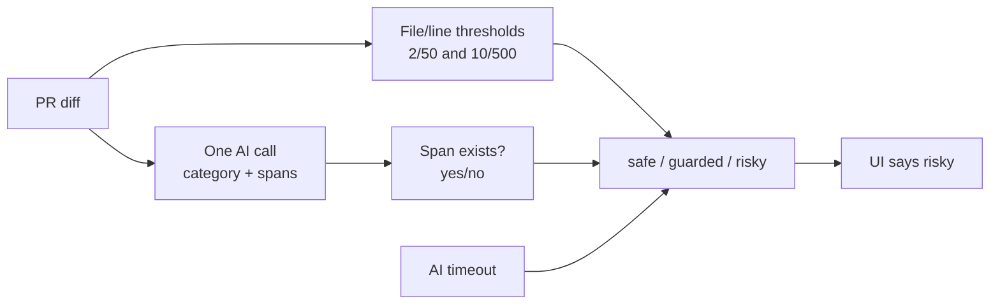
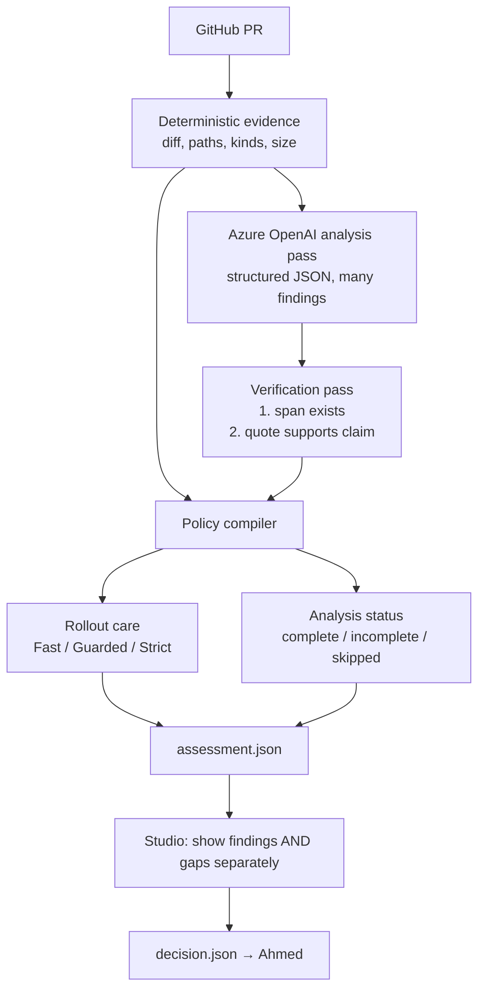

# Engine improvement plan — GitHub-canonical, AI-heavy analysis

**Status:** proposed · **Date:** 2026-08-13 · **Owner:** Andrew  
**Scope:** the canonical GitHub PR engine only (`SafeLaneEngine` + `PullRequestAssessmentEngine`).  
Ahmed's compile/rollout path is out of scope.

This plan answers: the current engine is thin, the thresholds are arbitrary, "risky" overclaims, and
AI is underused. The product path is **attach a GitHub repo → assess open PRs**.

---

## Decision already made

| Decision | Choice |
|----------|--------|
| Canonical engine | `SafeLaneEngine` / `PullRequestAssessmentEngine` |
| How analysis is invoked | GitHub repository connection only (Studio + `assess-pr` + `safelane.yml`) |
| Legacy local demo engine | Removed. `from safelane.engine import SafeLaneEngine` is the GitHub engine. |
| Model host | Switch from Ollama to **Azure OpenAI** |
| Who picks the lane | Policy still picks Fast / Guarded / Strict. AI still must not. |
| Target-repo `safelane.yml` | **Not required** to analyze a connected GitHub repo. Studio is enough. |
| Target-repo `.safelane/policy.yaml` | **Optional override.** Missing policy uses a bundled SafeLane default so any repo can be assessed. |
| Build vs reuse | **Hybrid.** Do not invent a risk scorer. Use Azure + change classes + DeployWhisper-style incomplete handling. Own SHA-bound assessment and Fast/Guarded/Strict mapping. |

ADR conflict: [ADR 0001](adr/0001-bound-ai-to-risk-findings.md) currently limits the model to **one**
bounded finding and template-rendered prose. This plan keeps "AI cannot pick the rollout" and
**amends** the rest: multiple findings, richer structured analysis, and a second verification pass.
A follow-up ADR should replace 0001's "one finding" clause.

---

## Build vs reuse

Do not build a competing Diff Risk Score. There is no OSS drop-in that already does SafeLane's
whole job either. The split:

| Keep / use existing | Build (this is the product) |
|---------------------|-----------------------------|
| Azure OpenAI for semantic findings (hosted, better than a local 7B) | GitHub attach, exact base/head SHA, assessment artifacts |
| gitStream-style change classes (docs/test/format vs auth/API/data) | Policy mapping to Fast / Guarded / Strict |
| DeployWhisper *rules*: heuristic/policy first; incomplete cannot stay Fast; LLM does not pick the verdict | `decision.json` handoff to Ahmed / Argo |
| ALCE / CodeRabbit three-way citation check | Bundled default policy when the repo has none |

Do not vendor DeployWhisper as the engine (IaC artifacts, advisory-only, hand-tuned 0–100 score).
Do not wrap ServiceNow / CodeRabbit / Akuity (wrong layer, commercial). Do not train bugbug (no
labels, MPL, Mozilla-specific). Stop investing in 2-files/50-lines as if it were a risk model.

---

## What's wrong today



1. **Size dominates.** A 40-line auth change can stay `safe`. A 600-line comment rewrite becomes
   `risky`. The cutoffs were demo policy ([research/risk-engine-options.md](../research/risk-engine-options.md)
   already said they are not empirical facts).
2. **The label lies.** `risky` sounds like "this will fail." The engine is choosing **rollout
   caution**, not predicting a production incident. NIST SP 800-30 separates likelihood, impact, and
   uncertainty; SafeLane collapsed them into one word.
3. **Verification is reference integrity, not meaning.** The checker proves the quoted line is in
   the diff. It does not prove the claim is true. The evaluation doc already named this gap
   ([research/risk-engine-evaluation.md](../research/risk-engine-evaluation.md), Gao et al. ALCE).
4. **Incomplete analysis and danger share a bucket.** Both raise the tier. Studio should show
   "we could not finish analysis" vs "we found a contract break."
5. **AI is a side quest.** If the model returns nothing, size rules decide everything. That is the
   opposite of "AI understands the change."
6. **CI has no AI.** `safelane.yml` points Ollama at `127.0.0.1:9`. The GitHub Check is a size
   heuristic. Azure OpenAI can run in CI.

---

## What good engines actually do (2026 research)

Primary notes: [`research/change-risk-engines-2026.md`](../research/change-risk-engines-2026.md)
and [`research/llm-change-analysis-engines-2026.md`](../research/llm-change-analysis-engines-2026.md).

**The shape that survives production is a funnel, not an LLM verdict.** A signal (learned or
heuristic) feeds versioned policy. The model almost never chooses the rollout.

| System | What to steal | What not to steal |
|--------|---------------|-------------------|
| **Meta DRS** | Rank/gate; never prompt an LLM for a numeric risk score (they call that uncalibrated) | Training a SEV predictor with no outcome data |
| **Meta RADAR** | Eligibility → heuristics → model → LLM *safe vs risk* classification → deterministic validation. All layers must pass | Letting the LLM auto-accept or pick the landing path |
| **DeployWhisper** | Heuristic score first; incomplete context cannot stay `go`; rollup is `go` / `caution` / `no-go` | Composite score mixing likelihood + impact + rollback |
| **CodeRabbit** | Three-way check results: `Passed` / `Failed` / `Inconclusive` | Treating inconclusive as a finding |
| **GitHub Copilot review** | Model may comment; it cannot approve or block merge | Comment severity as rollout authority |
| **Mozilla Bugbug** | Empirically fitted bands from observed outcomes | XGBoost for a hackathon with no labels |
| **Google SRE canarying** | Size exposure from error budget and confidence, not a pre-deploy score | Pretending 2/50 files is an error-budget calculation |
| **NIST SP 800-30** | Keep likelihood, impact, and uncertainty separate | One "risk" number |

SafeLane's remaining unique slice is still: **turn a PR assessment into Argo rollout care**
(weights, steps, probes). The analysis engine in front of that should copy RADAR's funnel and
DeployWhisper's incomplete-context rule.

---

## Target architecture (one engine)



Three outputs, not one mashed tier:

| Output | Meaning |
|--------|---------|
| **Findings** | Verified dangers the model found (contracts, data, security, …) |
| **Analysis status** | Did the model finish and verify? complete / incomplete / skipped |
| **Rollout care** | Fast / Guarded / Strict — policy result |

Studio must render all three. Never show only `risky`.

---

## Give the AI more work (without giving it the steering wheel)

The model still **must not** return a tier, profile, probe ID, command, or approval
(ADR 0001, kept).

It **should** return a much richer structured analysis of the exact diff:

| Field | Why |
|-------|-----|
| `change_kind` | `docs` / `test` / `config` / `api_contract` / `behavior` / `data` / `auth` / `infra` / `mixed` — so size is not the only classifier |
| `findings[]` | Up to N (suggest 5) safety cases, not one |
| `category` | Keep closed enums: availability, compatibility, data, security, operability |
| `spans[]` | Exact file / side / line / text — required |
| `claim` | One sentence: what contract or behavior is endangered |
| `runtime_effect` | Closed enum: callers_break, data_loss, authz_widen, unavailable, harder_ops, unknown |
| `verification_intent` | Closed enum bound later to a trusted probe |
| `unresolved_question` | What a human should confirm before a careful rollout |
| `nothing_found` | Explicit boolean so silence is a statement, not an accident |

Policy maps `runtime_effect` / `category` → **minimum care**. The model never says "Strict."

Example: a 30-line PR that removes `/v1/quote` → `change_kind=api_contract`,
`category=compatibility`, `runtime_effect=callers_break` → policy floor Strict, even though size
would have said Fast.

Example: a 800-line Markdown rewrite → `change_kind=docs`, no findings → Guarded at most because
analysis is complete and the kind is non-runtime. Not Strict just because it is "large."

---

## Fix the four concrete bugs

### 1. Replace arbitrary size→risky mapping

**New rule:** size is a **Fast eligibility gate** and a **default caution bump**, not a danger
finding.

- Fast only if: recognized paths + analysis complete + zero verified findings + change_kind in
  `{docs, test, behavior}` (or similarly low-care kinds) + below a *small* size cap.
- Crossing the large cap → **Guarded**, not Strict, unless a verified finding says otherwise.
- Strict comes from verified high-care findings (`data`, `security`, `callers_break`) or explicit
  policy floors (critical service, irreversible migration) — not from "500 lines."

Keep the numbers in `.safelane/policy.yaml` so they stay versioned and honest. Document them as
**policy defaults**, not science. After Azure is wired, the model classification should matter more
than the numbers.

### 2. Stop saying "risky" as if it were a prediction

Do not claim the change will fail.

Short-term (schema-compatible): keep `safe|guarded|risky` on the wire, but Studio copy becomes
**rollout care: Fast / Guarded / Strict** with a reason like "minimum care raised because a
verified compatibility finding exists."

Medium-term: add `rollout_care` as the user-facing field and treat `risk.tier` as a compatibility
alias. CONTEXT.md already says **risk tier** is a policy result, not an AI verdict — the UI is
what overclaims.

### 3. Verify meaning, not just existence

Two-pass check, both deterministic enough to test:

1. **Reference integrity (already exists):** every span's `text` matches that line in the diff.
2. **Support check (new):** a second Azure OpenAI call sees *only* `{claim, quoted lines}` and
   returns `supported` / `not_supported` / `insufficient_evidence` (ALCE-style citation
   faithfulness; CodeRabbit's three-way result). Drop `not_supported`. Treat
   `insufficient_evidence` and verifier failure as **analysis incomplete**, not a danger.

Never tell the user "source reference verified" as if the interpretation were proven.

### 4. Split "danger found" from "analysis incomplete"

| Situation | Findings | Analysis status | Minimum care |
|-----------|----------|-----------------|--------------|
| Small change, model finished, nothing found | none | complete | Fast allowed |
| Model found a verified contract break | yes | complete | Strict (policy floor) |
| Model timed out / schema invalid | none | incomplete | Guarded floor; Fast forbidden |
| Diff over budget / binary | none | skipped | Guarded floor |

Studio: two badges. CI Check summary: two lines. Policy trace: keep `finding.*` and
`evidence.ai_incomplete` as separate rows (they already are in code; the UI merges them).

---

## Azure OpenAI switch

Do not special-case Ollama. The analyzer is already a protocol (`PullRequestAnalyzer`). Add
`AzureOpenAIPullRequestAnalyzer` and select it from policy / env.

```
AZURE_OPENAI_API_KEY
AZURE_OPENAI_ENDPOINT       # https://<resource>.openai.azure.com/openai/v1/
AZURE_OPENAI_DEPLOYMENT     # Azure deployment name, passed as `model`
```

Policy `.safelane/policy.yaml`:

```yaml
ai:
  provider: azure_openai
  model: gpt-4.1          # pin deployment gpt-4.1 @ 2025-04-14, NoAutoUpgrade
  max_diff_bytes: 131072
  timeout_seconds: 60
  temperature: 0          # gpt-4.1 only; unsupported on o-series / GPT-5 reasoning
  analysis_max_findings: 5
  verifier: azure_openai
```

Implementation notes (from the Azure structured-outputs research):

- Use **Chat Completions** with `response_format.json_schema` and `strict: true`. Do not invent a
  code-review API; send the PR diff as chat content.
- Do **not** put `minLength` / `maxItems` in the Azure strict schema; keep those checks in engine
  validation.
- Structured outputs lock JSON *shape*, not truth. Invalid enums are prevented; wrong-but-legal
  findings still need the verifier pass.
- Over-budget / content-filter / timeout → `analysis incomplete`, never Fast.
- CI (`safelane.yml`) should call Azure with a GitHub secret. Then the Check Run is a real
  analysis, not a size heuristic pointing at port 9.
- Keep the Ollama adapter behind the same protocol until Azure is green, then delete it.

ADR 0001 already says: *"The response format must not depend on one Ollama model."* The provider
swap is in-policy. The richer schema is the ADR amendment.

---

## The GitHub workflow, and repos with no policy.yaml

These are two different things.

### `safelane.yml` — optional CI caller, not the engine

The workflow in *this* repo only runs on PRs **to SafeLane**. It does not follow you when Studio
connects `someone/other-repo`.

| You want | Need the workflow? |
|----------|--------------------|
| Attach a GitHub repo in Studio and see lanes | **No.** Studio calls `SafeLaneEngine.assess()` via `gh`. |
| A Check Run on SafeLane's own PRs | **Yes, keep it** — same engine, GitHub-native projection. After Azure, point it at Azure instead of `127.0.0.1:9`. |
| Checks on *someone else's* repo | Only if **that** repo installs the workflow (or a GitHub App). Out of scope for "connect any repo." |

Keep `.github/workflows/safelane.yml` for SafeLane itself. Do not make it a prerequisite for
analysis.

### `.safelane/policy.yaml` — right as an override, wrong as a gate

Today a connected repo with no `.safelane/policy.yaml` on the base SHA is
`RepositoryNotConfigured`. Studio skips those PRs. That is the wrong product for "paste a GitHub
repo and get a recommendation."

**Right direction:**

```
connect GitHub repo
    → if base SHA has .safelane/policy.yaml → use it (ADR 0005, repo opted in)
    → else → bundled default policy (SafeLane-owned, recorded on the assessment)
    → AI analyzes the PR diff
    → recommend Fast / Guarded / Strict
```

The bundled default should include: change-kind rules, finding → care floors, Azure AI settings,
Fast/Guarded/Strict stage shapes. It should **not** require that repo to know about Argo probes.
Trusted probes belong to compile (Ahmed). Analysis can run without them; compilation still cannot.

Record on every assessment:

- `policy.source`: `repository` or `bundled_default`
- `policy.sha256` of whichever bytes were used

A PR still cannot weaken the contract used to assess itself: if the base has a repo policy, use
that; if it does not, use the bundle. A PR that *adds* `.safelane/policy.yaml` is assessed under
the bundle (or the previous base policy), not under the file it just introduced.

This amends ADR 0005's "every connected repository must own `.safelane/policy.yaml`." Base-owned
policy stays the opt-in contract. Absence is no longer a hard stop.

---

## Remaining fixture cleanup

The demo `SafeLaneEngine` class is gone. Frozen `assessment-v2` / `decision-v3` examples and
`evaluate-ollama` still exist as evaluation fixtures, not as a second product engine.

---

## Implementation slices

| Slice | What ships | Done when |
|-------|------------|-----------|
| **0. Vocabulary + Studio copy** | Separate "findings" vs "analysis status" in assessment JSON and Studio | A timeout no longer looks like a contract break |
| **0b. Bundled default policy** | Assess repos with no `.safelane/policy.yaml`; record `policy.source` | Connecting a random GitHub repo produces lanes, not `RepositoryNotConfigured` |
| **1. Azure analyzer** | `AzureOpenAIPullRequestAnalyzer` behind the existing protocol; policy `provider: azure_openai` | Studio assesses a real GitHub PR through Azure structured output |
| **2. Richer AI schema** | Multiple findings, `change_kind`, `runtime_effect`, `nothing_found` | A small breaking-API PR is Strict even when size is "safe" |
| **3. Size policy rewrite** | Large size → Guarded default; Strict only from findings/floors | An 800-line docs PR is not Strict |
| **4. Semantic verifier** | Second pass; unsupported findings dropped | Fabricated interpretation cannot survive just because the line exists |
| **5. CI uses Azure** | `safelane.yml` secrets; remove `127.0.0.1:9` | GitHub Check includes model findings |

Slice 0 can land without Azure. Slice 1 is the capability unlock. Slices 2–4 are the actual
quality jump.

---

## What this plan will not do

- Train a Meta-style Diff Risk Score. There is no outcome dataset.
- Let the model return Fast / Guarded / Strict.
- Treat citation existence as proof the model is right.
- Pretend 2/50/10/500 were measured.
- Keep a parallel local-worktree analysis product.

---

## Related

- [docs/engine-walkthrough.md](engine-walkthrough.md) — how the canonical engine works today
- [docs/adr/0001-bound-ai-to-risk-findings.md](adr/0001-bound-ai-to-risk-findings.md) — AI vs rollout authority
- [docs/adr/0005-base-owned-repository-safety-contract.md](adr/0005-base-owned-repository-safety-contract.md) — why `SafeLaneEngine` is the module
- [research/risk-engine-options.md](../research/risk-engine-options.md) — why size bands were chosen for the demo
- [research/change-risk-engines-2026.md](../research/change-risk-engines-2026.md) — production funnels (DRS, RADAR, DeployWhisper, CodeRabbit)
- [research/llm-change-analysis-engines-2026.md](../research/llm-change-analysis-engines-2026.md) — Azure structured outputs, finder→verifier, citation faithfulness
