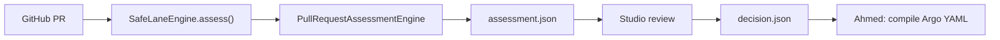
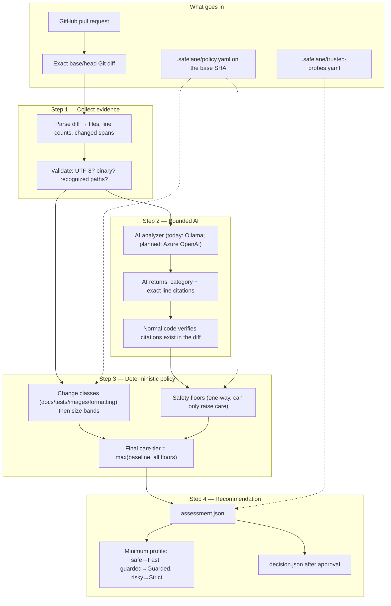
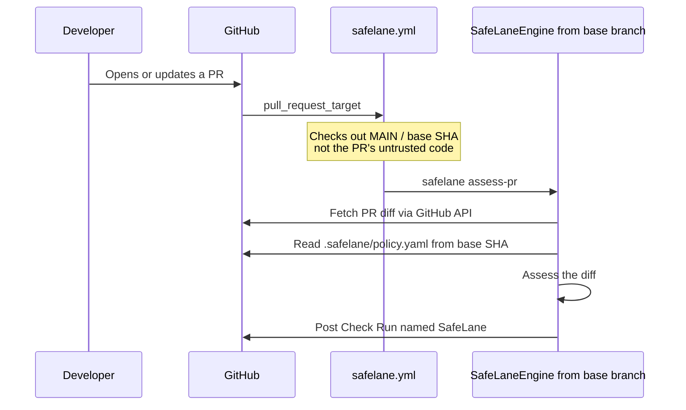

# SafeLane Engine — Full Walkthrough

SafeLane's engine is the **decision brain**: given a GitHub pull request, it examines the exact
base/head diff and recommends how carefully that change should be released (Fast / Guarded / Strict).
Ahmed's part starts **after** that recommendation is approved — turning `decision.json` into an Argo
Rollout manifest.

There is one product engine: **`SafeLaneEngine`**. Import it from `safelane.engine`. The only
analysis path is: connect a GitHub repository.

---

## The engine

**`SafeLaneEngine`** (`src/safelane/engine.py`, implemented in `src/safelane/change_safety.py`)
assesses one GitHub pull request. Analysis details live in `PullRequestAssessmentEngine`
(`src/safelane/pr_studio.py`).

Studio, the CLI, and `.github/workflows/safelane.yml` are callers of `assess()` / `resolve()`.
They do not contain a second policy engine.



**How you run it:** connect a GitHub repo (Studio or `safelane assess-pr`). SafeLane fetches open
PRs, reads `.safelane/policy.yaml` from the **base SHA**, fetches the exact PR diff, assesses it,
and writes `assessment.json`.

---

## The One-Sentence Version

SafeLane reads a GitHub PR diff, asks an AI model to name specific dangers in the changed lines,
applies repository-owned policy on top, and outputs a **care tier** (`safe` / `guarded` / `risky`)
that maps to a **rollout profile** (Fast / Guarded / Strict).

The AI can **describe what looks dangerous**. Policy chooses **how cautious the rollout must be**.
The engine is not predicting that the change will fail.

---

## High-Level Diagram



---

## The Three Rollout Lanes

The labels `safe` / `guarded` / `risky` are **how much care to apply**, not a prediction that the
change will fail. A more honest reading:

| Care tier (current name) | Profile | What it means (5-replica demo) |
|--------------------------|---------|--------------------------------|
| `safe` — low caution | **Fast** | All 5 pods go live immediately |
| `guarded` — medium caution | **Guarded** | 2 pods first → health check → then all 5 |
| `risky` — high caution | **Strict** | 1 pod → check → 2 → check → 3 → check → all 5 |

The engine **recommends** the minimum profile. A human can pick a *more* careful one, never a faster
one.

---

## How Assessment Works (Step by Step)

This is what happens when Studio or CI assesses a GitHub PR.

### Step 1 — Read the change from GitHub

`SafeLaneEngine.assess()` loads the PR snapshot, then:

1. Reads `.safelane/policy.yaml` from the **base SHA** (usually `main`)
2. Reads the trusted-probe catalog that policy points at
3. Fetches the exact base/head diff
4. Parses the diff (`diff_evidence.py`) into files, line counts, and `DiffSpan` tuples

If the repo has no `.safelane/policy.yaml` on the base revision, assessment fails with
`RepositoryNotConfigured`. Root `policy.yaml` is not used.

### Step 2 — Classify the change, then apply a size baseline

Before file/line counts, SafeLane applies the same predicates gitStream publishes for
`approve-safe-changes`:

```
(files | allDocs) or (files | allTests) or (files | allImages)
or (source.diff.files | isFormattingChange)
```

Those are **whole-PR** checks (`every` on an empty list is false). A mix of README + a PNG is not
a safe change. `requirements.txt` is not docs. Tests match
`[^a-zA-Z0-9](spec|test|tests)[^a-zA-Z0-9]` with the path padded as `/{path}/`, so `test.py` matches
and `testing/` / `contest.py` do not. Images are `svg` / `png` / `gif` only. Formatting is
minify-then-compare on the changed lines (JSON compact dump; otherwise whitespace), matching
gitStream's Prettier minify plus its unsupported-type whitespace fallback.

If that OR is true and analysis is complete, the baseline is **Fast** even when the PR is large.
A 10-file docs rewrite is no longer Strict just because it crossed 10 files.

Otherwise the scope thresholds still apply (current values are **policy choices, not measured
cutoffs**):

```
≤ 2 files AND ≤ 50 lines  →  safe baseline
≥ 10 files OR ≥ 500 lines →  risky baseline
everything else          →  guarded baseline
```

Sensitive paths use gitStream's other published automation: `files | match(list=sensitive_files) | some`.
The default list is gitStream's example (`src/app/auth/`, `src/app/routing/`, `src/app/resources/`).
A repo can override it with optional `change_classes.sensitive_path_prefixes`. A hit is extra care
(**Guarded**), not Strict — gitStream asks for more review; it does not claim the change will fail.

### Step 3 — Ask the AI (once, bounded)

Today `OllamaPullRequestAnalyzer` sends the diff to a local model. The planned replacement is Azure
OpenAI. Either way, ADR 0001 still applies: the model returns structured findings, not a rollout.

The AI returns something like: "compatibility finding at these exact lines." Normal code then
**verifies that those line citations exist in the diff**. Fabricated citations are rejected.

**Honest limit:** existence is not interpretation. The checker proves the quoted line is in the
diff. It does not prove the model understood the change correctly.

If the model is down, times out, or returns garbage → `evidence.ai_incomplete` and the care tier
cannot be Fast. Incomplete analysis is **not** the same as "danger found." The current UI often
collapses both into a higher tier.

### Step 4 — Apply safety floors

Floors are one-way rules that can only **raise** care:

| Floor | Trigger | Minimum care |
|-------|---------|--------------|
| `change_class.sensitive` | Path substring-matches the org sensitive list | guarded |
| `safety_case.compatibility` (etc.) | Verified AI finding in that category | From policy `minimum_tier` map |
| `evidence.path_unrecognized` | Changed file outside known paths | guarded |
| `evidence.ai_incomplete` | AI failed or unverifiable | guarded (blocks Fast) |
| `evidence.binary_patch` | Binary diff, unless the PR is already a safe change (e.g. images) | guarded |

**Final care tier** = the maximum of baseline + all applicable floors.

### Step 5 — Output artifacts

1. **`assessment.json`** (`change-assessment-v1`) — evidence, findings, policy trace, rollout
   options, review status. This is for Studio.
2. **`decision.json`** (`rollout-decision-v1`) — only after approval. **This is the file Ahmed
   consumes.**

---

## File for Ahmed

Give Ahmed **`decision.json`**. That is the only runtime handoff.

```
GitHub PR
  → SafeLaneEngine.assess() → assessment.json
  → human/auto approval   → decision.json   ← Ahmed starts here
  → compile()             → rollout.yaml    ← Ahmed's domain
```

`decision.json` contains the chosen profile, pod stages, trusted probe, exact SHAs, and an HMAC
authorization signature. Ahmed does not recompute the care tier.

---

## Key Files (Canonical Engine)

```
src/safelane/
├── engine.py              ← Public SafeLaneEngine API
├── change_safety.py       ← Engine implementation: assess / resolve / compile
├── pr_studio.py           ← GitHub host + PullRequestAssessmentEngine + AI analyzer
├── diff_evidence.py       ← Git diff parser → DiffSpan tuples
├── artifacts.py           ← JSON Schema validation + SHA256 hashing
├── github_checks.py       ← Posts the GitHub Check Run
├── cli.py                 ← studio, assess-pr
├── studio.py              ← HTTP server (port 4173)
└── repository_studio.py   ← Studio service over SafeLaneEngine
```

---

## The GitHub Workflow (`safelane.yml`)

This is **not a second engine**. It is CI calling the same `SafeLaneEngine.assess()` that Studio
calls.

```yaml
on:
  pull_request_target:    # fires when a PR is opened or updated
```



Why checkout the base branch, not the PR head? If CI ran the PR's SafeLane code, a malicious PR
could rewrite the assessor. Trusted code from `main` analyzes the PR's **diff** via the API.

**CI currently disables the AI** (`--base-url http://127.0.0.1:9`). So the GitHub Check is
scope-only: file/line thresholds, no model findings. Full AI analysis happens in Studio on a
machine that can reach the model. That split is a current limitation, not a second engine.

`.github/workflows/build-and-attest.yml` is Ahmed's image-build workflow. Ignore it for engine
work.

---

## CLI (canonical path only)

```powershell
# Launch Studio against a GitHub repo
uv run safelane studio --repository owner/repo

# Assess one PR (what the CI workflow runs)
uv run safelane assess-pr --repository owner/repo --number 42
```

---

## Known problems with the current engine

These are real gaps, not documentation nits:

1. **Thresholds are arbitrary.** `2 files / 50 lines = safe` and `10 files / 500 lines = risky`
   were demo-policy defaults. Nothing measured them. A 40-line auth change can be more dangerous
   than a 600-line comment rewrite.
2. **`risky` overclaims.** The engine is choosing rollout caution, not predicting failure.
3. **Citation checks are shallow.** They prove the cited line exists, not that the AI interpreted
   it correctly.
4. **AI failure and real danger look the same.** Both raise the care tier. Studio should separate
   "danger found" from "analysis incomplete."
5. **AI is under-involved.** One category + spans is a thin use of a capable model. Size thresholds
   still dominate when the model finds nothing.

---

## Design Principles (keep)

1. **AI describes the change; policy chooses the lane** — ADR 0001. More AI involvement must still
   stop short of letting the model pick Fast/Guarded/Strict.
2. **Evidence must be checkable** — citations have to exist in the exact diff.
3. **Uncertainty cannot create Fast** — missing analysis is not a green light.
4. **Two artifacts, one change** — `assessment.json` for review, `decision.json` for Ahmed.
5. **SHA-bound** — a new push invalidates the previous approval.
6. **Base-owned policy** — the PR cannot weaken the contract used to assess itself (ADR 0005).

---

## What You Can Ignore (Ahmed's Domain)

- `SafeLaneEngine.compile()` and `argo_rollout_for_decision()`
- `build-and-attest.yml`
- `register-image`
- `outcomes.py` and verification receipts
- kind / Kubernetes manifests

The engine stops at **`assessment.json` + recommended profile**. After approval, `decision.json`
is Ahmed's input.

---

## Related Docs

| Document | Purpose |
|----------|---------|
| [`CONTEXT.md`](../CONTEXT.md) | Canonical vocabulary |
| [`docs/adr/0005-base-owned-repository-safety-contract.md`](adr/0005-base-owned-repository-safety-contract.md) | Why `SafeLaneEngine` is the product module |
| [`docs/adr/0001-bound-ai-to-risk-findings.md`](adr/0001-bound-ai-to-risk-findings.md) | AI may find dangers; it may not pick the rollout |
| [`docs/safelane-studio.md`](safelane-studio.md) | GitHub Studio lifecycle |
| [`docs/risk-signals.md`](risk-signals.md) | Original size-band policy table |
| [`research/risk-engine-options.md`](../research/risk-engine-options.md) | Why thresholds were treated as policy, not science |
| [`docs/engine-improvement-plan.md`](engine-improvement-plan.md) | Plan to make this engine actually good (Azure OpenAI, richer AI, one GitHub path) |
| [`research/change-risk-engines-2026.md`](../research/change-risk-engines-2026.md) | How production change-risk engines actually work |
| [`research/llm-change-analysis-engines-2026.md`](../research/llm-change-analysis-engines-2026.md) | Azure OpenAI finder → verifier pipeline |
