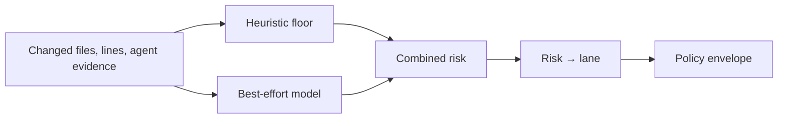

## A model can sound certain about a change it cannot see

A model may miss a migration, misread an agent-authored diff, or time out. The model is evidence about risk. It is not the authority that sets the rollout envelope.

The heuristic always runs. It sets the floor. The model runs best-effort and may only raise risk. The record stores both verdicts, the combined risk, the lane, and the facts used.

| Caller-claimed risk | SafeLane-collected assessment |
| --- | --- |
| “Low. Use fast.” | The heuristic sees charts/**; minimum risk is high. |
| “Medium. Use standard.” | The model says low; the heuristic floor remains medium. |
| No claim | SafeLane records the facts and selects from the policy. |

## Why the model can only narrow a lane

Widening authority from an uncertain signal is the wrong failure mode. A model that misses risk leaves the heuristic floor in place. A model that finds more risk moves the release toward guarded.

## Next

- [The Release Policy](./release-policy/)
- [The Release Record & Proof](./record-and-proof/)
- [CLI Command Reference](../reference/cli/)

