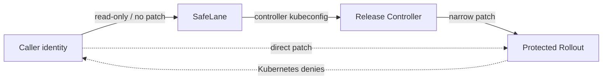

## One credential makes every instruction a permission

If an agent, CI job, and controller share a kubeconfig, a caller that ignores the workflow can patch the Rollout directly. Kubernetes cannot distinguish intent after the credential is shared.

| Without the boundary | With the boundary |
| --- | --- |
| The agent holds the controller credential. | The agent holds no controller credential. |
| Direct patch permission and release permission are the same. | Caller and controller identities have separate capabilities. |
| Kubernetes sees one principal. | Kubernetes sees a restricted caller and a privileged controller. |

The record stores caller_identity, controller_identity, and caller capability. The controller kubeconfig and context come from operator-owned project.yml settings.

## Why the controller credential is never in the agent's kubeconfig

The agent is allowed to request and drive a release. It is not allowed to become the controller. Keeping the credential outside the caller's environment turns that rule into a credential boundary, not a prompt instruction.

## Why the request schema forbids a lane field

The caller can name the change. It cannot name the authority that change receives. SafeLane derives the decision from evidence and policy.

## Next

- [Setting Up an Application](../guides/setting-up/)
- [The Release Record & Proof](./record-and-proof/)
- [Handling a Paused or Aborted Rollout](../guides/rollout-recovery/)

