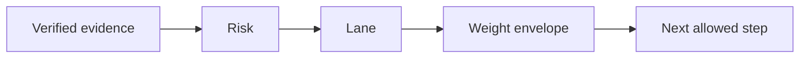

## A rollout without a policy is a caller's opinion

If the caller chooses both the risk and the rollout shape, every release is already at full authority. SafeLane makes the operator declare the lanes and their weights in policy.yml.

| Lane | Weights |
| --- | --- |
| fast | 50 → 100 |
| standard | 25 → 50 → 100 |
| guarded | 25 → 50 → 75 → 100 |

The current mapping is low → fast, medium → standard, and high → guarded. default_lane is guarded. Mandatory evidence is a merged commit on the default branch, a passing publish workflow, and an immutable GHCR digest.

## Why weights are policy data

The agent knows what it wants to do next. It does not know what the operator permits next. Keeping weights in the lane makes each progression request a policy operation, not a free-form promotion command.

## Why the default is the narrowest lane

Unknown evidence must not turn into the widest rollout. SafeLane chooses the narrowest configured lane as the ceiling for situations the policy does not describe. Eligibility still decides whether the release can enter rollout.

## Next

- [Assessment](./assessment/)
- [Configuration File Schemas](../reference/configuration/)
- [Running a Release End to End](../guides/release-end-to-end/)

