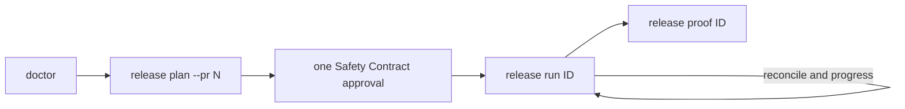

## A rollout command is too late to discover a bad release

Start with the release identity. SafeLane does the checking before it touches Argo.

    safelane doctor
    safelane release plan --pr 42 --json
    safelane release run rel_...
    safelane release proof rel_... --details

Plan verifies the exact merged commit, required checks, and immutable GHCR digest, then freezes the Safety Contract without changing Kubernetes. Run asks once, applies the Rendered Manifest Bundle through the controller identity, and remains attached while it reconciles Argo and requests each policy-authorized progression. Proof joins artifact, assessment, decision, execution, boundary, and outcome data.

## Why run needs no target weight

The frozen lane owns every allowed weight. `release run` derives the next progression from that envelope; callers cannot select a target that bypasses the recorded decision. Use `--step` only when you explicitly want at most one authorized progression instead of the default terminal loop.

## Next

- [Handling a Paused or Aborted Rollout](./rollout-recovery/)
- [The Release Record & Proof](../concepts/record-and-proof/)
- [Installing the Agent Skill](./agent-skill/)

