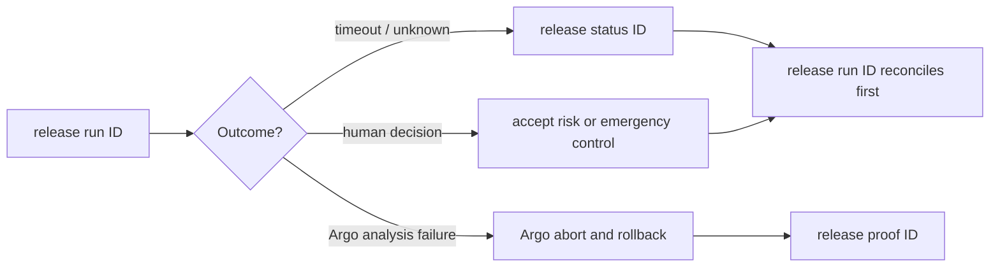

## A paused rollout is not permission to guess

Argo can pause at a canary gate. A timeout can leave the outcome unknown. Retrying blindly can send a second promotion after the first one already took effect.

    safelane release status rel_...
    safelane release status rel_... --json
    safelane release pause rel_... --reason "investigating an external incident"
    safelane release resume rel_... --reason "incident cleared"
    safelane release abort rel_... --reason "operator emergency stop"

Argo owns normal analysis failure, abort, and rollback. `release abort` is a separate emergency-control path; SafeLane records its caller, time, and reason without confusing it with `argo_abort`.

## Why timeout returns exit code 3

A timeout means SafeLane does not know whether the last mutation took effect. That is different from failure. Read status, then reconnect with `release run`; it reconciles before it requests another progression.

## Next

- [Exit Codes](../reference/exit-codes/)
- [CLI Command Reference](../reference/cli/)
- [The Boundary](../concepts/boundary/)

