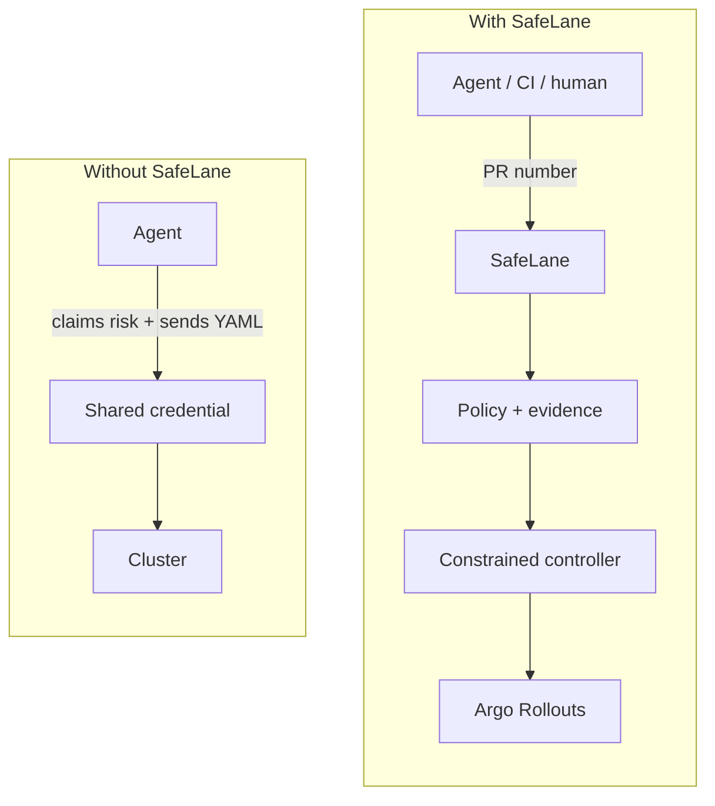

## Stop shipping every change the same way

Coding agents can operate deployment tools, but they commonly rediscover the latest PR, spend tokens rebuilding context, check generic health endpoints, and ask for approval at every gate.

SafeLane gives them one release path. You identify an exact merged pull request and approve its frozen Safety Contract once. SafeLane stays attached and coordinates Argo to promotion, rollback, or one specific decision-required outcome.

Argo remains the rollout engine: it evaluates Analysis Jobs, changes traffic, and aborts on failure. SafeLane assesses the change, bounds progression authority, reconciles execution, and writes proof.

| Without SafeLane | With SafeLane |
| --- | --- |
| The caller supplies risk, lane, and Kubernetes objects. | The caller supplies release identity. SafeLane collects evidence and renders trusted objects. |
| The agent babysits every gate. | One approved contract drives the attached release loop. |
| Release facts live in logs and chat. | Eligibility, execution, boundary, and outcome become one Release Proof. |

Deterministic evidence and mandatory runtime-analysis failures remain fail-closed. An operational semantic-model failure selects a recorded Guarded fallback instead of turning tool availability into a product outage.

## What SafeLane owns

- <code>safelane release plan</code>, which binds a merged pull request to verified GitHub and GHCR evidence.
- The operator-owned <code>policy.yml</code>, which maps risk to named rollout lanes.
- The operator-owned Release Template, rendered once and hashed before execution.
- An attached coordinator that requests only progression already authorized by the Safety Contract.
- A persisted Release Record and the <code>safelane release proof</code> view of it.

## Next

- [Quick Start](./start-here/quick-start/)
- [The Release Policy](./concepts/release-policy/)
- [CLI Command Reference](./reference/cli/)

