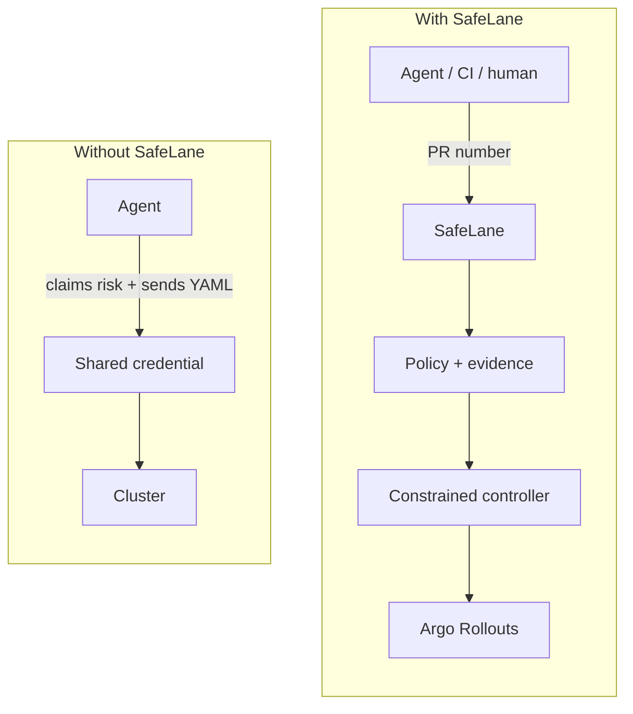

## The release bottleneck is authority

An agent can plan a release, watch a canary, and repair a bad step. It should not widen its own rollout. A caller should not supply its own risk score. One shared Kubernetes credential should not decide who can patch production.

SafeLane gives agents, CI, and people one guarded release path. You identify a merged pull request. SafeLane collects the evidence, applies the operator-owned Release Policy, and permits only the rollout step that policy allows.

The agent can drive the release. SafeLane remains the release authority.

| Without SafeLane | With SafeLane |
| --- | --- |
| The caller supplies risk, lane, and Kubernetes objects. | The caller supplies release identity. SafeLane collects evidence and renders trusted objects. |
| The agent holds a credential that can reach the cluster. | Caller and controller identities use separate kubeconfigs. |
| Release facts live in logs and chat. | Eligibility, execution, boundary, and outcome become one Release Proof. |

SafeLane fails closed. Ineligible and indeterminate evidence never becomes permission to release.

## What SafeLane owns

- <code>safelane release inspect</code>, which binds a merged pull request to verified GitHub and GHCR evidence.
- The operator-owned <code>policy.yml</code>, which maps risk to named rollout lanes.
- The operator-owned Release Template, rendered once and hashed before execution.
- A constrained Release Controller that can act only on the protected Rollout.
- A persisted Release Record and the <code>safelane proof</code> view of it.

## Next

- [Quick Start](./start-here/quick-start/)
- [The Release Policy](./concepts/release-policy/)
- [CLI Command Reference](./reference/cli/)

