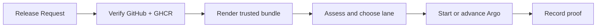

## Deployment agents have the wrong kind of freedom

An agent can see a failed canary and ask for more rollout. If it also chooses the risk, lane, and credential, the guardrail is only a suggestion.

SafeLane splits the job. You give it a merged pull request. It verifies GitHub and GHCR evidence, renders operator-owned Kubernetes YAML, chooses a policy lane, and calls the rollout controller with a bounded envelope.

The caller cannot name its own risk or lane. It cannot send Kubernetes configuration. It cannot use the controller credential. Kubernetes denies direct changes from the restricted caller identity.

| Before SafeLane | After SafeLane |
| --- | --- |
| A caller claims that an image is reviewed and safe. | SafeLane checks the merged commit, publish check, and immutable GHCR digest. |
| A caller chooses a rollout weight. | The policy lane supplies the next weight. |
| Release facts live in logs and chat. | <code>safelane proof &lt;release-id&gt;</code> reads the persisted record. |

## Why the caller cannot submit risk

Risk changes what the system is allowed to do. Letting the caller submit it lets the caller submit the decision. SafeLane accepts release identity and metadata, then derives risk from operator rules and verified evidence.

## Next

- [Quick Start](./quick-start/)
- [Assessment](../concepts/assessment/)
- [The Boundary](../concepts/boundary/)

